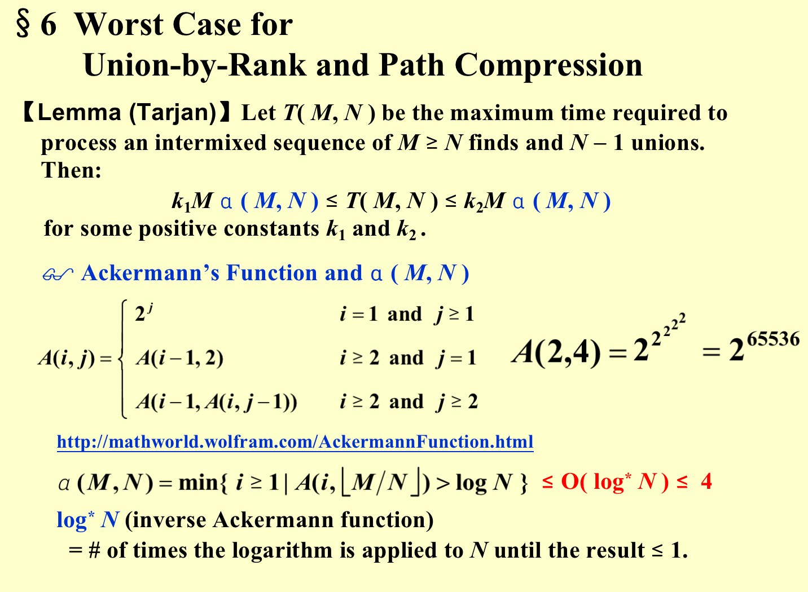

## SPARSE MATRIX

> Representing a sparse matrix by a 2D array leads to wastage of lots of memory as zeroes in the matrix are of no use in most of the cases. So, instead of storing zeroes with non-zero elements, we only store non-zero elements. This means storing non-zero elements with triples- (Row, Column, value).

* Using Array

```C
#include <iostream>
using namespace std;

int main()
{
	// Assume 4x5 sparse matrix
	int sparseMatrix[4][5] =
	{
		{0 , 0 , 3 , 0 , 4 },
		{0 , 0 , 5 , 7 , 0 },
		{0 , 0 , 0 , 0 , 0 },
		{0 , 2 , 6 , 0 , 0 }
	};

	int size = 0;
	for (int i = 0; i < 4; i++)
		for (int j = 0; j < 5; j++)
			if (sparseMatrix[i][j] != 0)
				size++;

	// number of columns in compactMatrix (size) must be
	// equal to number of non - zero elements in
	// sparseMatrix
	int compactMatrix[3][size];
  
	// Making of new matrix
	int k = 0;
	for (int i = 0; i < 4; i++)
		for (int j = 0; j < 5; j++)
			if (sparseMatrix[i][j] != 0)
			{
				compactMatrix[0][k] = i;
				compactMatrix[1][k] = j;
				compactMatrix[2][k] = sparseMatrix[i][j];
				k++;
			} 

	for (int i=0; i<3; i++)
	{
		for (int j=0; j<size; j++)
			cout <<" "<< compactMatrix[i][j];
		cout <<"\n";
	}
	return 0;
}

```

* Using Linked Lists

```C
#include<stdio.h>
#include<stdlib.h>

// Node to represent sparse matrix
struct Node
{
	int value;
	int row_position;
	int column_postion;
	struct Node *next;
};

// Function to create new node
void create_new_node(struct Node** start, int non_zero_element,int row_index, int column_index )
{
	struct Node *temp, *r;
	temp = *start;
	if (temp == NULL)
	{
		// Create new node dynamically
		temp = (struct Node *) malloc (sizeof(struct Node));
		temp->value = non_zero_element;
		temp->row_position = row_index;
		temp->column_postion = column_index;
		temp->next = NULL;
		*start = temp;
	}
	else
	{
		while (temp->next != NULL)
			temp = temp->next;
		// Create new node dynamically
		r = (struct Node *) malloc (sizeof(struct Node));
		r->value = non_zero_element;
		r->row_position = row_index;
		r->column_postion = column_index;
		r->next = NULL;
		temp->next = r;
	}
}
// This function prints contents of linked list
// starting from start
void PrintList(struct Node* start)
{
	struct Node *temp, *r, *s;
	temp = r = s = start;

	printf("row_position: ");
	while(temp != NULL){
		printf("%d ", temp->row_position);
		temp = temp->next;
	}
	printf("\n");
	printf("column_postion: ");
	while(r != NULL){
		printf("%d ", r->column_postion);
		r = r->next;
	}
	printf("\n");
	printf("Value: ");
	while(s != NULL){
		printf("%d ", s->value);
		s = s->next;
	}
	printf("\n");
}
// Driver of the program
int main(){
// Assume 4x5 sparse matrix
	int sparseMatric[4][5] =
	{
		{0 , 0 , 3 , 0 , 4 },
		{0 , 0 , 5 , 7 , 0 },
		{0 , 0 , 0 , 0 , 0 },
		{0 , 2 , 6 , 0 , 0 }
	};
	/* Start with the empty list */
	struct Node* start = NULL;
	for (int i = 0; i < 4; i++)
		for (int j = 0; j < 5; j++)
			// Pass only those values which are non - zero
			if (sparseMatric[i][j] != 0)
				create_new_node(&start, sparseMatric[i][j], i, j);
	PrintList(start);
	return 0;
}
```

## STACK

#### 1.ADT

#### 2.Implementations

* Linked List
* Array : The stack model must be well encapsulated.

#### 3.Applications

* Balancing Symbols
  * Pseudo Code


```C
Algorithm  {
    Make an empty stack S;
    while (read in a character c) {
        if (c is an opening symbol)
            Push(c, S);
        else if (c is a closing symbol) {
            if (S is empty)  { ERROR; exit; }
            else  {  /* stack is okay */
                if  (Top(S) doesn’t match c)  { ERROR, exit; }
                else  Pop(S);
            }  /* end else-stack is okay */
        }  /* end else-if-closing symbol */
    } /* end while-loop */ 
    if (S is not empty)  ERROR;
}
```


```C
#include <stdio.h>
#define STACKSIZE 30 
char stack[ STACKSIZE ]; // Global, but let's go with it
int top = 0;
void push( char x ) { 
    if( top == STACKSIZE )
        puts( "Stack Full");
    else
        stack[ top++ ] = x;
}
bool popExpect( char c ) { // compare expected char on top with passed char
    return top && c == stack[ --top ];
}
bool chk( const char *str ) {
    char *cp, pairs[] = "(){}[]"; // three important pairs
    bool isGood = true; // optimism
    for( int i = 0; isGood && str[ i ]; i++ )
        // is this char one of the "special" ones?
        if( ( cp = strchr( pairs, str[ i ] ) ) != NULL ) {
            int off = cp - pairs;
            // because "paired" 0,2,4 are open, 1,3,5 are close
            if( off%2 == 0 ) // opening
                push( cp[1] ); // push the close that matches this open
            else // special closing
                isGood = popExpect( str[ i ] ); // does this close match?
        }
    return isGood && top == 0;
}
int main() {
    const char *s1 = "(foobar)({}){bar}[[[(foo)]]]"; // balanced
    const char *s2 = "(foobar)({}){ { bar}[[[(foo)]]]"; // unbalanced open
    const char *s3 = "(foobar)({}){ ] bar}[[[(foo)]]]"; // unbalanced close
    puts( chk( s1 ) ? "Balanced" : "Unbalanced" );
    puts( chk( s2 ) ? "Balanced" : "Unbalanced" );
    puts( chk( s3 ) ? "Balanced" : "Unbalanced" );
    return 0;
}
```

* Calculation

  * Prefix

  * Infix「Convert To Postfix」

* Never pop a '(' from the stack except when processing a  ')' .
*  Observe that when ' (  ' is not in the stack, its precedence is the highest; but when it is in the stack, its precedence is the lowest.  Define in-stack precedence and incoming precedence for symbols, and each time use the corresponding precedence for comparison. 
* Note:  a – b – c will be converted to a b – c –.  However, $2^{2^{3}}$must be converted to 2 2 3 ^ ^  ,  not 2 2 ^ 3 ^ since exponentiation associates right to left.

    *  Observe that when ' (  ' is not in the stack, its precedence is the highest; but when it is in the stack, its precedence is the lowest.  Define in-stack precedence and incoming precedence for symbols, and each time use the corresponding precedence for comparison. 

    * Note:  a – b – c will be converted to a b – c –.  However, $2^{2^{3}}$must be converted to 2 2 3 ^ ^  ,  not 2 2 ^ 3 ^ since exponentiation associates right to left.


  * Postfix 「Easier To Calculate」

> ps:Tail Recursion! -- compliler will remove the recursion.

## The Queue ADT

* A queue is a First-In-First-Out (FIFO) list, that is, an ordered list in which insertions take place at one end and deletions take place at the opposite end.

* Linked list implementation

* Array Implementation

```C
struct  QueueRecord {
	int     Capacity ;   /* max size of queue */
	int     Front;          /* the front pointer */
	int     Rear;           /* the rear pointer */
	int     Size;  /* Optional - the current size of queue */
	ElementType  *Array;    /* array for queue elements */
 } ; 
```

* A circular Queue
  * Rear[0] Font[1]


## TREE

#### Basic Properties

* N nodes and N-1 edges
* node without any son is called  $leaf$
* 一棵树的度是这棵树里所有节点度的最大值
* 从节点 $n1$ 到 $nk$ 的路径是唯一的，其长度是路径上边的数量.
* 对于节点 $ni$，其深度为从根到 $ni$ 的唯一路径的长度$[Depth$ $root = 0]$
* 对于节点 $ni$，其高度为从 $ni$ 到一个叶节点的最长长度$[Height$ $leaf = 0]$
* 根的高度称为这棵树的高度 / 深度
* 一个节点的祖先（ancestors）是从根到这个节点的路径上的所有节点
* 一个节点的后裔（descendants）是这个节点子树中的所有节点

#### Implementation

* FirstChild-NextSibling 表示法

  - 记录第一个子节点和下一个兄弟节点


  - 因为一棵树的儿子顺序不定，所以一棵树的表示方式不唯一

    ```C
    struct TreeNode {
        ElementType Element;
        PtrToNode FirstChild;
        PtrToNode NextSibling;FirstChildFirfsads
    };
    typedef struct TreeNode *PtrToNode;
    ```


### Binary Tree

#### Basic Properties

- 第 *i* 层的节点数最多为 $2^{i-1}$
- 深度为 *k* 的二叉树最多有$2^{k}-1$ 个节点
- $n0$ 表示叶节点数，$n2$ 表示度为 2 的节点数，则 $n0 = n2 +1$
- 二叉树可以通过**数组**来表示
  - 根为 tree[1]
  - 节点 tree[i] 的左儿子为 tree[2i]，右儿子为 tree[2i+1]
  - 完全二叉树的数组中元素全部分布在 1 ~ n 中
- 表达式树（expression tree）

#### 遍历

* Preorder：root-left-right

* Postorder：left-right-root

* inorder:left-root-right

* level order:

```C
void levelorder(tree_ptr tree) {
    enqueue(tree);
    while (queue is not empty) {
        visit(T = dequeue());
        for (each child C of T) 
            enqueue(C);
    }
}
```

```C
//    二叉树的实现（C语言）
//    链表，递归实现
typedef char Elementtype;    //    定义数据类型，可根据需要自行定制
typedef struct TreeNode * Node;    //    Node相当于struct treeNode *
//    定义数节点结构
typedef struct TreeNode {
    Elementtype Element;
    Node left;    //    树节点的左子节点
    Node right;    //    树节点的右子节点
}TREE,*PTREE;

void CreatTree(PTREE *);    //    树的先序创建函数
void PreOrderTree(PTREE );    //    树的前序遍历函数
void InOrderTree(PTREE );    //    树的中序遍历
void PostOrderTree(PTREE );    //    树的后序遍历
void LeafOfTree(PTREE );    //    打印树的叶子节点函数
int  Get_Leaf_Num(PTREE );    //    获取树叶子节点个数
int Get_Height(PTREE );    //    获取树的高度

int main() {
    PTREE Root;    
    printf("请先序输入二叉树的节点数据： ");
    CreatTree(&Root);    
    printf("\n前序遍历结果为：");
    PreOrderTree(Root);    
    printf("\n中序遍历结果为：");
    InOrderTree(Root);
    printf("\n后序遍历结果为：");
    PostOrderTree(Root);
    printf("\n打印叶子节点为：");
    LeafOfTree(Root);
    printf("\n叶子节点个数为：%d", Get_Leaf_Num(Root));
    printf("\n二叉树的高度为：%d", Get_Height(Root));
    printf("\n");
    return 0;
}
//    定义树先序创建函数
void CreatTree(PTREE *ROOT){
  char val = 0;
  val = getchar();
  if(wal=='*'){*ROOT=NULL;}
  else{
    (*Root)=(PTREE)malloc(sizeof(TREE));
        if ((*Root) == NULL) {
            printf("创建节点失败，无法分配可用内存...");
            exit(-1);
        }
    		else{
          (*Root)->Element =val;
          CreatTree(&(*Root)->left);
          CreatTree(&(*Root)->right); 
        }
  }
  
}

//    树的前序遍历函数定义
void PreOrderTree(PTREE Root) {
    if (Root == NULL)
        return;
    else {
        putchar(Root->Element);
        PreOrderTree(Root->left);
        PreOrderTree(Root->right);
    }
}

//    树的中序遍历函数定义
void InOrderTree(PTREE Root) {
    if (Root == NULL)
        return;
    else {
        InOrderTree(Root->left);
        putchar(Root->Element);
        InOrderTree(Root->right);
    }
}
//    树的后序遍历函数定义
void PostOrderTree(PTREE Root) {
    if (Root==NULL) 
        return ;
    else{
        PostOrderTree(Root->left);
        PostOrderTree(Root->right);
        putchar( Root->Element);
    }
}
//树的后序遍历的循环形式
Iterative Program 
void iter_postorder（tree_ptr_tree）{
  stack S = CreateStack(MAX_SIZE);
  for(;;){
    
  }
}
//    打印树的叶子节点函数定义
void LeafOfTree(PTREE Tree) {
    if (Tree == NULL)    
        return ;
    else {
        if (Tree->left == NULL&&Tree->right == NULL)
            putchar(Tree->Element);
        else {
            LeafOfTree(Tree->left);
            LeafOfTree(Tree->right);
        }
    }  
}
//    获取树的叶子节点个数函数定义
int Get_Leaf_Num(PTREE Tree) {
    if (Tree == NULL)
        return 0;
    if (Tree->left == NULL&&Tree->right == NULL)
        return 1;
    //递归整个树的叶子节点个数 = 左子树叶子节点的个数 + 右子树叶子节点的个数
    return Get_Leaf_Num(Tree->left) + Get_Leaf_Num(Tree->right);
}
//    获取树高的函数定义
int Get_Height(PTREE Tree) {
    int Height = 0;
    if (Tree == NULL)
        return 0;
    //树的高度 = max(左子树的高度，右子树的高度) + 1
    else
    {
        int L_Height = Get_Height(Tree->left);
        int R_Height = Get_Height(Tree->right);
        Height = L_Height >= R_Height ? L_Height + 1 : R_Height + 1;
    }
    return Height;
}
```

* inorder iterative

```c
#include <stdio.h>
#include <stdlib.h>
#include <stdbool.h>

// 定义二叉树结点
struct TreeNode {
    int val;
    struct TreeNode* left;
    struct TreeNode* right;
};

// 创建一个二叉树结点
struct TreeNode* createNode(int val) {
    struct TreeNode* newNode = (struct TreeNode*)malloc(sizeof(struct TreeNode));
    newNode->val = val;
    newNode->left = NULL;
    newNode->right = NULL;
    return newNode;
}
// 结构体模拟栈
struct TreeNodeStack {
    struct TreeNode* data;
    struct TreeNodeStack* next;
};

struct TreeNodeStack* createStackNode(struct TreeNode* node) {
    struct TreeNodeStack* stackNode = (struct TreeNodeStack*)malloc(sizeof(struct TreeNodeStack));
    stackNode->data = node;
    stackNode->next = NULL;
    return stackNode;
}

void push(struct TreeNodeStack** stack, struct TreeNode* node) {
    struct TreeNodeStack* stackNode = createStackNode(node);
    stackNode->next = *stack;
    *stack = stackNode;
}

struct TreeNode* pop(struct TreeNodeStack** stack) {
    if (*stack == NULL) {
        return NULL;
    }
    struct TreeNodeStack* temp = *stack;
    *stack = (*stack)->next;
    struct TreeNode* node = temp->data;
    free(temp);
    return node;
}

bool isEmpty(struct TreeNodeStack* stack) {
    return stack == NULL;
}

// 中序遍历二叉树并返回结果作为数组
int* inorderTraversal(struct TreeNode* root, int* returnSize) {
    struct TreeNodeStack* stack = NULL;
    int* result = (int*)malloc(sizeof(int));
    int resultSize = 0;
    struct TreeNode* current = root;
    while (current != NULL || !isEmpty(stack)) {
        while (current != NULL) {
            push(&stack, current);
            current = current->left;
        }
        current = pop(&stack);
        result = (int*)realloc(result, (resultSize + 1) * sizeof(int));
        result[resultSize] = current->val;
        resultSize++;
        current = current->right;
    }

    *returnSize = resultSize;
    return result;
}

// 主函数
int main() {
    struct TreeNode* root = createNode(1);
    root->right = createNode(2);
    root->right->left = createNode(3);
    
    printf("Inorder Traversal: ");
    int resultSize;
    int* result = inorderTraversal(root, &resultSize);
    for (int i = 0; i < resultSize; i++) {
        printf("%d ", result[i]);
    }
    free(result);
    return 0;
}

```

#### 创建TREE

* 1.Postorder &  Inorder 后序&中序

```C
BiTree* postInTree(int post[],int in[],int n)  {
    if (n<=0)   return nullptr;
    int i=0;
    while (post[n-1]!=in[i])    i++;	//i也正好是左子树节点数
    BiTree* nw=new BiTree;
    nw->data=in[i];
    nw->lc=postInTree(post,in,i);		//建左子树
    nw->rc=postInTree(post+i,in+i+1,n-i-1);		//建右子树
    return nw;
}
```

* 2.preorder & inorder 前序&中序

```C
BiTree* preInTree2(int pre[],int in[],int n)  { //这是笔记上的我的方法,n是当前二叉树的节点数
    if (n<=0)   return nullptr;
    int i=0;
    while (in[i]!=pre[0])   i++;		//此时i正好是左子树节点数。先序遍历的首元素一定是根节点
    BiTree* nw=new BiTree;
    nw->data=in[i];
    nw->lc=preInTree2(pre+1,in,i);		//建左子树，左子树节点i个
    nw->rc=preInTree2(pre+i+1,in+i+1,n-i-1);		//建右子树，右子树节点n-i-1个
    return nw;
}
```

### Application

* Linux dir「Typical Preoder Traversal」

```C
static void  ListDir ( DirOrFile D, int Depth )
{
    if  ( D is a legitimate entry )   {
        PrintName (D, Depth );
        if ( D is a directory )
            for (each child C of D )
                ListDir ( C, Depth + 1 );
    }
}
```

* Calculating the size of the directory「Typical Postorder Traversal」

* 线索二叉树 Threader Binary Tree

### Binary Search Tree

* Delete

```C
SearchTree Delete(ElementType X, SearchTree T) {
    Position TmpCell;
    if (T == NULL) Error("not found");
    else if (X < T->Element) T->Left = Delete(X, T->Left);
    else if (x > T->Element) T->Right = Delete(X, T->Right);
    else {
        if (T->Left && T->Right) {
            TmpCell = FindMin(T->Right);
            T->Element = TmpCell->Element;
            T->Right = Delete(T->Element, T->Right);
        } else {
            TmpCell = T;
            if (T->Left == NULL) T = T->Right;
            else if (T->Right == NULL) T = T->Left;
            free(TmpCell);
        }
    }
    return T;
}
```

* All binary trees: Equals n nodes pop sequence!!

>  $C_{n}=\sum_{i=1}^{n} C_{i}C{n-i-1}$

### 完全二叉树（complete binary tree）

* 所有叶节点都在相邻的两层上的二叉树

* Basic Properties:

  - 除了最后一层，每一层都是满的


  - 最后一层的节点都靠左排列

  - $2^{h}$ ~ $2^{h+1}-1$ nodes$(0,1,2,3- height = 3)$

  - $h=O(log(n))$

* INSERT

```C
void Insert(ElementType X, MaxHeap H) {
    if (IsFull(H)) {
        Error("Full Heap");
        return;
    }
    int i = ++H->Size;
    for (; H->Elements[i/2] < X; i /= 2) {
        H->Elements[i] = H->Elements[i/2];
    }
    H->Elements[i] = X;
}
```

* DELETE

```C
ElementType DeleteMax(MaxHeap H) {
    if (IsEmpty(H)) {
        Error("Empty Heap");
        return H->Elements[0];
    }
    int i, Child;
    ElementType MaxElement, LastElement;
    MaxElement = H->Elements[1];
    LastElement = H->Elements[H->Size--];
    for (i = 1; i * 2 <= H->size; i = Child) {
        Child = i * 2;
        if (Child != H->Size && H->Elements[Child + 1] > H->Elements[Child]) {
            Child++;
        }
        if (LastElement < H->Elements[Child]) {
            H->Elements[i] = H->Elements[Child];
        } else {
            break;
        }
    }
    H->Elements[i] = LastElement;
    return MaxElement;
}
```

> Question: how to make it a natural stop without using $Child != H->size$

## The Dynamic Equivalence Problem

A dynamic graph generally refers to a graph that keeps on changing its configuration. Let’s deep dive into it using an example:

- Let’s consider the edge information for the given graph as: {{1,2}, {2,3}, {4,5}, {6,7}, {5,6}, {3,7}}. Now if we start adding the edges one by one, in each step the structure of the graph will change. So, after each step, if we perform the same operation on the graph while updating the edges, the result might be different. In this case, the graph will be considered a dynamic graph.
- For example, after adding the first 4 edges if we look at the graph, we will find that node 4 and node 1 belong to different components but after adding all 6 edges if we search for the same we will figure out that node 4 and node 1 belong to the same component.

### THE DISJOINT SET ADT

- UNION

> NOTE:UNION is the union of the head of one head to another(thus for a random element x,always find the "head" element Find(x) and modify s[Find(x)]

```c
void  SetUnion ( DisjSet S, 
                 SetType Rt1, 
                 SetType Rt2 )
{    S [ Rt2 ] = Rt1 ;     }
```

- Find

```c
SetType  Find ( ElementType X, DisjSet S )
{   for ( ; S[X] > 0; X = S[X] )   ;
    return  X ;
}
```

- Analysis for the Given problem

```c
Algorithm using union-find operations
{  Initialize  Si = { i }  for  i = 1, ..., 12 ;
   for  ( k = 1; k <= 9; k++ )  {  /* for each pair  i 等价j  即如果给出九组等价关系*/
      if  ( Find( i ) != Find( j ) )
          SetUnion( Find( i ), Find( j ) );
   }
}
```

#### Smart Union Algorithms

- ！！其实可以不开新数组，只记录在根的数据中

##### Union by rank

- **Rank:**

The rank of a node generally refers to the distance (the number of nodes including the leaf node) between the furthest leaf node and the current node. Basically rank includes all the nodes beneath the current node.

- **Algorithm:**
- **Initial configuration:**
- **rank array:** This array is initialized with zero.
- **parent array:** The array is initialized with the value of nodes i.e. parent[i] =i.
- The algorithm steps are as follows:
- Firstly, the Union function requires two nodes(**let’s say u and v**) as arguments. Then we will find the ultimate parent (using the findPar() function that is discussed later) of u and v. Let’s consider the ultimate parent of u is **pu** and the ultimate parent of v is **pv**.
- After that, we will find the rank of **pu** and **pv**.
- Finally, we will connect the ultimate parent with a smaller rank to the other ultimate parent with a larger rank. But if the ranks are equal, we can connect any parent to the other parent and we will increase the rank by one for the parent node to whom we have connected the other one.

```c
void make_set(int v) {
    parent[v] = v;
    rank[v] = 0;
}
void union_sets(int a, int b) {
    a = find_set(a);
    b = find_set(b);
    if (a != b) {
        if (rank[a] < rank[b])
            swap(a, b);
        parent[b] = a;
        if (rank[a] == rank[b])
            rank[a]++;
    }
}
```

##### Union by size

- Quite similar as Union by rank.

```C
void make_set(int v) {
    parent[v] = v;
    size[v] = 1;
}
void union_sets(int a, int b) {
    a = find_set(a);
    b = find_set(b);
    if (a != b) {
        if (size[a] < size[b])
            swap(a, b);
        parent[b] = a;
        size[a] += size[b];
    }
}
```

- Let T be a tree created by union-by-size with N nodes, then $(Height(T) \le \lfloor log_2N \rfloor + 1$

- Proof: By induction. (Each element can have its set name changed at most$log_2N$

   times.）「Union by size」

  - First , all note are at depth 0 at the very beginning
  - Every time,we do Union:the node was set on a new tree whose size is at least twice its size
  - So a node from either set can only incrase the depth by 1
  - For n nodes ,every node can have its set name changed at most log2 N times.
  - Thus,Time complexity for Find is $O (l o g N )$

- Here is a proof by induction on the tree height k. 「Union By Size」

  - The base case K=0 is easy, since a tree of height 0 always has just 1 node
  - Suppose the claim is true for h=k. Now consider a union-by-height tree of height k+1.
  - There must have been a union that brought two trees together and increased the height of one of them from k to k+1.
  - Let those two trees (at the time of that union) be T1 and T2. We know that both T1 and T2 were of height k before the union.
  - If one of them were of height less than k, then union-by-height would have changed the root of that shorter one to make it point to the root of the taller one, and the height of the unioned tree would still be k.
  - Now we can apply the induction hypothesis: the trees T1 and T2 each have at least  $2^k$ nodes. Thus, the unioned tree has at least $2^k + 2^k = 2^{k+1} $nodes.

- Time complexity of $N$ Union and $M$ Find operations is now. $O( N + M log_2N)$

##### Path Compression

Basically, connecting each node in a particular path to its ultimate parent refers to path compression. Let’s understand it using the following illustration

1. **Base case:** If the node and the parent of the node become the same, it will return the node.
2. We will call the findPar() function for a node until it hits the base case and while backtracking we will update the parent of the current node with the returned value.

```C
SetType  Find ( ElementType  X, DisjSet  S )
{
    if ( S[ X ] <= 0 )    return  X;
    else  return  S[ X ] = Find( S[ X ], S );//IMPORTANT！！！
}
//The simple implementation does what was intended: first find the representative of the set (root vertex), and then in the process of stack unwinding the visited nodes are attached directly to the representative.
SetType  Find ( ElementType  X, DisjSet  S )
{   ElementType  root,  trail,  lead;
    for ( root = X; S[ root ] > 0; root = S[ root ] )
        ;  /* find the root */
    for ( trail = X; trail != root; trail = lead ) {
       lead = S[ trail ] ;   
       S[ trail ] = root ;   
    }  /* collapsing */
    return  root ;
}
```

**NOTE**

- Though using the path compression technique it seems like the rank of the node is also changing, we cannot be sure about it. So, we will not make any changes to the rank array while applying path compression.
- Just take “height” as an estimated rank.

##### Worst Case for Union-by-Rank and Path Compression[¶](#worst-case-for-union-by-rank-and-path-compression)

```C
#include <stdio.h>
#include <stdlib.h>
struct DisjointSet {
    int *rank, *parent, *size;
    int n;
};
struct DisjointSet* createDisjointSet(int n) {
    struct DisjointSet* ds = (struct DisjointSet*)malloc(sizeof(struct DisjointSet));
    ds->n = n;
    ds->rank = (int*)malloc((n + 1) * sizeof(int));
    ds->parent = (int*)malloc((n + 1) * sizeof(int));
    ds->size = (int*)malloc((n + 1) * sizeof(int));
    for (int i = 0; i <= n; i++) {
        ds->rank[i] = 0;
        ds->parent[i] = i;
        ds->size[i] = 1;
    }
    return ds;
}
int findUPar(struct DisjointSet* ds, int node) {
    if (node == ds->parent[node])
        return node;
    ds->parent[node] = findUPar(ds, ds->parent[node]);//PATH COMPRESSION
    return ds->parent[node];
}
void unionByRank(struct DisjointSet* ds, int u, int v) {
    int ulp_u = findUPar(ds, u);
    int ulp_v = findUPar(ds, v);
    if (ulp_u == ulp_v)
        return;
    if (ds->rank[ulp_u] < ds->rank[ulp_v]) {
        ds->parent[ulp_u] = ulp_v;
    } else if (ds->rank[ulp_v] < ds->rank[ulp_u]) {
        ds->parent[ulp_v] = ulp_u;
    } else {
        ds->parent[ulp_v] = ulp_u;
        ds->rank[ulp_u]++;
    }
}
void unionBySize(struct DisjointSet* ds, int u, int v) {
    int ulp_u = findUPar(ds, u);
    int ulp_v = findUPar(ds, v);
    if (ulp_u == ulp_v)
        return;
    if (ds->size[ulp_u] < ds->size[ulp_v]) {
        ds->parent[ulp_u] = ulp_v;
        ds->size[ulp_v] += ds->size[ulp_u];
    } else {
        ds->parent[ulp_v] = ulp_u;
        ds->size[ulp_u] += ds->size[ulp_v];
    }
}
int main() {
    struct DisjointSet* ds = createDisjointSet(7);
    unionBySize(ds, 1, 2);
    unionBySize(ds, 2, 3);
    unionBySize(ds, 4, 5);
    unionBySize(ds, 6, 7);
    unionBySize(ds, 5, 6);
    if (findUPar(ds, 3) == findUPar(ds, 7)) {
        printf("Same\n");
    } else {
        printf("Not same\n");
    }
    unionBySize(ds, 3, 7);
    if (findUPar(ds, 3) == findUPar(ds, 7)) {
        printf("Same\n");
    } else {
        printf("Not same\n");
    }
    free(ds->rank);
    free(ds->parent);
    free(ds->size);
    free(ds);
    return 0;
}
```


