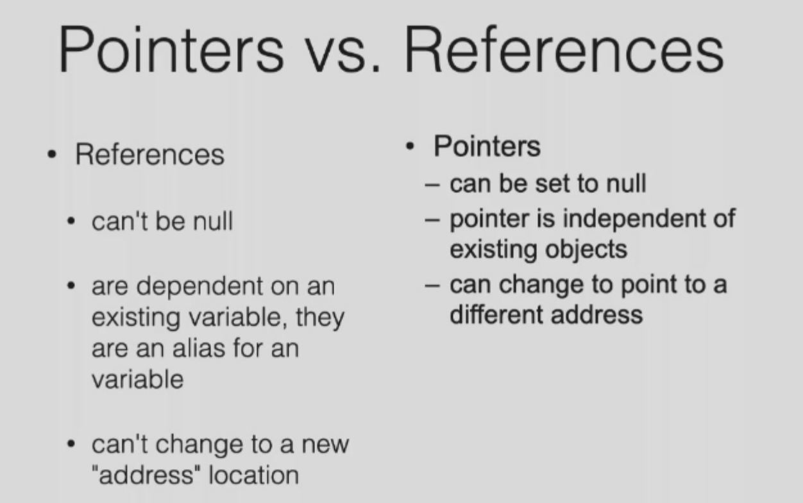

## In & Out

```C++
#include<iostream>
using namespace std;
int main()
{
  	int age;
    cin >> age >> name;
    return 0;
}
```

* `cout` 标准输出   `<<` Inserter

* `cout` 为 `cout << "Hello World"` 的结果

## String

`#include<string>`

```C++
#include<iostream>
#include<string>
using namespace std;
int main()
{
  	int age;
    string name;
    cin >> age >> name;
    cout << "Hello World!" << name << " is " << age << " today!" << endl;
    cout << name.length() << endl;
    return 0;
}
```

* 字符串结尾非`\0`

`string place("Hangzhou").`

`int a(8)`

#### Sub-string

```C
#include <iostream>
#include <string>
using namespace std;
int main() {
    string originalString = "Hello, World!";
    // Using substr to extract a substring
    int startPos = 7; // Starting position
    int length = 5;   // Length of the substring to extract
    string extractedSubstring = originalString.substr(startPos, length);
    // Displaying the result
    cout << "Original String: " << originalString << endl;
    cout << "Substring from position " << startPos << " with length " << length << ": " << extractedSubstring << endl;
    return 0;
}
```

#### Alter-string

* Assign

```C++
#include <iostream>
#include <string>
using namespace std;
int main() {
    // Original string
    string myString = "Hello, World!";

    // Example 1: Assign the value of another string
    string anotherString = "Goodbye";
    myString.assign(anotherString);
    cout << "After assign(const string& str): " << myString << endl;

    // Example 2: Assign a substring of another string
    string sourceString = "123456789";
    myString.assign(sourceString, 2, 5);  //Starting from position 2,take 5 characters
    cout << "After assign(const string& str, size_t subpos, size_t sublen): " << myString << endl;

    // Example 3: Assign the value of a C-string
    const char* cString = "C-Style String";
    myString.assign(cString);
    cout << "After assign(const char* s): " << myString << endl;

    // Example 4: Assign the first n characters of a C-string
    const char* cStringWithLength = "ABCDE";
    size_t n = 3;
    myString.assign(cStringWithLength, n);
    cout << "After assign(const char* s, size_t n): " << myString << endl;

    // Example 5: Assign a string consisting of n copies of character c
    char characterToRepeat = 'X';
    size_t numberOfCopies = 4;
    myString.assign(numberOfCopies, characterToRepeat);
    cout << "After assign(size_t n, char c): " << myString << endl;

    return 0;
}

```

```
After assign(const string& str): Goodbye
After assign(const string& str, size_t subpos, size_t sublen): 34567
After assign(const char* s): C-Style String
After assign(const char* s, size_t n): ABC
After assign(size_t n, char c): XXXX
```

> `size_t` is a data type in C++ that is commonly employed for expressing the size of objects or the count of elements. It belongs to the category of unsigned integer types and is designed to have a size large enough to handle the maximum possible size of objects on a given platform. The definition of `size_t` can be found in the standard library header `<cstddef>` (or `<stddef.h>` in C), and it is typically introduced using `typedef` or `using`.

* Insert

```C++
#include <iostream>
#include <string>

using namespace std;

int main() {
    // Original string
    string myString = "Hello, World!";

    // Example 1: Insert another string at a specific position
    string insertString = "Beautiful ";
    size_t insertPosition = 7;  // Before the 'W'
    myString.insert(insertPosition, insertString);
    cout << "After insert(size_t pos, const string& str): " << myString << endl;

    // Example 2: Insert a substring of another string at a specific position
    string sourceString = "12345";
    size_t subpos = 2;
    size_t sublen = 3;
    myString.insert(12, sourceString, subpos, sublen);  // Insert at position 12
    cout << "After insert(size_t pos, const string& str, size_t subpos, size_t sublen): " << myString << endl;

    // Example 3: Insert a C-string at a specific position
    const char* cString = "XYZ";
    myString.insert(6, cString);  // Insert at position 6
    cout << "After insert(size_t pos, const char* s): " << myString << endl;

    // Example 4: Insert the first n characters of a C-string at a specific position
    const char* cStringWithLength = "ABCDE";
    size_t n = 3;
    myString.insert(3, cStringWithLength, n);  // Insert at position 3
    cout << "After insert(size_t pos, const char* s, size_t n): " << myString << endl;

    // Example 5: Insert n copies of character c at a specific position
    char characterToInsert = '!';
    size_t numberOfCopies = 4;
    myString.insert(0, numberOfCopies, characterToInsert);  // Insert at the beginning
    cout << "After insert(size_t pos, size_t n, char c): " << myString << endl;

    return 0;
}
```

```
After insert(size_t pos, const string& str): Hello, Beautiful World!
After insert(size_t pos, const string& str, size_t subpos, size_t sublen): Hello, Beaut345iful World!
After insert(size_t pos, const char* s): Hello,XYZ Beaut345iful World!
After insert(size_t pos, const char* s, size_t n): HelABClo,XYZ Beaut345iful World!
After insert(size_t pos, size_t n, char c): !!!!HelABClo,XYZ Beaut345iful World!
```

* Erase

```C++
#include <iostream>
#include <string>
using namespace std;
int main() {
    // Original string
    string myString = "Hello, World!";
    // Example 1: Erase a portion of the string
    size_t erasePosition = 7;  // Start erasing from position 7
    size_t eraseLength = 5;    // Erase 5 characters
    myString.erase(erasePosition, eraseLength);
    cout << "After erase(size_t pos, size_t len): " << myString << endl;
    // Example 2: Erase the entire string (using default arguments)
    myString.erase();
    cout << "After erase(): " << myString << endl;
    return 0;
}
```

```
After erase(size_t pos, size_t len): Hello, !
After erase(): 
```

* Replace

```C++
#include <iostream>
#include <string>

using namespace std;

int main() {
    // Original string
    string myString = "Hello, World!";

    // Example 1: Replace a portion of the string with another string
    size_t replacePosition = 7;        // Start replacing from position 7
    size_t replaceLength = 5;           // Replace 5 characters
    string replacementString = "Universe";
    myString.replace(replacePosition, replaceLength, replacementString);
    cout << "After replace(size_t pos, size_t len, const string& str): " << myString << endl;

    // Example 2: Replace a portion of the string with a substring of another string
    string sourceString = "12345";
    size_t subpos = 2;
    size_t sublen = 3;
    myString.replace(12, 5, sourceString, subpos, sublen);  // Replace at position 12
    cout << "After replace(size_t pos, size_t len, const string& str, size_t subpos, size_t sublen): " << myString << endl;

    // Example 3: Replace a portion of the string with a C-string
    const char* cString = "XYZ";
    myString.replace(6, 5, cString);  // Replace at position 6
    cout << "After replace(size_t pos, size_t len, const char* s): " << myString << endl;

    // Example 4: Replace a portion of the string with the first n characters of a C-string
    const char* cStringWithLength = "ABCDE";
    size_t n = 3;
    myString.replace(3, 5, cStringWithLength, n);  // Replace at position 3
    cout << "After replace(size_t pos, size_t len, const char* s, size_t n): " << myString << endl;

    // Example 5: Replace a portion of the string with n copies of character c
    char characterToReplace = '!';
    size_t numberOfCopies = 4;
    myString.replace(0, 1, numberOfCopies, characterToReplace);  // Replace at the beginning
    cout << "After replace(size_t pos, size_t len, size_t n, char c): " << myString << endl;

    return 0;
}
```

```
After replace(size_t pos, size_t len, const string& str): Hello, Universe!
After replace(size_t pos, size_t len, const string& str, size_t subpos, size_t sublen): Hello, Unive345
After replace(size_t pos, size_t len, const char* s): Hello,XYZe345
After replace(size_t pos, size_t len, const char* s, size_t n): HelABCZe345
After replace(size_t pos, size_t len, size_t n, char c): !!!!elABCZe345
```

* Find

```C++
#include <iostream>
#include <string>
using namespace std;
int main() {
    // Original string
    string myString = "Hello, World!";
    // Example 1: Find the position of a substring
    string searchString = "World";
    size_t foundPosition = myString.find(searchString);
    cout << "Position of '" << searchString << "': " << foundPosition << endl;
    // Example 2: Find the position of a substring starting from a specific position
    size_t startPosition = 7;
    foundPosition = myString.find(searchString, startPosition);
    cout << "Position of '" << searchString << "' starting from position " << startPosition << ": " << foundPosition << endl;
    return 0;
}
```

```
Position of 'World': 7
Position of 'World' starting from position 7: 7
```

## Dynamic memory allocation

`new` and `delete`

```C++
new int;
new int[10];
new Stash;
delete p;
delete []p; //指针指向的是多个对象
```

```C++
// Allocate an array of integers
int* p = new int[5];
// Use the allocated memory
// Deallocate the memory using delete []
delete [] p;
```

* New -- 申请空间，同时初始化对象

* It is safe to delete a `Null`

*  `malloc`  returns `null` indicating not enough space

  `new` just alert error.

## Class

### Declaring references

```C++
char c;
char& r=c;
```

> For local or global variables , the initial value of the bending is required.
>
> In parameters lists and member varaibles , not necessary

```C++
void f(int& x);
f(y);	//initialized when function is called 
```



**Restrictions**

* No references to references.
* No pointers to references. (References to pointer is OK)
* No arrays of references.

### Intro

```C++
#include <iostream>
#include <string>
using namespace std;
typedef struct point {
    float x;
    float y;
    /*version1*/
    void print(){
        cout << x << " " << y << endl;
    }
    /*version 2*/
    void move(int dx, int dy);
} Point;
void Point::move(int dx, int dy){
    x += dx;
    y += dy;
}
/*void print(const Point *p)
{
    printf("%d %d\n", p->x, p->y); // const means that the function will not change the value of the variable 
}
void move(Point* p,int dx, int dy)
{
    p->x += dx;
    p->y += dy;
}*/
int main()
{
    Point a;
    a.x = 1;
    a.y = 2;
    a.print();
    a.move(3, 4);
}
```

```C++
// Class
#include <iostream>
#include <string>
using namespace std;
class Point{
  public:
    void init(int x,int y);
    void move(int dx,int dy);
    void print()const;
  private:
    int x;
    int y;
};
void Point::init(int ix,int iy){
  x=ix;
  y=iy;
}
void Point::move(int dx,int dy){
  x+=dx;
  y+=dy;
}
void Point::print()const{
  cout<<"("<<x<<","<<y<<")"<<endl;
}
int main()
{
    Point a;
    a.init(10,20);
    a.print();
}
```

* Take for example, the print function , **How does the function knows what exactly is x and y** ?

  ```C++
  void Point::print()const{
    cout << this << endl
    cout<<"("<<this->x<<","<<this->y<<")"<<endl;
  }
  ```

  `this`  -- `Point* this` --hidden parameter

  Another example

  ```C++
  void Point::init(int x,int y){
    this->x=x;
    this->y=y; 
  }
  ```

### Resolver

```C++
void S::f() {
    ::f(); // Would be recursive otherwise!
    ::a++; // Select the global a
    a--; // The a at class scope
}
```

### Object-Oriented

#### Constructer

* Constructer is to initialize , not to allocate memory.
* Once there is a "constructer" ,you cannot initilize by `Point c = {10,20}`

```c++
#include <iostream>
#include <string>
using namespace std;
class Point{
  public:
  	Point(int deep);  //one argument
    Point(int x,int y); //two arguments
  	Point(){x = 13,y=31;}; // no argument
    void move(int dx,int dy);
    void print()const;
  private:
    int x;
    int y;
};
Point::Point(int ix,int iy){
  x=ix;
  y=iy;
}
Point::Point(int deep){
  x=y=deep;
}
void Point::move(int dx,int dy){
  x+=dx;
  y+=dy;
}
void Point::print()const{
  cout<<"("<<x<<","<<y<<")"<<endl;
}
int main()
{
    Point a(10,20);
  	Point c(10);//Point c = 10
  	Point d;
  	d.print();
    a.print();
}
```

* A default constructer is one that can be called with no arguments
* If no default constructer is coded , the compiler will automatically implement one(in default version)

#### Destructor「析构」

* Destructor is called automatically by the compiler when theobject goes out of scope

* The order of destruction is the reverse of construction.

* Scope is delimited by curly braces`{ }`.

* Upon entering a function, space for all local variables is allocated,but constructors are not invoked until the specific constructor line is executed. 

  Similarly, when entering a `switch case` statement, space for objects is generated but not constructed, which may lead to issues during destruction.

```c++
void f(int i){
  if(i<10){
    goto jump1; //Error: goto bypasses init
  }
  X x1;	//Constructor
  jump1:
  	switch(i){
      case 1:
        X x2;//Constructor
      case 2 : //Error: case bypasses init
        X x3;//Constructor
        break;
    }
}
```

* Memory for x1(x2) is allocated , but not initialized , so **destruction** will fail

#### Definitions of a class

- In C++, separated `.h` and `.cpp` files are used to define one class.
- Class declaration and prototypes in that class are in the header file ( `.h` ).
- All the bodies of these functions are in the source file (`.cpp`)

* Standard header file sturcture
  ```C++
  #ifnedf HEADER_FLAG
  #define HEADER_FLAG
  //Type declaration here...
  #endif
  ```
`#include` is to insert the included file into the `.cpp` file at where the `#include` statement is.
- `#include "xx.h"` : search in the *current directory firstly*, then the directories
  declared somewhere
- `#include <xx.h>` : search in the specified directories
- `#include <xx>` : same as `#include <xx.h>`
### Example
`NumberDisplay.h`
```C++
#ifndef _NUMBER_DISPLAY_HEAD_
#define _NUMBER_DISPLAY_HEAD_
#include<string>
class NumberDisplay{
  private:
    int limit;
    int value;
  public:
  NumberDisplay(int limit);
  int increase();
  std::string toString();
}
#endif
```
`NumberDisplay.cpp`
```C++
#include "NumberDisplay.h"
#include<string>
#include<iostream>

NumberDisplay::NumberDisplay(int limit){
  value = 0;
  this->limit = limit;
}
/**
 * @return 1 for turn over
*/
int NumberDisplay::increase():{
  value++;
  if(value == limit){
    value = 0;
    return 1;
  }
  return 0;
}
std::string NumberDisplay::toString(){
  if(value<10){
    return "0"+value;
  }
  else{
    return ""+value;
  }
}
#ifdef _TEST_ND_
#include<iostream>
using namespace std;
int main(){
  NumberDisplay d(10);
  for(int i=9;i<20;i++){
    d.increase();
    cout << d.tostring()<<endl;  
  }

}
#endif
```
`clock.h`
```C++
#ifndef _CLOCK_HEAD_
#define _CLOCK_HEAD_
#include "NumberDisplay.h"
class Clock{
  private:
    NumberDisplay hour;
    NumberDisplay minute;
  public:
     Clock();
     void dida();
}
```
`clock.cpp`
```C++
#include "clock.h"
#include<iostream>
using namespace std;
Clock::Clock():
  hour(24),minute(60) //initialization list
{

}
void Clock::dida(){
  if(minute.increase()){
    hour.increase
  }
  cout << hour.toString();
  cout << ":";
  cout << minute.toString();
  cout << endl;
}
```
* What if ?
`clock.h`
```C++
#ifndef _CLOCK_HEAD_
#define _CLOCK_HEAD_
//#include"NumberDisplay.h"
class NumberDisplay
class Clock{
  private:
    NumberDisplay *hour;
    NumberDisplay *minute;
  public:
     Clock();
     void dida();
}
```