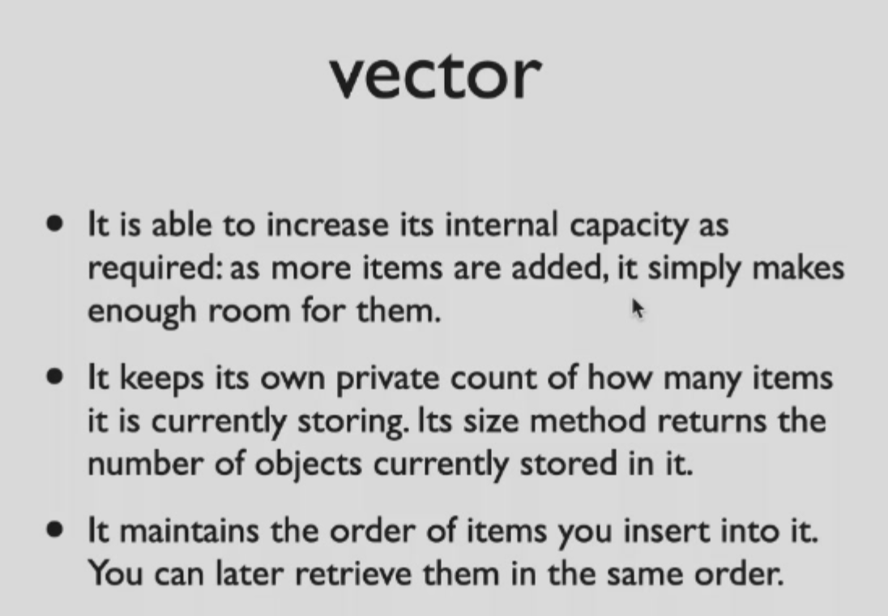
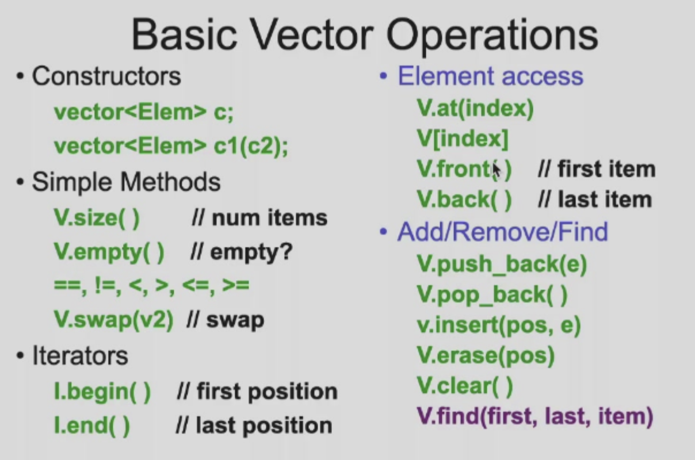
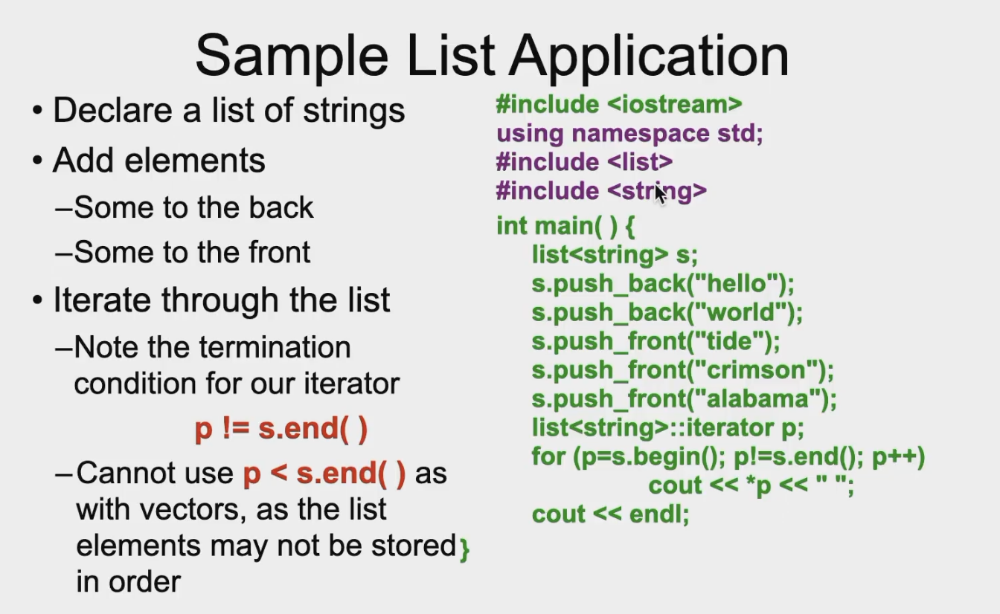
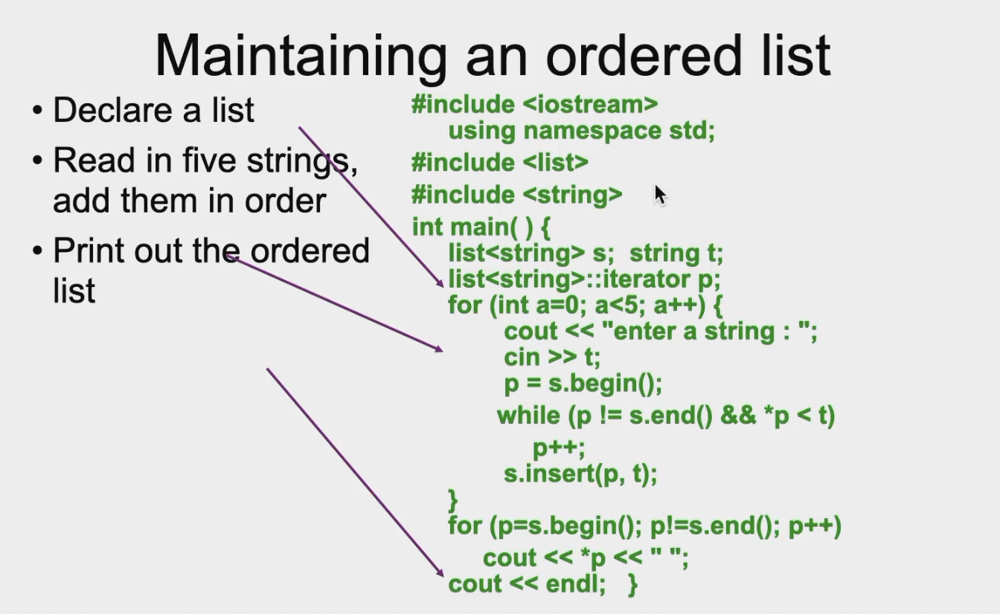

## Container	

Collection objects are objects that can store an arbitrary number of other objects.

### Vector

#### Example.1

```C++
#include <iostream>
using namespace std;
#include<vector>
int main(){
  vector<int> x;
  for (int a=0;a<1000;a++){
    x.push_back(a);
  }
  vector<int>::iterator p;
  for(p=x.begin();p<x.end();p++)
    	cout << *p << " ";
  return 0; 
}
```

```C++
int main(){
  vector<int> x;
  for(int a=0;a<100;a++){
    x.push_back(a);
  }
  cout << x.size()<<endl
    vector<int>::iterator p;
  for(auto k : x){
    cout << k << " ";
  }
  cout << endl;
  return x;
}
```

* iterator : class inside vector

* generic classes `vector<string> notes;`

  Have to specify two types





* Insert & erase -- use iterator

#### Example.2

```C++
int main(){
  vector<Student> ss //Student is a class
  Student s(1);
  ss.push_back(s);
  s.x = 10; // does not change ss[0]
}
```

```C++
int main(){
  vector<Student*> ss 
  Student s(1);
  ss.push_back(&s);
  s.x = 10; //will change(obviously)
}
```

#### Operations

* 对于，比如`<vector>` 可以向任意下标赋值，不会报错，但是这不会改变`.size() .back()`等 ，所以实际上我们要用`push_back()`等去insert

### List



* Dif : `p!=s.end()`



### Maps

