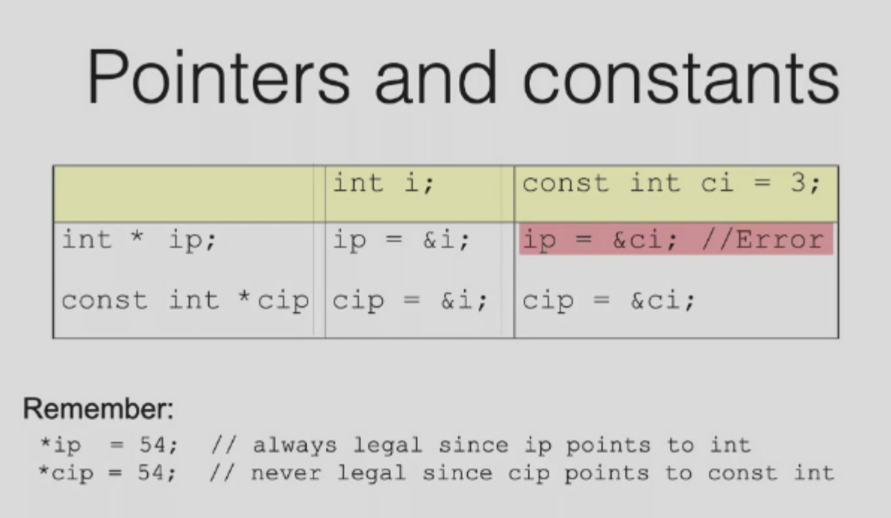

## Container	

Collection objects are objects that can store an arbitrary number of other objects.

### Vector

#### Example.1

```C++
#include <iostream>
using namespace std;
#include<vector>
int main(){
  vector<int> x;
  for (int a=0;a<1000;a++){
    x.push_back(a);
  }
  vector<int>::iterator p;
  for(p=x.begin();p<x.end();p++)
    	cout << *p << " ";
  return 0; 
}
```

```C++
int main(){
  vector<int> x;
  for(int a=0;a<100;a++){
    x.push_back(a);
  }
  cout << x.size()<<endl
    vector<int>::iterator p;
  for(auto k : x){
    cout << k << " ";
  }
  cout << endl;
  return x;
}
```

* iterator : class inside vector

* generic classes `vector<string> notes;`

  Have to specify two types


* Insert & erase -- use iterator

#### Example.2

```C++
int main(){
  vector<Student> ss //Student is a class
  Student s(1);
  ss.push_back(s);
  s.x = 10; // does not change ss[0]
}
```

```C++
int main(){
  vector<Student*> ss 
  Student s(1);
  ss.push_back(&s);
  s.x = 10; //will change(obviously)
}
```

#### Operations

* 对于，比如`<vector>` 可以向任意下标赋值，不会报错，但是这不会改变`.size() .back()`等 ，所以实际上我们要用`push_back()`等去insert

### List


* Dif : `p!=s.end()`

```C++
#include <iostream>
using namespace std;
#include<list>
list <int> L;
for(int i=0;i<5;i++){
  L.push_back(i)
}
L.erase(++L.begin())
copy(L.begin(),L.end(),ostream_iterator<int>(cout,","));
```


> 通常用vector ： 更节约空间,除非需要大量增加，删除

### Maps

> Hash

```C++
#include <map>
map<long,int> root;
root[4] = 2;
root[1000000] = 1000;
long l;
cin >> l;
if (root.count(l))
    cout<<root[l]
else cout<<“Not perfect square”;
```

### Pitfalls

```C++
if ( my_list.count() == 0 ) { ... } // Slow
if ( my_list.empty() ) {...} // Fast
```

* Erase for Iterator !

  ```C++
  list<int> L;
  list<int>::iterator li;
  li = L.begin();
  L.erase(li);
  ++li; // WRONG
  // Use return value of erase to advance
  li = L.erase(li); // RIGHT
  ```

* Inadvertently inserting into `map<>`

  ```C++
  if (foo["bob"]==1)
  //silently created entry “bob”
  //Solutions: Use count() to check for a key without creating a new entry. if ( foo.count("bob") )
  ```

## Function

#### Function Overloading

```C++
void print(char * str, int width); // #1 
void print(double d, int width); // #2 
void print(long l, int width); // #3 
void print(int i, int width); // #4 
void print(char *str); // #5 
print("Pancakes", 15); 
print("Syrup"); 
print(1999.0, 10); 
print(1999, 12); 
print(1999L, 15);
```

* Can go wrong

#### Default arguments

A default argument is a value given in the declaration that the compiler automatically inserts if you donʼt provide a value in the function call.

```C++
int harpo(int n, int m = 4, int j = 5);
int chico(int n, int m = 6, int j); // illegal
//To define a function with an argument list, defaults must be added from right to left.
int groucho(int k = 1, int m = 2, int n = 3);
beeps = harpo(2);
beeps = harpo(1,8);
beeps = harpo(8,7,6);
```

* **Default arguments** Cannot write in the **def part**,  but the **函数声明！** part.

  ```C++
  void f(int i, int j = 10);
  int main()
  { ...
  }
  void f(int i, int j){
      ...
  }
  // USE IN THIS WAY
  ```

#### Friend [Access Control]

```C++
struct X{
  private:
  	int x;
  public :
  	void initialize();
  	friend void g(X*,int);
  	friend void Y::f(X*);
  	friend struct Z;
  	friend void h();
};
```

### Overhead for a function call

#### Inline Functions

* An inline function is expanded in place , like a preprocessor macro , so the overhead of the function call is eliminated.
* Def for inline is "Actually 声明"
* 当调用函数时，编译器把函数替换到实际位置
* 整个inline函数放入头文件
* 如果放在cpp里，那么只能local使用

```C++
inline int f(int i) {
    return i*2;
}
main() {
    int a=4;
    int b = f(a);   // become b = a * 2;
}
```

```C++
// .h File!!!
class Point{
  ...
  public:
  	inline void print(string & msg = "");
};
inline void Point::print(string & msg = ""){
  ...
}
```

* While 可执行程序size 变大 tradoff for effectiveness
* Better for 宏macro  ：check
* Compiler will automatically do inline or undo inline

#### Tradeoff

* 将成员函数的定义写在声明内，就会自动 inline. 也可以在 body 的地方加上 inline.
  ```C++
  class Cup {
      int color;
  public:
      int getColor() { return color; }
      void setColor(int color) {
          this->color = color;
      }
  };
  ```

### Const

`const int a = 6`  -- `not changable variable`

* value must be initialized. `const int bufsize = 1024;`
* Unless you make an explicit extern declaration , like `extern const int bufsize;`

* **Compiler** to make sure that it will not be changed.

  > Connot be optimized : （remain variables）
  >
  > * Global variables.
  > * 函数参数
  > * 成员变量

```C++
const int x = 123;  // const, literal
x = 27;     // illegal!
x++;    // illegal!
int y = x;  // ok, copy const to non-const
y = x;  // ok, same thing
const int z = y;    // ok, const is safer
```

```C++
const int i[] = { 1, 2, 3, 4 };
float f[i[3]]; // Illegal(in C++98)
struct S { int i, j; };
const S s[] = { { 1, 2 }, { 3, 4 } };
double d[s[1].j]; // Illegal
```

* It is possible to use `const` for aggregates, but storage will be allocated. In these situations,`const` means "a piece of storage that cannot be changed." 

  However,the value **cannot** be used at compile time because the compiler is not required to know the contents of the storage at compile time.

### Pointer

```C++
char * const q = "abc"; // q is const
*q = 'c'; // ERROR
// char a[] = "abc"; *q = 'c' is ok.
q++; // ERROR
const char *p = "ABCD"; // (*p) is a const char
*p = 'b'; // ERROR! (*p) is the const
```

* Quiz

  ```C++
  string p1("Fred");
  const string* p = &p1; // p1 cannot be changed through p.
  string const* p = &p1; // like the first one.
  string *const p = &p1; // p cannot be changed.only point to p1.
  ```



#### String Literals

```C++
char *s = "Hello"; //can be compile but bus error because actually const char *s
// Add const compile will not pass.
s[0] = 'K';
printf("%s\n",s);
// Write in an array
char s[] = "Hello, world!";
```

#### Const Object

```C++
const Currency the_raise(42, 38);
```

Compiler Will ERROR:

* Public member variable
* its member function will change the variable

**Thus,when we write all  the member functions,SPECIFY CONST! For Compiler to know if it will change the value of member variables!**

```C++
int Date::set_day(int d) {
    //...error check d here...
    day = d; // ok, non-const so can modify
}
int Date::get_day() const {
    day++; // ERROR modifies data member
    set_day(12); // ERROR calls non-const member
    return day; // ok
}
```

* `const` 定义的对象，只能调用带 `const` 属性的成员函数。
* `const` 必须保证成员变量有初始值！默认构造函数.

* Overload (const can distinguish the two functions.)，会根据对象调用时是否 `const` 来决定调用哪个成员函数

  事实上 `const` 后的成员函数参数，相当于 `const A *this`, 而不加 const 就只是 `A *this`.

  `const` 作用在隐藏参数 `A* this`

  ```C++
  void f() const;
  void f();
  ```

* member of class is **constant** : must be initialized by the constructor(const) or the C++11 way

### Static

* 静态本地变量实际上是全局变量，被存储在静态内存中

  只在第一次访问**[只在第一次被执行到的时候]**时被构造

  出现在全局变量/函数前，表示访问限制，只有当前文件可以访问

  在程序结束后析构

* Global Objects

  全局变量的构造发生在 `main()` 之前，在 `main()` 或者 `exit()` 之后析构
  但是不同编译单元的全局变量，如果存在依赖关系，但这是无法保证的

  **最好不在C++使用global variable**

* 静态成员变量和静态本地变量是一样的

  访问受限，限于类内部，实际上是全局变量。

  **在这个类内所有的对象都维持相同的值，对象 A 修改了那么对象 B 的这个变量的值也会改变**
  
* **静态成员函数**没有 this, 不能调用**非静态成员变量**，也不能访问非静态函数

  可以在没有**创建类的对象**的时候就能调用静态成员函数

```C++
#ifndef _STAT_MEM_
#define _STAT_MEM_

class StatMem{
public:
  int getHeight(){return m_h;}
  void setHeight(int i){m_h = i}
  int getWeight(){return m_w;}
  void setWeight(int i){m_w = i;}
  
  static int m_h;
  int m_w;
}
#endif 
```

* 一个静态的全局变量，必须在头文件对应的.cpp中重新

  ```C++
  #include"StatMem.h"
  int StatMem::m_h
  ```

​	且不能再加`static`

### Namespace

