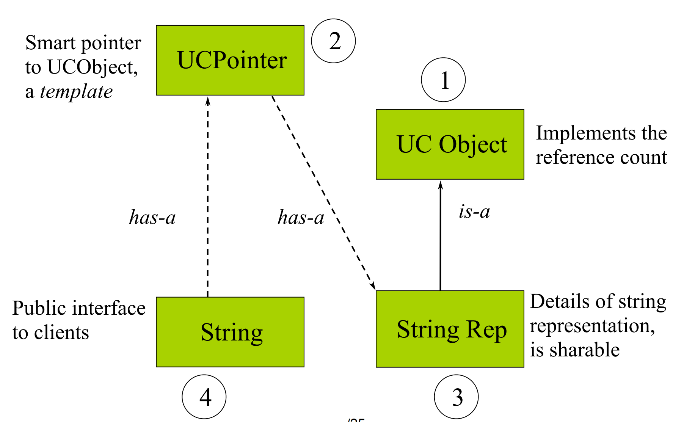

## Smart Pointers
- Smart pointers are objects that store pointers to dynamically allocated (heap) memory.
### Example
`String abc("abcdefg");`
* 要做的是String类内部存储的自动回收的指针，而不是String类的指针。
* Whenever a pointer is assigned: p = q; Have to do the following
```c++
p->decrement(); // p's count will decrease 
p = q; 
q->increment(); // q/p's count will increase
```


#### UCObject
* delete this; 是合法的，但之后不应该再使用 this 指针(之后不涉及成员变量)
```c++
#ifndef UCObject_H_
#define UCObject_H_
#include <assert.h> 
class UCObject { 
public: 
    UCObject() : m_refCount(0){ } 
    /**
     * Only destruct when refCount is 0
     * assert, 因为不是对象的问题，是外部的问题。
     */
    virtual ~UCObject() { assert(m_refCount == 0);};  
    /**
     * 不拷贝 refcount 
     */ 
    UCObject(const UCObject&) : m_refCount(0) { }      
    void incr() { m_refCount++; } 
    void decr(); 
    int references() { return m_refCount; } 
private: 
    int m_refCount; 
};
inline void UCObject::decr() { 
    m_refCount -= 1; 
    if (m_refCount == 0) { 
    delete this;  // goto UCObject::~UCObject()
    } 
} 
#endif
```
#### UCPointer
* 隐含了 T 必须继承自 UCObject, 这样才有 incr 的成员函数
* 这里只要构造了对象，就会调用 increment 函数
* 拷贝构造后要对计数加一
* 赋值我们要先检查二者指向的是不是同一个对象
```c++
#ifndef UCPointer_H_
#define UCPointer_H_
template <class T> 
class UCPointer { 
private: 
    T* m_pObj; 
    void increment() { if (m_pObj) m_pObj->incr(); } 
    void decrement() { if (m_pObj) m_pObj->decr(); } 
public: 
    UCPointer(T* r = 0): m_pObj(r) { increment();} 
    ~UCPointer() { decrement(); }; 
    UCPointer(const UCPointer<T> & p); 
    UCPointer& operator=(const UCPointer<T> &); 
    T* operator->() const; 
    T& operator*() const { return *m_pObj; }; 
}
template <class T> 
UCPointer<T>::UCPointer(const UCPointer<T> & p){ 
    m_pObj = p.m_pObj; 
    increment(); 
}
template <class T> 
UCPointer<T>& 
UCPointer<T>::operator=(const UCPointer<T>& p){ 
    if (m_pObj != p.m_pObj) { 
    decrement(); 
    m_pObj = p.m_pObj; 
    increment(); 
} 
    return *this; 
}
template<class T> 
T* UCPointer<T>::operator->() const { 
    return m_pObj; 
}
template <class T>
T& UCPointer<T>::operator*() const { 
    return *m_pObj; 
}
#endif
```
```c++
Ellipse elly(200F, 300F); 
UCPointer<Shape> p(&elly); 
p->render(); // calls Ellipse::render() on elly!
```
```p->render();``` 会调用 ```m_pObj->render()``` 
* Actually p has no render function, but the class m_pObj points to has render function.

#### StringRep
* 补: C++ 内字符串不是通过 char 的方式实现(没有 \0), 一个字符串和一个长度变量。
* 拷贝构造时会调用 UCObject 的拷贝构造。
* UCObject的拷贝构造永远是**制造新的东西**，是指向UCObject的拷贝构造
```c++
abc = "Hello World"
```
```c++
#ifndef StringRep_H_
#define StringRep_H_
#include <cstring.h>
#include "UCObject.h" 
class StringRep : public UCObject { 
public: 
    StringRep(const char *); 
    ~StringRep(); 
    StringRep(const StringRep&); 
    int length() const{ return strlen(m_pChars); } 
    int equal(const StringRep&) const; 
private: 
    char *m_pChars; 
    // reference semantics -- no assignment op! 
    // 私有，外界不能做 StringRep 的赋值
    void operator=(const StringRep&) {}
};
/**
 * 1. 传入的字符串为空，那么只有一个 \0 
 */
StringRep::StringRep(const char *s) { 
    if (s) { 
    int len = strlen(s) + 1; 
    m_pChars = new char[len]; 
    strcpy(m_pChars , s); 
    } 
    else { 
    m_pChars = new char[1]; 
    *m_pChars = '\0'; 
    } 
} 
StringRep::~StringRep() { 
    delete [] m_pChars ; 
}
StringRep::StringRep(const StringRep& sr) { 
    int len = sr.length(); 
    m_pChars = new char[len + 1]; 
    strcpy(m_pChars , sr.m_pChars ); 
} 
int StringRep::equal(const StringRep& sp) const { 
    return (strcmp(m_pChars, sp.m_pChars) == 0); 
}
#endif
```
#### String
```c++
class String { 
public: 
    String(const char *); 
    ~String(); 
    String(const String&); 
    String& operator=(const String&); 
    int operator==(const String&) const; 
    String operator+(const String&) const; 
    int length() const; 
    operator const char*() const; 
private: 
    UCPointer<StringRep> m_rep; 
};
String::String(const char *s) : m_rep(0) { 
    m_rep = new StringRep(s); 
} 
String::~String() {} 
// Again, note constructor for rep in list. 
String::String(const String& s) : m_rep(s.m_rep) {  
    // 做 UCPointer<StringRep> 的拷贝构造
} 
String& String::operator=(const String& s) { 
    m_rep = s.m_rep; // let smart pointer do work! 
    return *this; 
}
int String::operator==(const String& s) const { 
    // overloaded -> forwards to StringRep 
    return m_rep->equal(*s.m_rep); // smart ptr * 
} 
int String::length() const { 
    return m_rep->length(); 
}
```
* 这里 m_rep(0) 实际上是用 0 去做 UCP 的构造(也可以不写，因为默认 0). 
* new 返回的是 StringRep *, 而左边是 UCP<StringRep>, 这里赋值时就会把 StringRep * 转化为 UCP<StringRep>, 再赋值

#### Main
```c++
#include<iostream>
using namespace std;
#include "String.h"
int main(){
    cout << "Hello\n";
    /**
     * 1. Construct a StringRep object with "Hello"
     * 2. Construct a UCP<StringRep> object with the StringRep object
     * 3. overlaoded '=' operator for UCP<StringRep> object
     * (m_rep = new StringRep("Hello");)
     * 4. Destructor for UCP<StringRep> object
     */
    String a = "Hello";
    /**
     * Copy constructor for String object
     * 1.String::String(const String& s) : m_rep(s.m_rep) { //做 UCPointer<StringRep> 的拷贝构造} 
     * 2.Copy constructor for UCP<StringRep> object
     * (1) m_pObj = p.m_pObj; 
     * (2)increment(); 
     */
    String b=a;
    /**
     * Overloaded '=' operator for String object
     * 1.Overloaded '=' operator for UCP<StringRep> object
     * So actually nothing beacuse b and a are pointing to the same object
     */
    b = a;
    b = 'bye';
    /**
     * Overloaded '=' operator for String object
     * 1.Overloaded '=' operator for UCP<StringRep> object
     */
    b = a;
    cout(a==b)<<endl;
}
```

* UCPointer maintains reference counts
* UCObject hides the details of the count
* String is very clean
* StringRep deals only with string storage and manipulation
* UCObject and UCPointer are reusable
* 代码是可复用的。
* Objects with cycles of UCPointer will never be deleted
* UCP 指向的对象永远不被删除。