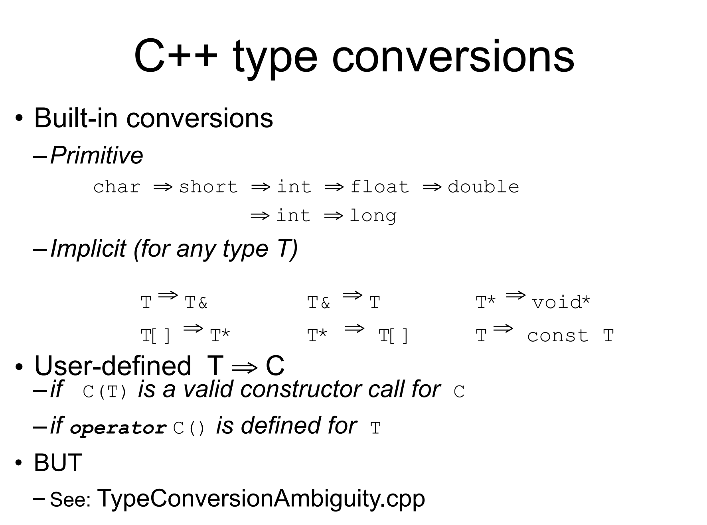

## Copy Ctor
```c++
void f(){
    Stash students();
}
```

* `Stash students();` is a function prototype, while `students` is a function that returns a `Stash` object.

```c++
#include<iostream>
using namespace std;
class A{
    int i;
public:
    A(){cout<<"A()"<<endl;}
    virtual ~A(){cout<<"~A()"<<endl;}
    int getVal(){return i;}
    void setVal(int i){this->i=i;}
};
void f(A aa){
    cout << "aa: "<<&aa << endl;
    cout << aa.getVal() << endl;
}
int main(){
    A a;
    a.setVal(10);
    cout << "a: "<<&a << endl;
    cout << "-------------------\n";
    f(a);
    cout << "-------------------\n";

    return 0;
}
```
```
A()
a: 0x16dc9f088
-------------------
aa: 0x16dc9f068
10
~A()
-------------------
~A()
```

* Only one time of constructor is called.
```c++
#include<iostream>
using namespace std;
class A{
    int i;
public:
    A(int i){cout<<i<<endl;}
    virtual ~A(){cout<<"~A()"<<endl;}
    int getVal(){return i;}
    void setVal(int i){this->i=i;}
};
void f(A aa){
    cout << "aa: "<<&aa << endl;
    cout << aa.getVal() << endl;
}
int main(){
    A a(10);
    a.setVal(10);
    cout << "a: "<<&a << endl;
    cout << "-------------------\n";
    f(a);
    cout << "-------------------\n";

    return 0;
}
```

* Without default constructor, still one time of constructor is called.
```c++
#include<iostream>
using namespace std;
class A{
    int i;
public:
    A(int i){cout<<i<<endl;}
    A(const A& r):i(r.i){cout<<"A(const A&)"<<endl;}
    virtual ~A(){cout<<"~A()"<<endl;}
    int getVal(){return i;}
    void setVal(int i){this->i=i;}
};
void f(A aa){
    cout << "aa: "<<&aa << endl;
    cout << aa.getVal() << endl;
}
int main(){
    A a(10);
    a.setVal(10);
    cout << "a: "<<&a << endl;
    cout << "-------------------\n";
    f(a);
    cout << "-------------------\n";

    return 0;
}
```
```
10
a: 0x16b763088
-------------------
A(const A&)
aa: 0x16b763068
10
~A()
-------------------
~A()
```

* in f(), `A(const A&)` is called.
* `A(const A&)` is a copy constructor.

### When is copy ctor called?
* When an object is constructed.
```c++
Person baby_a("Fred");
// these use the copy ctor
Person baby_b = baby_a; // not an assignment
Person baby_c( baby_a ); // not an assignment
```
* Two implicit cases:
    * When an object is passed by value.[引用或指针不会调用copy ctor]
    * When an object is returned by value.
#### Cases when we want to define our own copy ctor
* When we want to do a partial copy.
* Pointer!!!
> 如果有成员变量是指针，会和原来对象一样指向同一块内存!
> 如果有一个对象被析构，那么这块内存就被 delete, 这就变成了无效内存!

#### Tips
* In general, be explicit
* Create your own copy ctor -- don't rely on the default
* If you don't need one declare a private copy ctor:私有的拷贝构造函数使得对象不能被拷贝构造
  * prevents creation of a default copy constructor
  * generates a compiler error if try to pass-by-value - don't need a defintion

```c++
#include<iostream>
using namespace std;
class A{
    int i;
    string s;
public:
    A(int i){cout<<i<<endl;}
    A(const A& r):i(r.i),s(r.s){cout<<"A(const A&)"<<endl;}
    virtual ~A(){cout<<"~A()"<<endl;}
    int getVal(){return i;}
    void setVal(int i){this->i=i;}
};
A f(A aa){
    A bb(20);
    cout << "aa: "<<&aa << endl;
    cout << aa.getVal() << endl;
    return bb;
}
int main(){
    A a(10);
    a.setVal(10);
    cout << "a: "<<&a << endl;
    cout << "-------------------\n";
    A d = f(a);
    cout << "-------------------\n";
    d.setVal(30);
    return 0;
}
```
```
10
a: 0x16dd97070
-------------------
A(const A&)
20
aa: 0x16dd97010
10
~A()
-------------------
~A()
~A()
```

* 编译器在return处优化了，也就是直接把bb放在要返回的地方，而不是在函数内部创建一个临时对象，然后再拷贝到返回的地方


* C++ 会做拷贝构造，如果类中全部都是对象，那么是ok的，但是如果有指针：
  * 那么编译器会做浅拷贝，也就是拷贝指针，而不是指针指向的内容，不同指针指向同一块内存，一个析构了，另一个就是野指针了。
#### types of function parameters and return value
**way in**

* a new object is to be created in f `void f(Student i)`;
* **better with const** if no intend to modify the object `void f(Student *p);`
* **better with const** if no intend to modify the object `void f(Student& i);`


**way out**

* a new object is to be created at returning `Student f()`;
* what should it points to?  `Student* f()`;
* what should it refers to?  `Student& f()`;

```c++
char *foo() {
    char *p;    
    p = new char[10];
    strcpy(p, "something");
    return p;
}
void bar() {
    char *p = foo();
    printf("%s", p);
    delete p;
}
```
* p 本身是本地变量，但指向的地方是**全局的空间**
* 要不要做`delete p`?
  1. 如果不做，出了函数就找不到这个空间了，内存泄漏:如果一个一直在运行的程序中有内存泄漏，那么这个程序会越来越慢，因为内存越来越少！
  2. 那我怎么知道我应该delete呢？如果是new出来的，那么就要delete，如果是指向全局的，那么就不用delete
* 也就是说这样传出指针不是一个好的方法，因为不知道是不是要delete！
#### Tips:
* Pass in an object if you want to store it : 函数要存一个对象，**不用用指针或者引用传入**，而是直接传入
  * 比如做了一个类要保存一个树，如果传入的是指针，那么每次都是同一个地址!
```c++
while(){
    Person p;
    p.read();
    s.put(&p);
}
```
* Pass in a **const** pointer or reference if you want to **get the values**
* Pass in a pointer or reference if you want **to do something to it**
* Pass out an object if you create it in the function:如果创建了新的对象，就要传对象出去(**新的对象是本地变量**)
* Pass out pointer or reference of the passed in only : 传出去的指针/引用只能是传入的指针/引用
* **Never new something and return the pointer!!!!**
  * 在哪里 new 就在哪里 delete!!
  * (类内是可以的，比如在构造的 new 在析构的时候 delete)

**C++对本地变量会自动回收，但是对new出来的不会自动回收，所以写的时候尽量多用本地变量**
**返回对象的话，要不拷贝构造，要不移动构造，总会被回收，不用担心内存泄漏**
## Move Ctor
### Left Value and Right Value
* 只能出现在赋值号右边的叫右值，可以出现在赋值号左边的叫左值
* 左值都是右值
* 可以简单地认为能出现在赋值号左边的都是左值：
    - 变量本身、引用
    - `*` 、 `[]` 运算的结果
- 只能出现在赋值号右边的都是右值
  - 字⾯量
  - 表达式
* 引用只能接受左值!!—>引用是左值的别名
* 调用函数时的传参**相当于参数变量在调用时的初始化**
* `&&` 成为右值引用
```c++
int x=20;               // 左值
int&& rx = x * 2;       // x*2的结果是一个右值，rx延长其⽣命周期
int y = rx + 2;         // 因此你可以重用它:42
rx = 100;               // 一旦你初始化一个右值引用变量，该变量就成为了一个左值，可以被赋值
int&& rrx1 = x;         // 非法:右值引用无法被左值初始化
const int&& rrx2 = x;   // 非法:右值引用无法被左值初始化
```
* `x` 不存在了，右值引用依然可以使用
* 右值引用本身是个左值!
```c++
int x = 10;
int &&a = x + 2;
int y = a + 2;
cout << y << endl;
x = 5;
cout << y << endl;
a = 40;
cout << y << endl;
cout << a << endl;
int &&b = x;        // ERR: 右值引用不能绑左值（为了区分
int &&b = x+0;      // ok
```
* `c++11` :接受const左值的函数可以接受右值
```c++
void fun(int &lref) {
    cout << "l-value" << endl;
}
void fun(int &&rref) {
    cout << "r-value" << endl;
}
int main() {
    int x = 10;
    fun(x);     // l value
    fun(10);    // r value
}
```
### Move Ctor

* Move ctor is a special constructor that takes an **rvalue reference** to an object of the same class and moves the resource owned by the rvalue reference to the object being constructed.

* 如果有一个对象，里面有指针指向一块内存
  * 拷贝构造就是重新申请一块内存并将原内存的数据拷贝过来
  * 移动构造就是让新对象的指针指向内存，但原指针不再指向这个内存`(nullptr)`.

```c++
DynamicArray(DynamicArray&& rhs) : m_size{rhs.m_size}, m_array{rhs.m_array}
{
    rhs.m_size = 0;
    rhs.m_array = nullptr;
    cout << "Move constructor: dynamic array is moved!\n";
}
```

* Move ctor is called when an object is constructed from an rvalue,avoid unnecessary deep copy.

#### When is move ctor called?
* 类内**有指针**，而且**对象会在函数内传进传出** (原来的不要了)
* 如果类内没有指针，根本不会有“移动“一说
* `f(P p);` : 传入一个右值，会调用右值引用的构造函数
  * `f(P &&p);` : 如果提供了移动构造，可以传一个右值
  * `f(const P &p);` 
* 返回右值:
  * 可以传出去`f`内的本地变量
  * 因为一般来说，我们不能传出去本地变量，但是右值是可以的，只能传出去传进来的东西
#### `std::move`
```c++
vector<int> v1{1, 2, 3, 4};
vector<int> v2 = v1;
vector<int> v3 = std::move(v1);// 此时调用用移动构造函数
```

* 此时调用复制构造函数，v2是v1的副本 
* 通过 `std::move` 将 v1 转化为右值，从⽽激发 v3 的移动构造函数，实现移动语义
#### c++11 new features
##### 对象初始化

```c++
//小括号初始化
string str("hello");
//等号初始化
string str = "hello";
//大括号初始化
struct Studnet{
    char *name;
    int age;
};
Studnet s = {"dablelv", 18};//Plain of Data类型对象
Studnet sArr[] = {{"dablelv", 18}, {"tommy", 19}}; //POD数组
```
##### 列表初始化
```c++
class Test{
    int a;
    int b;
    public:
    Test(int i, int j);
};
Test t{0, 0}; //C++11 only，相当于 Test t(0,0);
Test *pT = new Test{1, 2}; //C++11 only，相当于 Test* pT=new Test(1,2);
int *a = new int[3]{1, 2, 0}; //C++11 only
```
### Delegating Ctor
```c++
class class_c{
public:
    int max;
    int min;
    int middle;
    class c(int my_max){
        max = my_max>0?my_max:10;
    }
    class_c(int my_max, int my_min):class_c(my_max){
        min = my_min>0&&my_min<max?my_min:1;
    }
    class_c(int my_max, int my_min, int my_middle):class_c(my_max, my_min){
        middle = my_middle>min&&my_middle<max?my_middle:(min+max)/2;
    }
};
int main(){
    class_c c(10, 5, 7);
}

```
## Overloaded Operators
* Types that cannot be overloaded:
    * `::` `.` `*` `?` `:`
    * `sizeof` `typeid`
    * `new` `delete` `new[]` `delete[]`
    * `static_cast` `dynamic_cast` `const_cast` `reinterpret_cast`

* Only existing operators can be overloaded.
* Overloaded operators must Preserve number of operands and Preserve precedence
* Operators must be overloaded on a class or enumeration type

### How to overload operators
* keyword `operator` followed by the operator to be overloaded
####  As a member function
```c++
class A {
public:
    A(int ii):i(ii){}
    int get() {return i;}
    /* 返回的一定是 A 的一个新的对象 */
    const A operator+(const A &that) const {
        A c(this->i+that.i);        /* 这里可以访问 that. 私有是针对类的，不是针对对象的。 */
        return c;
    }
    //!返回的应该是右值，所以const！
    private:
        int i;
}
int main() {
    A a = 6;
    A b = 7;
    A c = a + b;    /* a + 9 也是可以的；但 9 + a 不行 */
    cout << c.get() << endl;    /* 输出 13 */
}
``` 

* Why use `const`?
    * `const` member functions can be called on `const` objects
    * `const` objects can only call `const` member functions
    * `const` member functions can't change the object
    * `const` member functions can't call non-const member functions
  * And we don't want to change the object in `operator+`

```c++
#include<iostream>
using namespace std;
class A{
    int i;
public:
    A(int i):i(i){cout<<"A()"<<i<<endl;}
    A(const A& r):i(r.i){cout<<"A(const A&)"<<endl;}
    virtual ~A(){cout<<"~A()"<<endl;}
    int getVal(){return i;}
    void setVal(int i){this->i=i;}
    A operator+(const A& r){
        cout << "operator+" << endl;
        A a(this->i+r.i);
        return a;
    }
};
int main(){
    A a(10);
    A b(20);
    A c = a+b;
}
/*
A()10
A()20
operator+
A()30
~A()
~A()
~A()
 */
```

* `A c = a+b;` is equivalent to `A c = a.operator+(b);`
* `A c = a+3;` is equivalent to `A c = a.operator+(3);`
* And when using '3' as the second operand：
  we construct a temporary object of A(3) and pass it to the operator+ function.
```c++
#include<iostream>
using namespace std;
class A{
    int i;
public:
    A(int i):i(i){cout<<"A()"<<i<<endl;}
    A(const A& r):i(r.i){cout<<"A(const A&)"<<endl;}
    virtual ~A(){cout<<"~A()"<<endl;}
    int getVal(){return i;}
    void setVal(int i){this->i=i;}
    A operator+(const A& r){
        cout << "operator+" << endl;
        A a(this->i+r.i);
        return a;
    }
};
int main(){
    A a(10);
    A b(20);
    A c = a+3;
}
/*
A()10
A()20
A()3
operator+
A()13
~A()
~A()
~A()
~A()
*/
```

* However, if we want to use `3+a` , member function can't be used!!!

#### As a global function
* Explicit **First Argument** 
* Developer does not need special access to the classes
* May need to be a `friend` of the class
* Type conversinos performed on **BOTH arguments**
```c++
#include<iostream>
using namespace std;
class A{
    int i;
public:
    A(int i):i(i){cout<<"A()"<<i<<endl;}
    A(const A& r):i(r.i){cout<<"A(const A&)"<<endl;}
    virtual ~A(){cout<<"~A()"<<endl;}
    int getVal()const{return i;}
    void setVal(int i){this->i=i;}
};
A operator+(const A& r,const A&l){
        cout << "+outside" << endl;
        A temp(r.getVal()+l.getVal());
        return temp;
}
int main(){
    A a(10);
    A b(20);
    A c = 3+a;
}
/*
A()10
A()20
A()3
+outside
A()13
~A()
~A()
~A()
~A()
*/
```
#### VS
* Unary operators should be members.
* Assignment operators `=`,`()`,`[]` ,`->` and `->*` must be members.
* All other binary operators as non-members!

**Note : What if A class don't have `getVal()` function?**
* We can use `friend` to access private members of class A.
```c++
friend const A operator+(const A& r,const A&l); 
```

### The Prototype of operators
* `+` `-` `*` `/` `%` `^` `&` `|` `~` :
  - `const T operatorX(const T& l, const T& r);`
  - 希望传reference，因为不想拷贝，但是又不想改变原来的对象,所以必须是const 
* `!` `&&` `||` `==` `!=` `<` `>` `<=` `>=` :
  - `bool operatorX(const T& l);`
  * Relational Operators : `==` `!=` `<` `>` `<=` `>=`
    - implement `!=` in terms of `==`
    - implement `>` `>=` `<` in terms of `<`
```c++
class Integer { 
 public: 
 ... 
 bool operator==( const Integer& rhs ) const; 
 bool operator!=( const Integer& rhs ) const; 
 bool operator<( const Integer& rhs ) const; 
 bool operator>( const Integer& rhs ) const; 
 bool operator<=( const Integer& rhs ) const; 
 bool operator>=( const Integer& rhs ) const; 
 }
bool Integer::operator==( const Integer& rhs ) const { 
    return i == rhs.i; 
} 
// implement lhs != rhs in terms of !(lhs == rhs) 
bool Integer::operator!=( const Integer& rhs ) const { 
    return !(*this == rhs); 
} 
bool Integer::operator<( const Integer& rhs ) const { 
    return i < rhs.i; 
}
// implement lhs > rhs in terms of lhs < rhs 
bool Integer::operator>( const Integer& rhs ) const { 
    return rhs < *this; 
} 
// implement lhs <= rhs in terms of !(rhs < lhs) 
bool Integer::operator<=( const Integer& rhs ) const { 
    return !(rhs < *this); 
} 
// implement lhs >= rhs in terms of !(lhs < rhs) 
bool Integer::operator>=( const Integer& rhs ) const { 
    return !(*this < rhs); 
}
```
* `[ ]`
  - 不能是const，因为可能作为左值 : `a[6]=7`
  - 不能返回新对象，新对象可能被丢掉，返回reference
  - `E& T::operator[](int index);`
  - 这个类是容器.
```c++
#include <iostream>
class T {
private:
    int data[10];
public:
    // 重载 operator[]
    int& operator[](int index) {
        return data[index];
    }
};
int main() {
    T obj;
    // 使用 operator[] 修改对象的值
    obj[6] = 7;
    std::cout << obj[6] << std::endl; // 输出 7
    return 0;
}
```
```c++
class A {
public:
    A(int s):size(s){
        buf = new int[s];
    }
    int& operator [] (int idx){
        return buf[index];
    }
    virtual ~A(){
        delete [] buf;
    }
private:
    int size;
    int *buf;
}
```

* `++` and `--`
  - Distinction between prefix and postfix
  - `const Integer& operator++(); // prefix `
    -  1. 引用表示返回的是原来的对象，而不是新的对象
    -  2. const 表示不改变原来的对象 比如不能做 `++a.f()`,`++a=5` 这样的操作
```c++
class Integer{
public:
    const Integer& operator++(); // prefix 
    const Integer operator++(int); // postfix
    const Integer& operator--(); // prefix
    const Integer operator--(int); // postfix
};
const Integer& Integer::operator++() { 
    *this += 1; // increment have to overload +=
    return *this; // fetch 
} 
// int argument not used so leave unnamed so 
// won't get compiler warnings 
const Integer Integer::operator++( int ){ 
    Integer old(*this); // fetch 
    ++(*this); // increment 调用了刚刚的函数
    return old; // return 
}

int main(){
    ++x; // calls x.operator++(); 
    x++; // calls x.operator++(0); 
    --x; // calls x.operator--(); 
    x--; // calls x.operator--(0); 

}
```
* stream extractor/inserter
  * 返回类型必须是ostream&，因为要支持连续输出
  * 需要在类的内部声明为友元函数 `friend ostream& operator<<(ostream& os, const A& a);`
```c++
ostream& operator <<(ostream & os, const A &a)
{
    cout << a.size() << endl;
    return os;
}
```
* Defining a stream extractor
```c++
ostream& manip(ostream& out) { 
    ... 
    return out; 
} 
ostream& tab ( ostream& out ) { 
    return out << '\t'; 
} 
cout << "Hello" << tab << "World!" << endl;
```

### Copying vs Initialization

#### Assignment Operator
* Assignment operator is a   binary operator
* Must be a member function 必须是成员函数
* Will be generated for you if you don't provide one –Same behavior as automatic copy ctor -- memberwise assignment
* Check for assignment to self拷贝构造之前，内存的指针 p 是没有值的，但是赋值的时候 p 是有值的。所以需要先 delete p 再 new. 
*  但如果是自己赋值给自己，源操作的内存已经被 delete 掉了
> 先释放了原有的内存，然后又试图使用已经被释放的内存进行赋值，这样就会导致内存泄漏
*  在重载赋值运算符时，**一定要注意防止自赋值的情况发生!!** 如果不加以处理，可能会导致程序崩溃或内存泄漏。一般来说，我们会在重载赋值运算符的实现中添加自赋值检查，确保在自赋值情况下不会对对象进行操作。

* Be sure to assign to all data members
* **Return a reference to `*this`**
```c++
    // 重载赋值运算符
    MyClass& operator=(const MyClass& other) {
        if (this != &other) { // 检查是否自赋值
            delete data; // 释放原有内存
            data = new int(*other.data); // 深拷贝数据
        }
        return *this; // 返回引用
    }
```
* 默认赋值运算符不会进行指针的深拷贝，这可能会导致多个对象共享同一块内存，从而引发潜在的内存管理问题。因此，在包含指针成员的类中，通常需要显式地重载赋值运算符，以确保进行深拷贝

#### When we have to overload assignment operator?
* **When we have pointers in the class!**

### Type Conversion
```c++
class PathName {
 string name;
public:
 // or could be multi-argument with defaults
 // Or Type Conversion
 PathName(const string&);
 ~ PathName();
};
...
string abc("abc");
PathName xyz(abc); // OK!
xyz = abc; // OK abc => PathName Type Conversion
``` 

* 先利用 abc 构造一个 PathName 的对象，随后赋值给 xyz.
* **以其他变量为参数的构造函数可以帮助我们做这个赋值也就是类型转换！！！！**
* 在构造函数前面加上 `explicit` 关键字: 
```c++
explicit PathName(const string&);
``` 

* 这时我们的构造函数**只能用来做构造！！！** 
* 所以此时，不能把 string 对象赋值给 PathName.这样编译时就会出错。
* **制止不小心的隐式类型转换**

### Conversion Operators
* Operator name is **any type descriptor**
* No **explicit arguments**
* No **return type**
* Compiler will use it as a type conversion from 
```c++
class Rational {
public:
 ...
 operator double() const; // Rational to double
}
Rational::operator double() const { 
 return numerator_/(double)denominator_;
}
Rational r(1,3); 
double d = r; // r=>double
```

* 不需要写返回类型。 如果我们在重载的运算符前面加上 explicit, 那么我们就必须写作 `double d = (double)r;`
* 注意：类型转换符和构造函数的重载只能有一个存在！
* 想将 T 转化为 C, 那么需要一个 C(T) 的不加 explicit的构造函数，或者 `operator C()` 的重载。如果两个都有，编译器会出错。



* Better prevent implicit type conversion?
* `&&`,`||`,`,`最好不要重载


