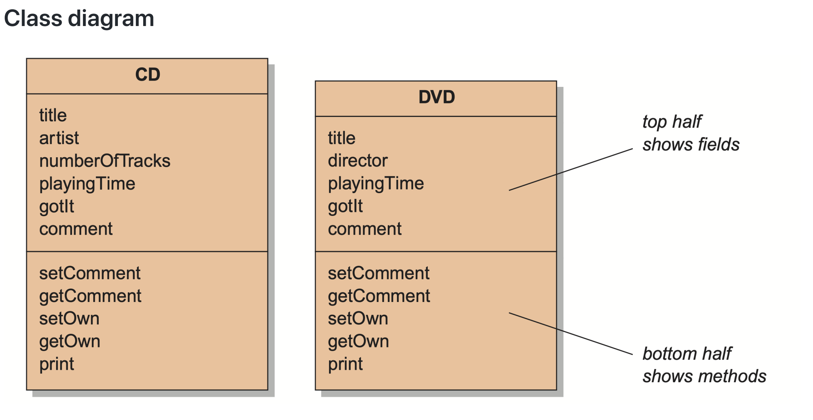
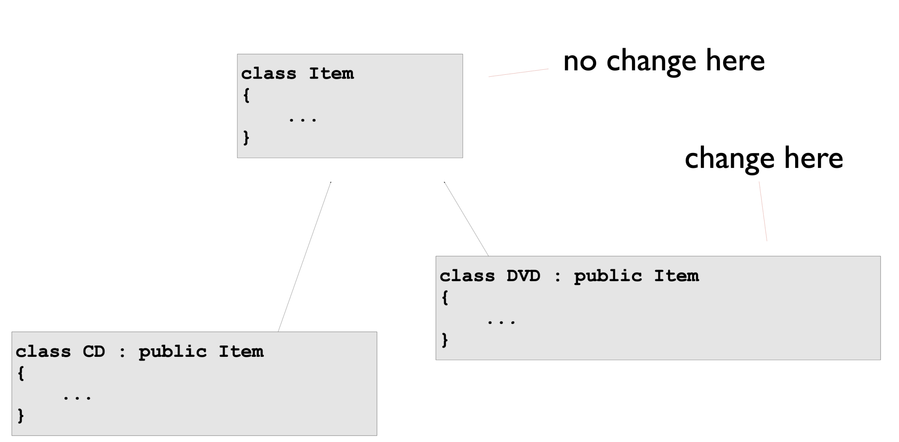

# Inheritance

**Inheritance is the ability to define the behavior or implementation of one class as a superset of another class.**

Take a closer look at an example.



```c++
class Database {
    vector<CD> cds;
    vector<DVD> dvds;
    public:
        void addCD(CD &aCD);
        void addDVD(DVD &aDVD);
        void list() {
            for (auto x:cds) { cd.print(); }
            for (auto x:dvds) { x.print(); }
        }
}
```

**Solution**




### Basic Declaration

>  use std : avoid include a lot of header files.
>
> ```c++
> #include<string>
> using namespace std;
> 
> //or
> 
> std::string
> ```

```c++
class Employee{
  public:
  	Employee(const std::string& name,const std::string& ssn);
  	const std :: string & get_name() const;
  	const string& getName()const{return name;}
  	const string& getSSN()const{return ssn;}
  	void print()const;
    //void print(std::ostream& out)const;
  	void print(const std::string & msg)const;
	protected: // Self and descendant can access
  		std::string m_name;
  		std::string m_mssn;
};
Employee::Employee( const string& name, const string& ssn ):m_name(name),m_ssn( ssn){// initializer list sets up the values!}
  
inline const std::string& Employee::get_name()const{
  return m_name;
}
inline void Employee::print(std::ostream& out)const{
  out << m_name<<endl;
  out << m_ssn<<endl;
}
inline void Employee::print(std::ostream& out,const std::string& msg)const{
  out << msg << endl;
  print(out);
}
class Manager : public Employee {
    public:
        Manager(const std::string& _name, const std::string& _ssn, const std::string& _title);
        const std::string& get_title() const;
        void print() const;
    private:
        std::string m_title;
};
Manager::Manager(const string& _name, const string& _ssn, const string& _title = "" ):Employee(_name, _ssn), m_title( _title ) {}
```

> Better to initialize the parent class by calling its constructor instead of 
>
> ```c++
>  Manager(const std::string& name, const std::string& ssn, const std::string&title):name(_name),ssn(_ssn)mtitle)_title){}
> ```

```c++
void Manager::print()const{
 	Employee::print();
  cout << title << endl;
}
```

```c++
#include "employee.h"
#include "manager.h"
int main()
{
    Employee p1("John Smith","123123");
    Manager p2("Tom Jordan", "3267","Mr.");
    p1.print(); 
    p2.print();
    p1.print("Welcome:");
    //p2.print("Welcome:");     报错
   
  
    Employee *p = &p1;
    p->print();
    p = &p2; 
    p->print();             // 按 Employee 里面的函数输出，而不是 Manager
}
```

* If parent's member is private: it can never be accessible by its descendant!

  ```c++
  cout<<name<<endl //supose name(private) is from parent class, ERROR
  ```

#### Name Hide

子类重新定义了父类的某个函数，就会把其他 overload 的函数覆盖掉（C++ 独有，无法解释），如上面的例子中, `p2.print("welcome")` 会报错

* 要调用父类的成员函数，要 `Employee::print()`.

* Failed to inherit:
  * **parent's constructor/destructor** is not inherited, but constructor/destructor will be called automatically.
  * 赋值的运算符不会被继承

```c++
class Derived : public Base ...
class Derived : protected Base ...
class Derived : private Base ..
```


