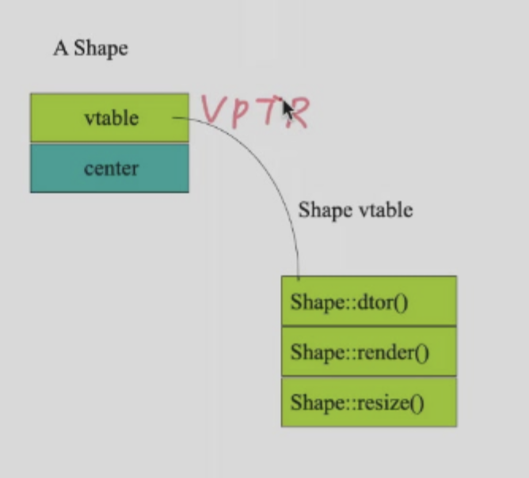

## Inheritance

**Inheritance is the ability to define the behavior or implementation of one class as a superset of another class.**

Take a closer look at an example.


```c++
class Database {
    vector<CD> cds;
    vector<DVD> dvds;
    public:
        void addCD(CD &aCD);
        void addDVD(DVD &aDVD);
        void list() {
            for (auto x:cds) { cd.print(); }
            for (auto x:dvds) { x.print(); }
        }
}
```

**Solution**


### Basic Declaration

>  use std : avoid include a lot of header files.
>
> ```c++
> #include<string>
> using namespace std;
> 
> //or
> 
> std::string
> ```

* Descandend class will call parent class's constructor automatically. BUT!!! the constructor is not inherited!!!!
* Size of descandent class is the "sum" of parent class and descandent class.
* In descandent class, you can access parent class's member by `::` operator.
* Descandend class can access parent class's public and protected member, but not private member.
  While protected member is like 'private' member for the descandent class.


```c++
class Employee{
  public:
  	Employee(const std::string& name,const std::string& ssn);
  	const std :: string & get_name() const;
  	const string& getName()const{return name;}
  	const string& getSSN()const{return ssn;}
  	void print()const;
    //void print(std::ostream& out)const;
  	void print(const std::string & msg)const;
	protected: // Self and descendant can access
  		std::string m_name;
  		std::string m_mssn;
};
Employee::Employee( const string& name, const string& ssn ):m_name(name),m_ssn( ssn){// initializer list sets up the values!}
  
inline const std::string& Employee::get_name()const{
  return m_name;
}
inline void Employee::print(std::ostream& out)const{
  out << m_name<<endl;
  out << m_ssn<<endl;
}
inline void Employee::print(std::ostream& out,const std::string& msg)const{
  out << msg << endl;
  print(out);
}
class Manager : public Employee {
    public:
        Manager(const std::string& _name, const std::string& _ssn, const std::string& _title);
        const std::string& get_title() const;
        void print() const;
    private:
        std::string m_title;
};
Manager::Manager(const string& _name, const string& _ssn, const string& _title = "" ):Employee(_name, _ssn), m_title( _title ) {}
```

Better to initialize the parent class by calling its constructor instead of 

> ```c++
>Manager(const std::string& name, const std::string& ssn, const std::string&title):name(_name),ssn(_ssn)mtitle)_title){}
> ```

```c++
void Manager::print()const{
 	Employee::print();
  cout << title << endl;
}
```

```c++
#include "employee.h"
#include "manager.h"
int main()
{
    Employee p1("John Smith","123123");
    Manager p2("Tom Jordan", "3267","Mr.");
    p1.print(); 
    p2.print();
    p1.print("Welcome:");
    //p2.print("Welcome:");     报错
   
  
    Employee *p = &p1;
    p->print();
    p = &p2; 
    p->print();             // 按 Employee 里面的函数输出，而不是 Manager
}
```

* If parent's member is private: it can never be accessible by its descendant!

  ```c++
  cout<<name<<endl //supose name(private) is from parent class, ERROR
  ```

* `protected` : only descandents can access.

#### Name Hide

子类重新定义了父类的某个函数，就会把其他 overload 的函数覆盖掉（C++ 独有，无法解释），如上面的例子中, `p2.print("welcome")` 会报错

* 要调用父类的成员函数，要 `Employee::print()`.

* Failed to inherit:
  * **parent's constructor/destructor** is not inherited, but constructor/destructor will be called automatically.
  * 赋值的运算符不会被继承

```c++
class Derived : public Base ...
class Derived : protected Base ...
class Derived : private Base ..
```

## Polymorphism

```c++
class A public B{

};
class A protected B{

};
class A private B{

};
```


* `public` : A isa B

>Public Inheritance should imply substitution

If B isa A, you can use a B any where an A can be used.
if B isa A, then everything that is true for A is also true of B.
  Be careful if the substitution is not valid!


* $A \rightarrow B$
* $A^* \rightarrow B^*$ 
* $A\& \rightarrow B\& $

### Upcasting
```c++
#include <iostream>
using namespace std;
class A{
  public:
    int i;
    void f(){cout<<"A::f()"<<endl;}
    A(){i=10;cout<<"A()"<<i<<endl;}
};
class B:public A{
  public:
    int i;
    void f(){cout<<"B::f()"<<endl;}
    B(){i=20;cout<<"B()"<<i<<endl;}
};
int main(){
  B b;
  A *p=&b;
  b.f();
  p->f();   // A::f()
  cout<< sizeof(*p)<<endl;
  int *pi = (int*)p;
  cout<< pi[0] <<","<<pi[1]<<endl;
  cout << p->i <<endl;
  cout << b.i<<endl;
}
```

```
A()10
B()20
B::f()
A::f()
4
10,20
10
20
```

* When accesing `f()` function using pointer to ites parent class, it will call the parent class's function.`<without virtual>`

```c++
#include <iostream>
using namespace std;
class A{
  public:
    int i;
    virtual void f(){cout<<"A::f()"<<endl;}
    A(){i=10;cout<<"A()"<<i<<endl;}
};
class B:public A{
  public:
    int i;
    void f(){cout<<"B::f()"<<endl;}
    B(){i=20;cout<<"B()"<<i<<endl;}
};
int main(){ 
  B b;
  A *p=&b;
  cout << sizeof(b)<<endl; 
  cout << sizeof(A)<<endl; 
  b.f();
  p->f();
  cout<< sizeof(*p)<<endl;
  int *pi = (int*)p;
  cout<< pi[0] <<","<<pi[1]<<endl;
  cout << p->i <<endl;
  cout << b.i<<endl;
}
```


* After adding `virtual` keyword, it will call the child class's function.

```
A()10
B()20
16
16
B::f()
B::f()
16
73269440,1
10
20
```
### Example : Drawing Program
```c++
class XYPos{}
class Shape {
public: 
    Shape();
    virtual ~Shape();
    virtual void render();
    void move (const XYPos&);
    virtual void resize();
protected:
    XYPos center;
}
```


* keyword `virtual` is used to define a function that can be overwritten in a derived class.

```c++
class Ellipse : public Shape {
public:
    Ellipse(float maj, float minr);
    virtual void render(); // will define own
protected:
    float major_axis, minor_axis;
};
class Circle : public Ellipse {
public:
    Circle(float radius) : Ellipse(radius, radius){}
    virtual void render();
};
```


* Whether is a static or dynamic binding is determined by the type of the pointer or reference.
* Only virtual functions can be dynamically bound.

1. if` .render()` : static binding
2. if`->render()` : dynamic binding
3. if `&引用访问` : dynamic binding
* **Only C++ default to static binding!**
* static binding is faster than dynamic binding.


```c++
void render(Shape* p) {
    p->render(); // calls correct render function
} // for given Shape! void func() {
Ellipse ell(10, 20);
ell.render(); // static -- Ellipse::render();
Circle circ(40);
circ.render(); // static -- Circle::render();
render(&ell); // dynamic -- Ellipse::render();
render(&circ); // dynamic -- Circle::render()
```
```c++
void render(Shape* p) {
    p->render(); // calls correct render function
} 
```


* `Shape *p` : polymofphic varaible
* A polymorphic variable has two types: **its static type and its dynamic type**.

### How virtual functions work
* VPTR
Any class with a virtual function has a hidden pointer(VPTR) to a table(V table) of function pointers.
* V table
The V table is a table of the addresses of the virtual functions for that class.



* **Note : Pointer size is 8 bytes in 64-bit system. And We have to consider alignment.**

* Vtable is created at compile time.SO it is static.


#### See the vptr
* Back to the previous example
```c++
int main(){ 
  B b;
  A *p=&b;
  cout << sizeof(b)<<endl; 
  cout << sizeof(A)<<endl; 
  b.f();
  long long **vp = (long long**)p;
  void (*pf) () = (void (*)())(*(*vp));
  cout << "-------------"<<endl;
  pf();
}
```
```
A()10
B()20
16
16
B::f()
-------------
B::f()
```
* Add
```c++
class A{
  public:
    int i;
    virtual void f(){cout<<"A::f()"<<endl;}
    A(){i=10;cout<<"A()"<<i<<endl;}
    void g(){f();}//this->f()
};
```
```c++
p->g();
```
```
B::f()
```
* Add
```c++
class A{
  public:
    int i;
    virtual void f(){cout<<"A::f()"<<endl;}
    A(){i=10;cout<<"A()"<<i<<endl;f();}
    void g(){f();}//this->f()
};
```


* While in constructor, it will call the parent class's function. `A::f()`

* How dose `vptr` come?

* When the object is created, space will be allocated and the constructor will be called. When the constructor is called, the vptr will be set to the `vtable` of the class!!!

* Think about the order of the constructor: 

  When a descendent class is created, the parent class's constructor **will be called first**. So the vptr will be set to the **parent class's vtable first**. Then the descendent class's constructor will be called and the **vptr will be set to the descendent class's vtable**.

#### What happens if ?
```c++
Ellipse ell(10, 20);
Circle circ(40);
elly = circ; 
```

* Area of circ is **sliced off**!
* Only the part of the object that is of the type of the variable is copied.
* vptr remans to be `elly` 's vptr.

```c++
a = b;
p = &a;
p -> f();
```

* `A::f()`
* `p->f()` will call the parent class's function.

**What about?**

```c++
Ellipse *elly = new Ellipse(20F,40F);
Circle *circ = new Circle(60F);
elly = circ;
```

* The original Ellipse for `elly` is lost.
* `elly ->render();//Circle::render()`

**What about ?**

```c++
void func(Ellipse &elly){
  elly.render()
}
Circle circ(60F);
func(circ);
```

* References act like **pointers**.

#### Summary:Run this

```c++
#include <iostream>
using namespace std;
class A{
  public:
    int i;
    virtual void f(){cout<<"A::f()"<<endl;}
    A(){i=10;cout<<"A()"<<i<<endl;f();}
    void g(){f();}//this->f()
};
class B:public A{
  public:
    int i;
    void f(){cout<<"B::f()"<<endl;}
    B(){i=20;cout<<"B()"<<i<<endl;}
};
int main(){ 
  B b;
  A a;

  A *p=&b;
  cout << "----------"<<endl;
  p->f();
  cout << sizeof(b)<<endl; 
  cout << sizeof(A)<<endl; 
  
  int *pi = (int*)p;
  cout<< long(pi[0]) <<","<<pi[2]<<","<<pi[3]<<endl;

  long long **vp = (long long**)(p);
  void (*pf) () = (void (*)())(*(*vp));
  pf();
  p->g();

  cout << "-------------"<<endl;
  a = b;
  p = &a;

  pi = (int*)p;
  cout<< long(pi[0]) <<","<<pi[2]<<endl;

  long long **vp1 = (long long**)(p);
  void (*pf1) () = (void (*)())(*(*vp1));
  pf1();
  cout<<"-----------"<<endl;
  b.f();
  a.f();
  p -> f();
  cout <<"----------"<<endl;
  A *x1 = new A();
  B *x2 = new B();
  
  x1 = x2;
  cout << "-----------"<<endl;
  x1->f(); 
}
```

### Virtual Destructors

* Make the destructor virtual **IF** they might be inherited!

```c++
Shape *p = new Ellipse(100.0F, 200.0F); ...
delete p;
```
p 的静态类型是 Shape, 如果不定义虚函数，那么 p 只会发生静态绑定，即调用 **Shape**的析构函数，无法调用**Ellipse**的析构函数!

* 只要一个类可能会被继承，就应该定义虚析构函数！

### Overriding

* Must be parent and child class
* Must have the same name and signature[名称和参数表相同!]
* parent class's function must be virtual！
* 这时子类可以不加 `virtual` 关键字，默认是 virtual 的，但是推荐加，为了孙类。
* 返回类型相同或者是协变的(子类的返回类型是父类的子类)(返回的是父累返回类型的，子类型)
```c++
class Expr {
public: 
    virtual Expr* newExpr();
    virtual Expr& clone();
    virtual Expr self();
}
class BinaryExpr : public Expr {
public:
    virtual BinaryExpr* newExpr();  // ok
    virtual BinaryExpr& clone();    // ok
    virtual BinaryExpr self();      // Error!
}
```
>指向子类的对象可以被看做是一个指向父类的对象。但是子类的对象和父类的对象是不同的
* 可以在子类中调用父类的被 overide 的函数。
```c++
void Derived::func() {
    cout << "In Derived::func!";
    Base::func(); // call to base class
}
```
```c++
class Base {
public:
    virtual void func();
    virtual void func(int);
};
```
* If you override an overloaded function, you must override all of of the variants !
* If you don't override all of the variants, the other variants will be hidden!

> 换句话说，如果你在派生类中只重写了 `func()`，而没有重写 `func(int)`，那么 `func(int)` 就会在派生类中不可见，因为基类中的 `func(int)` 被隐藏了。这可能导致你在派生类中无法调用 `func(int)`，除非你使用了显式的作用域解析符来指定调用基类中的函数。

### Summary
* Never redefine an inherited non-virtual function
* Never redefine an inherited default parameter value
  - Theyʼre statically bound too!
  - And what would it mean?
```c++
#include <iostream>
using namespace std;
class A {
    public:
        A() { f(); }
        virtual void f() { cout << "A::f()"; }
};
class B : public A {
    public:
        B() { f(); }
        void f() { cout << "B::f()"; }
};
int main() {
    B b;
}
//A::f()B::f()
```
* VPTR 会在构造函数的 initialized list 里初始化。我们会执行 A 的构造函数，这个时候 VPTR 是 A 的，因此会调用 A 中的 f 函数
* 父类结束后回到 B 的构造函数，这时把 VPTR 改写为指向 B 的表，这时的动态绑定就变为 B 的 f 函数

### Abstract Classes

* 我们不应该制造 Shape 的对象，他的作用只在于**提供一个抽象的概念和公共接口!!**
* 一个类中有一个或多个纯虚函数，这个类就是抽象类
* 纯虚函数：
  ```c++
  virtual void render() = 0;
  ```
```c++
class XYPos{ ... }; // x,y point
class Shape {
public:
    Shape();
    virtual void render() = 0; 
    void move(const XYPos&);
    virtual void resize();
protected:
    XYPos center;
};
```
### Multiple Inheritance
* C++ 是唯一一个支持多重继承的面向对象语言
```c++
class B1 { int m_i; };
class D1 : public B1 {};
class D2 : public B1 {};
class M : public D1, public D2 {};
void main() {
    M m; //OK
    B1* p = new M; // ERROR: which B1
    B1* p2 = dynamic_cast<D1*>(new M); // OK
}
```
* Refer to https://note.hobbitqia.cc/OOP/oop7/#protocol-classes
> Say No to Multiple Inheritance
</font>