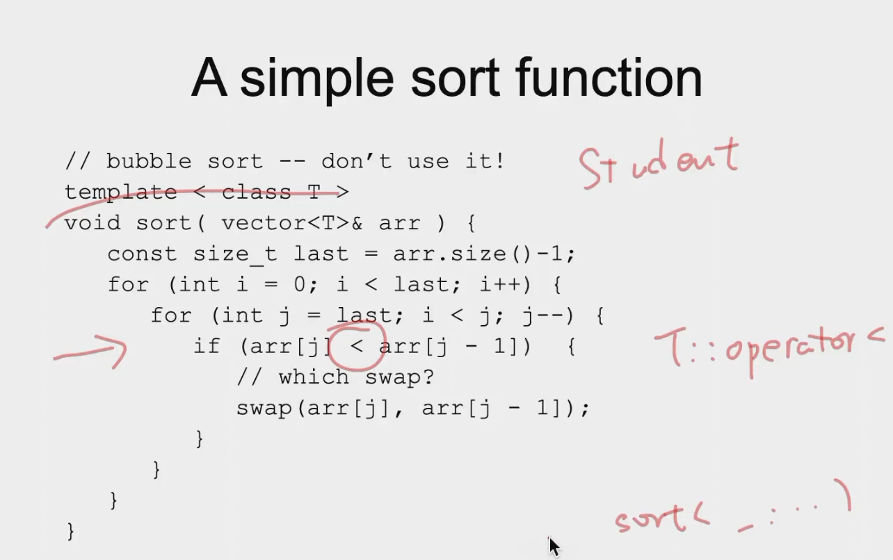

## Template
### Function Template
函数模板：用于制造函数的模板!也就是说它不是一个函数，而是一个函数的模板，编译器会根据参数类型生成对应的函数。

* 我们不需要告诉编译器去制造函数，调用的时候自然会根据参数类型生成对应的函数。
* 如果这个时候已经有了某一个函数，那么编译器会优先调用已有的函数。
```c++
void swap( int& x, int& y ) { 
    T temp = x; 
    x = y; 
    y = temp; 
}
```
```c++
template < class T > 
void swap( T& x, T& y ) { 
    T temp = x; 
    x = y; 
    y = temp; 
}
```

* The class `T` specifies a parameterized type name 
* class means any built-in type or user-defined type
* Inside the template, use T as a type name
* 有模板之后进行实例化
* 可以理解为，模板高速编译器这个函数会有很多重载版本，编译器会根据参数类型生成对应的函数。
```c++
int main() { 
    int a = 1, b = 2; 
    swap( a, b ); 
    cout << a << " " << b << endl; 
    return 0; 
}
```
```c++
int i = 3; int j = 4; 
swap(i, j); // use explicit int swap 
float k = 4.5; float m = 3.7; 
swap(k, m); // instanstiate float swap 
std::string s("Hello"); 
std::string t("World"); 
swap(s, t); // std::string swap 
```

* 这里 `swap(k,m)` 会调用函数模板，随后生成 `float swap`, 编译器会插入函数，调用。
* 在 C++ 中编译后重载函数的名字不再是 f, 而是 _f_int/_f_double/_f_void..., 把函数的参数类型编入函数的名字
* Only exact match on types is used
* **No conversion operations are applied**
* 必须类型相同！
```c++
swap(int, int); // ok 
swap(double, double); // ok 
swap(int, double); // error!
```

* Even implicit conversions are ignored!
* Template functions and regular functions coexist
```c++
void swap(&int, &int);
template <class T> void swap(&T, &T);
swap(1, 2); //Wrong!:should be left value reference
int a = 1, b = 2;
swap(a, b); //OK
```
```c++
template <class T>
void f(int i){
    T a;
    a = i;
}
//Use in this way:
f<int>(3);
f<double>(1.0);
```


### Class Template
```c++
template <class T> 
class Vector { 
public: 
 Vector(int); 
 ~Vector(); 
 Vector(const Vector&); 
 Vector& operator=(const Vector&); 
 T& operator[](int); 
private: 
 T* m_elements; 
 int m_size; 
};
```

* 类模板一定是显式的(如 STL 模板)
* 类模板里的所有函数都是类模板，所以如果在外面定义的时候，也要加上模板!!!
```c++
template<class T>
T& vector<T>::operator[](int i){ //Note this <T>!!!
    return m_elements[i];
}
```

```c++
Vector<int> v1(100); 
Vector<Complex> v2(256); 
v1[20] = 10; 
v2[20] = v1[20]; // ok if int->Complex define
```
> A simple sort function



* 需要支持 `operator<` 重载
* 类模板的函数是声明而不是定义，没有分离的 .h 文件。（不需要 inline 关键字）

    ```c++
    template< class Key, class Value> 
    class HashTable { 
    const Value& lookup(const Key&) const; 
    void install(const Key&, const Value&); 
    ... 
    }; 
    ```

* Templates nest — they’re just new types!
  ```c++
  Vector< Vector< double *> > // note space > >
  ```
* Type arguments can be complicated 
  ```c++
  Vector< int (*)(Vector<double>&, int)>
  ```

#### Note : 函数指针
在C++中，函数指针是一种特殊的指针，它指向函数而不是指向变量。函数指针可以在程序运行时动态地指向不同的函数，从而实现程序的灵活性和可扩展性。

要定义一个函数指针，需要指定函数的返回类型和参数类型，并使用指针声明符 `*` 来声明指针。函数指针的一般形式如下：

```cpp
return_type (*pointer_name)(arg_type1, arg_type2, ...);
```

其中：
- `return_type` 是函数的返回类型；
- `pointer_name` 是函数指针的名称；
- `arg_type1, arg_type2, ...` 是函数的参数类型。

例如，假设有一个函数 `int add(int a, int b)`，可以定义一个指向该函数的指针如下：

```cpp
int (*ptr)(int, int);  // 定义一个指向返回类型为 int，接受两个 int 类型参数的函数指针
```

然后，可以将函数 `add` 的地址赋给指针 `ptr`，使其指向 `add` 函数：

```cpp
ptr = add;
```

现在，可以通过指针调用函数 `add`：

```cpp
int result = (*ptr)(2, 3);  // 等价于 int result = add(2, 3);
```

或者可以简化为：

```cpp
int result = ptr(2, 3);  // 也等价于 int result = add(2, 3);
```

这样，函数指针就可以用来动态地指向不同的函数，并调用相应的函数。在示例中，`Vector<int (*)(Vector<double>&, int)>` 就是一个向量，其元素是指向接受 `Vector<double>` 和 `int` 参数的函数的指针，并返回 `int` 类型值。
### Expression parameters
```c++
template <class T, int bound=100>
class FixedVector {
public:
    FixedVector();
    FixedVector(int);
    FixedVector(const FixedVector&);
    FixedVector& operator=(const FixedVector&);
    T& operator[](int);
private:
    T m_elements[bound];
    int m_size;
};
```
 
* Usage:
```c++
FixedVector<int, 200> v1;
FixedVector<int> v2; // bound=100
```
### Template and Inheritance
* Template can inherit from a non-template class
```c++
template <class T>
class Derived : public Base<T> {
public:
    Derived();
    Derived(const Derived&);
    Derived& operator=(const Derived&);
    T& operator[](int);
};
```
* Template can inherit from a template class
```c++
template <class T>
class Derived : public Base<T> {
public:
    Derived();
    Derived(const Derived&);
    Derived& operator=(const Derived&);
    T& operator[](int);
};
```
* Non-template class can inherit from a template class
```c++
template <class T>
class Base {
public:
    Base();
    Base(const Base&);
    Base& operator=(const Base&);
    T& operator[](int);
};
class Derived : public Base<int> {
public:
    Derived();
    Derived(const Derived&);
    Derived& operator=(const Derived&);
    int& operator[](int);
};
```
* 模板的所有东西都需要在头文件中定义，因为编译器需要看到模板的定义才能生成对应的函数。
* 静态成员变量必须在类外定义，因为静态成员变量是类的一个属性，而不是对象的属性。也就是放在.cpp文件中定义。
* 不同编译单元如果出现同一个模板的实例化，会出现重复定义的问题，用`weak`关键字解决?