## Breif Intro

- 做存储的时候，访问需要字对齐，按照字去取
- Cache 局部性原理

## Signal

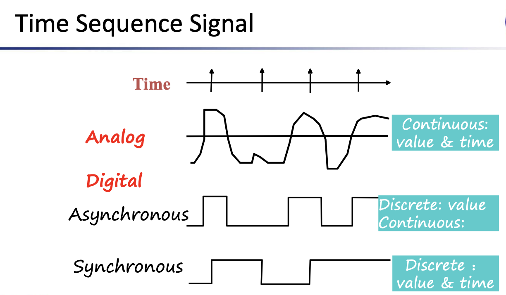

The most commonly used two-valued information is an electrical signal - voltage or current typically two discrete values represented  by the voltage range of values.

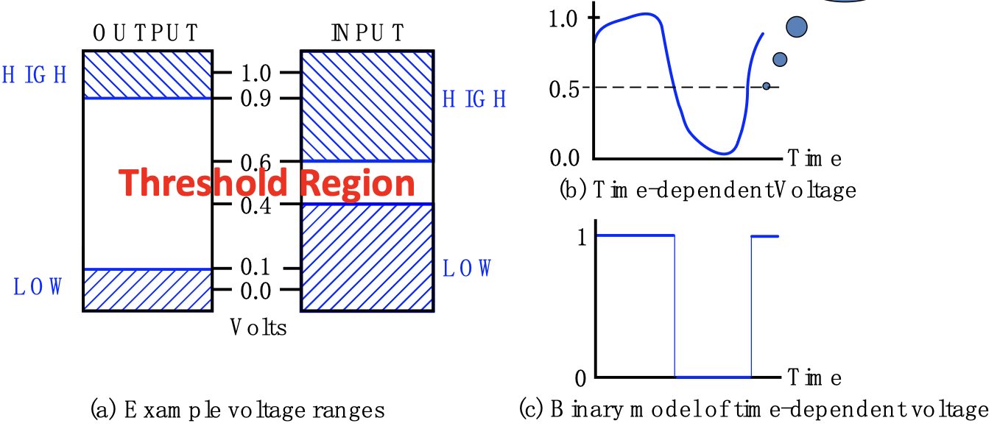

## Digital Systems

 Takes a set of discrete information inputs and discrete internal information (system state) and generates a set of discrete information outputs.

### Types of Digital Systems

* Combinational Logic System:No state present , **one** input just decide **one** output(one to one , no state)

* Sequential System

  State present

  > State updated at discrete times -- Synchronous Sequential System [Periodic]
  >
  > State updated att any time -- Asychronous Sequential System

  State function : $f_{state}=Function(State,Input)$

  Output function : $f_{output}=Function(State)$ or $f_{output}=Function(State,Input)$

## Organization of Computer

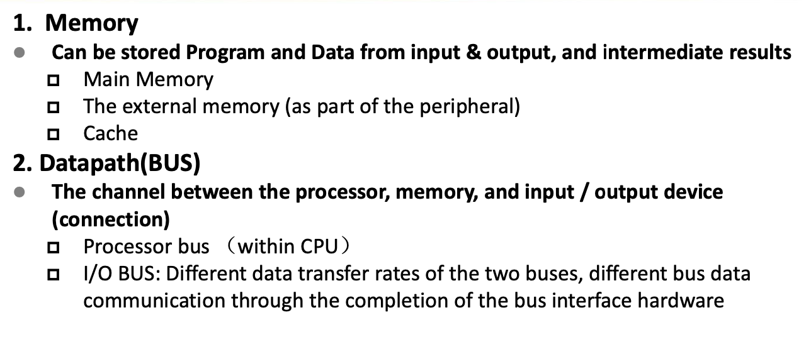

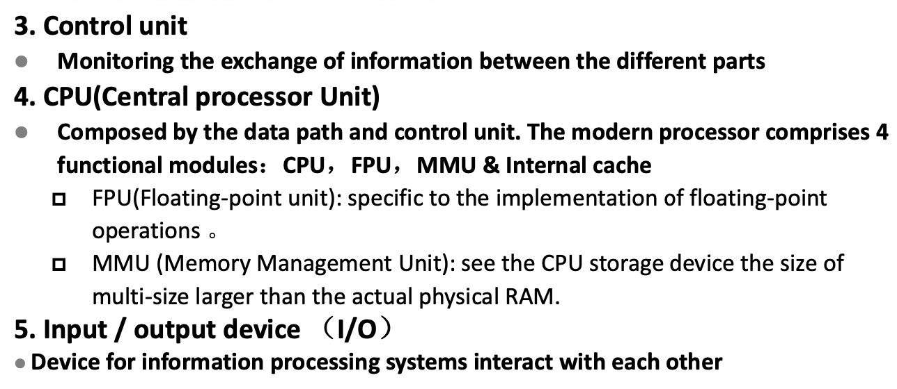

### Embedded Systems

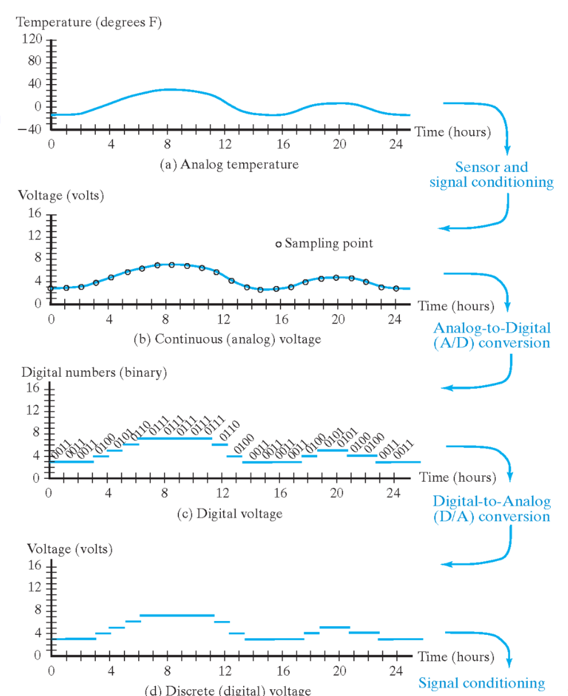

## Number Systems & Codes

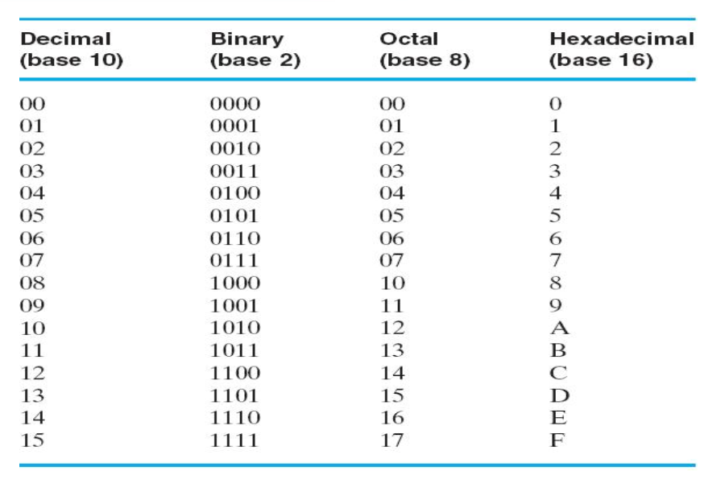

### Covert

#### Decimal To Binary

* 整数——权展开式除2，余数构成最低位——除2取余

* 小数**—**—权展开式乘2，整数构成最高位**—**—乘2取整

  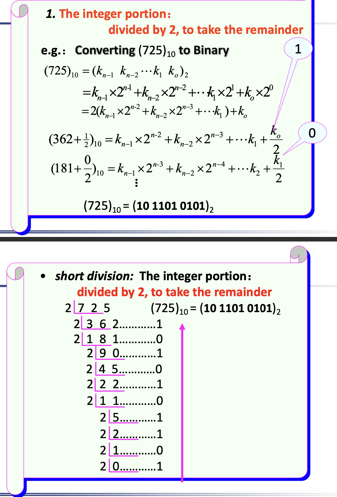

  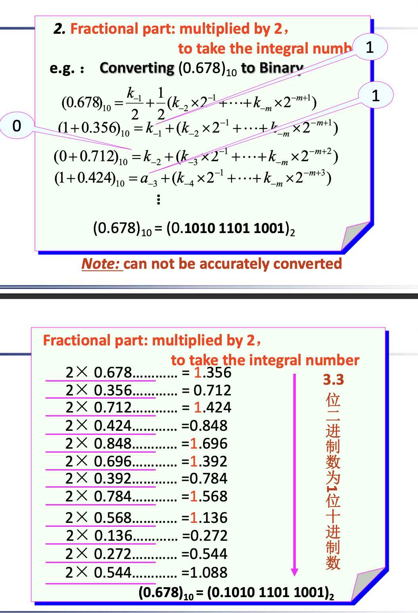

### Binary Numbers and Binary Coding

#### Non-numeric Binary Codes

Given n binary digits (called bits), a binary code is a mapping from a set of represented elements to a subset of the $2^n$  binary numbers.

#### Number of Elements Represented

* You can represent 4 elements in radix r = 2 with n = 2 digits: (00, 01, 10, 11).

* You can represent 4 elements in radix $r=2$ with $n=4$ digits (0001,0010,0100,1000) $One\ Hot\ Code$

* Other Examples

  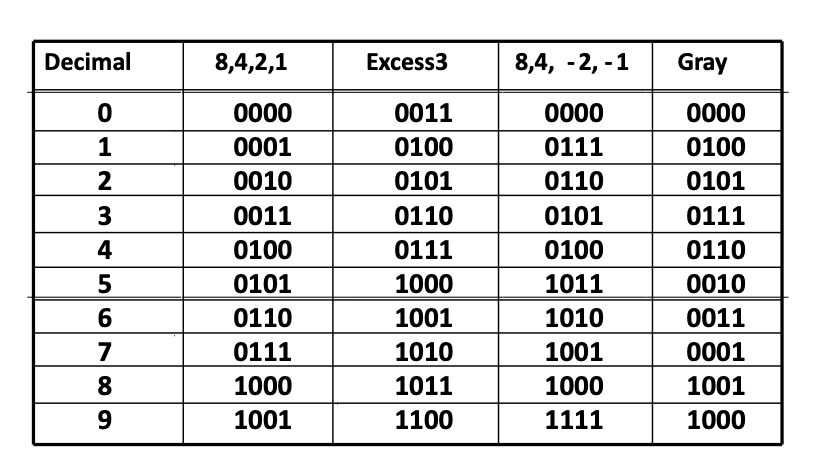

  * For $8\ 4\ -2\ -1$ $\&$ $Excess\ 3$ code -- "Symmetric"(complement) Same Probability for $0$ and $1$
  * $Excess\ 3$ code -- (**real binary value plus 3**)

### Binary Coded Decimal (BCD)

#### Arithmetic

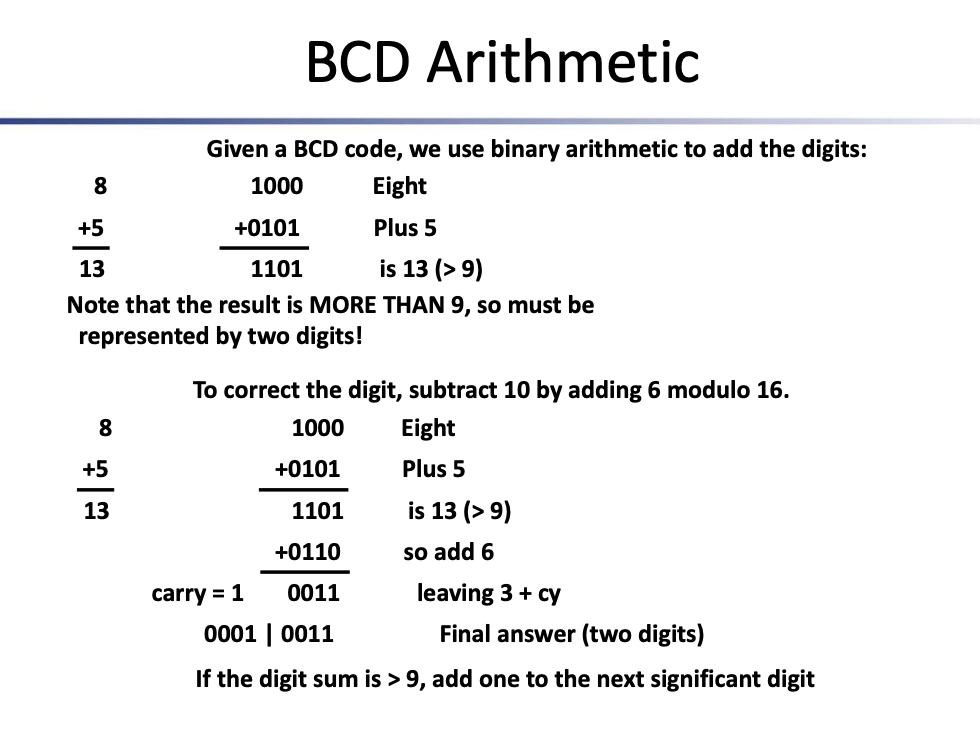

> Add Six

### ASCII

### Parity Bit Error-Detection Codes

**Redundancy (e.g. extra information)**, in the form of extra bits, can be incorporated into binary code words to detect and correct errors.

A simple form of **redundancy** is parity, an extra bit appended onto the code word to make the number of 1’s **odd** or **even**. 

Parity can detect all single-bit errors and some multiple-bit errors.

* A code word has even parity if the number of 1’s in the code word is even.

* A code word has odd parity if the number of 1’s in the code word is odd.

### Gray Code

#### Optical Shaft Encoder

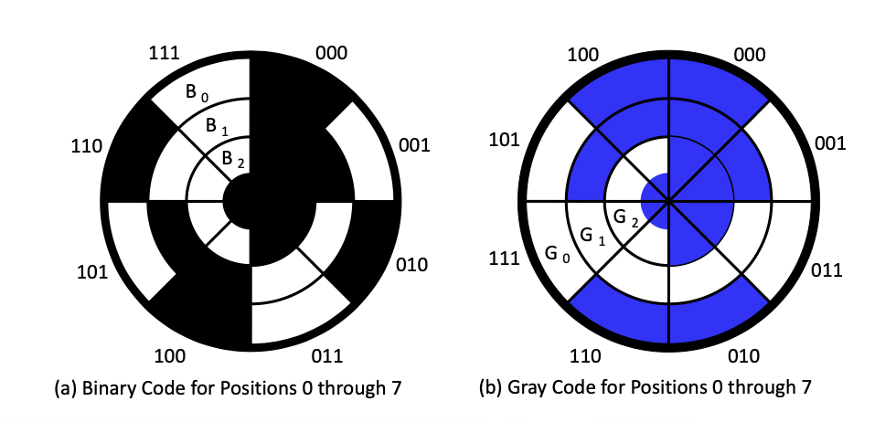

> Suppose we want to know the angle shifted by the machine.
>
> If Use Binary Code-- 如果三个传感器位置不统一，在从000-111过程中可能会出现：000-100-110-111 -- 中间过程畸变

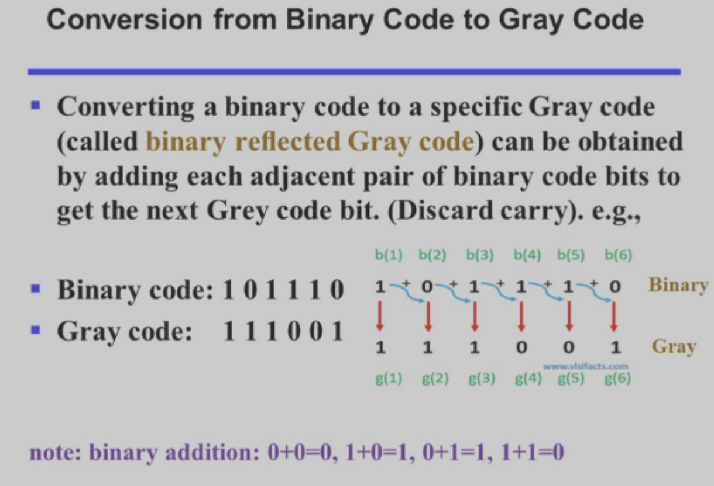

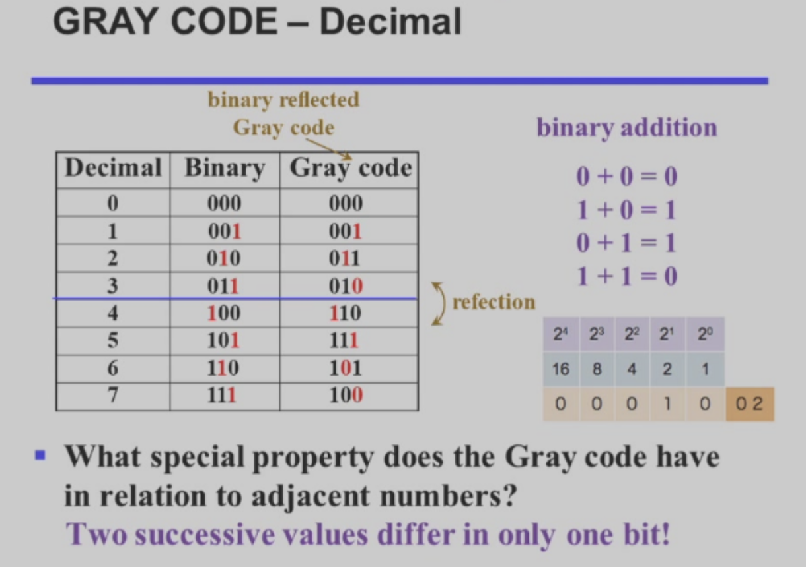

