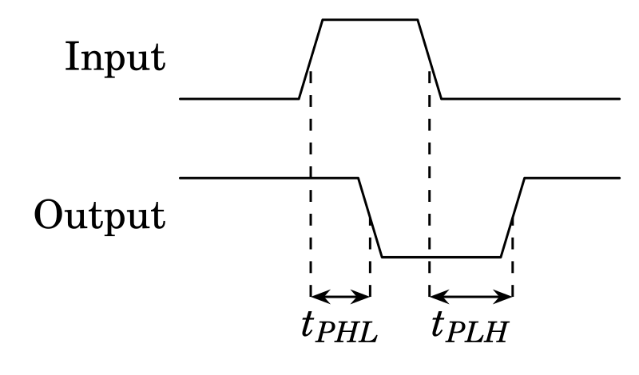
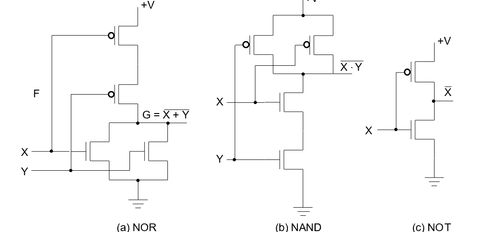

## Binary Logic and Gates

### Gate Delay

- In actual physical gates, if one or more input changes causes the output to change, the output change does not occur instantaneously.
- The delay between an input change(s) and the resulting output change is the gate delay denoted by $t_{G}$



#### $t_{pd}$ [Propagation Delay]

#### Inertial Delay

* Rejection Time ["Thin" Pulse cannot take place in real-time circumstances]


### NMOS and PMOS


* When an $NMOS$ transistor receives a **non-negligible** voltage, the connection from the source to the drain acts as a wire. Electricity will flow from the source to the drain uninhibited. This is referred to as a closed circuit. 

  On the other hand, when an nMOS transistor receives a voltage at around 0 volts, the connection from the source to the drain will be **broken**, which is referred to as an open circuit.


* The p-type transistor works counter to the n-type transistor. 

  Whereas the nMOS will form a closed circuit with the source when the voltage is non-negligible, the pMOS will form an open circuit with the source when the voltage is non-negligible.



### Tristate gate


### Common logic gate circuit

#### NAND operation


#### NOR operation


#### AND-OR-INVERT operation


#### Exclusive OR


#### Exclusive NOR


## Basic concepts of Boolean algebra

#### The XOR identities

* $X\oplus0=X\ X\oplus1=\bar{X}$
* $X\oplus X=0\ X\oplus\bar{X}=1$
* $X\oplus\bar{Y}=\bar{X}\oplus Y=\overline{X\oplus Y}$
* $X\oplus Y=Y\oplus X=X\bar{Y}+\bar{X}Y$
* $\overline{X\oplus Y}=XY+\bar{X}\bar{Y}$
* $(X\oplus Y)\oplus Z=X\oplus(Y\oplus Z)=X\oplus Y\oplus Z$

#### Basic properties of Boolean algebra

* $(X+Y)(X+Z)=X+YZ$
* $\overline{X+Y}=\bar{X}·\bar{Y}$
* $\overline{X·Y}=\bar{X}+\bar{Y}$
* $A(A+B)=A$
* $A+AB=A$
* $A(\bar{A}+B)=AB$
* $A+\bar{A}B=A+B$
* $(A+B)(\bar{A}+C)(B+C)=(A+B)(\bar{A}+C)$
* $AB+\bar{A}C+BC=AB+\bar{A}C$

#### Complementing and Duality rules

* For logic function F, interchange **AND** and **OR** operators ;complement each constant value and literal, then obtained the new function is the **inverse** function of the original function is referred to as: $\bar{F}$

  Note the following two points:

  > **The holding operation** **priority** **unchanged, if necessary, add brackets indicate.**
  >
  > **Within converting,** **public non-operation** **remains unchanged for several variables**
  >
  > 

* Duality rules: For logic function F ,**AND** $\Leftrightarrow$ **OR**  **0** $\Leftrightarrow$ **1** 

  > **If F‘ is the F Duality, then F is also F’ of Duality.** **F and F‘ is mutually Duality formula** **.**
  >
  > If the two logical functions F and G are equal, then the Duality formula F' and G' are also equal.

#### **Substitution rules**

Any logical equation that contains a variable **A**, and if all occurrences of **A's** position** are replaced with a logical function F, the equation still holds.


#### Shannon formula

– Assuming: Function F contained variables $x$、$\bar{x}$, at "**x AND F**" operation, variable $x$ may be replaced by **1** , variable $\bar{x}$ can be replaced by **0**. 

– At "**x AND F**" operation, $x$ can be  "0", $\bar{x}$ can be replaced with "1" .

> $xf(x,\overline{x},y...)=xf(1,0,y…)$
>
> $\overline{x}f(x,\overline{x},y...)=\overline{x} f(0,1,y...)$

Similarly

> $x+f(x,\bar{x},y……z)=x+f(0,1,y……z)$
>
> $\bar{x}+f(x,\bar{x},y……z)=\bar{x}+f(1,0,y……,z)$


If the function F contains the both of the variables $x,\bar{x}$ may be follow:


#### Example

  ```
  AB + A'C + BC = AB + A'C (Consensus Theorem)
  Justification 1: 1 . X = X
  Justification 2:X + X’ = 1
  原式 = AB + A’C + ABC + A’BC  X(Y + Z) = XY + XZ (Distributive Law)
  		 = AB + ABC + A’C + A’BC  X + Y = Y + X (Commutative Law)
  		 = AB . 1 + ABC + A’C . 1 + A’C . B  X . 1 = X, X . Y = Y . X(Commutative Law)
  			= AB (1 + C) + A’C (1 + B) X(Y + Z) = XY +XZ (Distributive Law)
  			= AB . 1 + A’C . 1 = AB + A’C X . 1 = X
  ```

  ```
  (X+Y)'Z + XY' = Y'(X+Z) 
  原式 = X’ Y’ Z + X Y’ 		(A + B)’ = A’ . B’ (DeMorgan’s Law)
  = Y’ X’ Z + Y’ X 					A . B = B . A (Commutative Law)
  = Y’ (X’ Z + X) 					A(B + C)=AB + AC (Distributive Law)
  = Y’ (X’ + X)(Z + X) 			A + BC = (A + B)(A + C) (Distributive Law)
  = Y’·1 ·(Z + X) 					A + A’ = 1 = Y’ (X + Z) 1 . 
  													A = A, A + B = B + A (Commutative Law)
  ```

### Simplification

* Example


#### OR-AND style simplification


## Standard Forms

#### Canonical Forms

##### Miniterms

Minterms are AND terms with every variable present in either true or complemented form.

Given that each binary variable may appear normal (e.g., x) or complemented (e.g., x ), there are $2^n$ minterms for n variables. denoted as $m_i$

1) only one set of variables value make to 1 for any one minterm . 
2) any two minterms multiplied equal to 0 
3) Sum of all minterms equal to 1
4) Any one minterm is not contained in the original function F,it can be seen as inAnti-function $\bar{F}$ 。


##### Maxterms

Maxterms are OR terms with every variable in true or complemented form.

Given that each binary variable may appear normal (e.g., x) or complemented (e.g., x), there are $2^n$ maxterms for n variables. denoted as $M_i$

1) only one set of variables value make to 0 for any one Maxterm
2) sum of any two Maxterms equal to $M_i+M_j=1 \ i\ne j$
3) Product of all Maxterms equal to 0 
4) Any one Maxterm is not contained in the original function F,it can be seen as inAnti-function $\bar{F}$


##### Minterm and Maxterm Relationship

* $M_i$ and $m_i$ is complement $\overline{M_i}=m_i$
* $F=\sum m_i = \overline{\Pi M_i}$


#### Function of the canonical forms

* Sum of Minterms(SOM)
* Product of Maxterms (POM)


#### Standard Forms

* Standard Sum-of-Products (SOP) : Equations are written as OR of AND terms
* Standard Sum-of-Products (POP) : Equations are written as AND of OR terms

For a logical function SOP or POS is the optimized（两级门，门级数最小）

## Karnaugh map of Functio

略.

## Multi-level circuit optimization

 #### COST

* Literal Cost  : Just Literal Appearances

* Gate Input Cost $G$ : Add **AND** **OR** term but exclude one-literal term

  > AB+CD+E -- 7
  >
  > BD+ABC+ACD --11

* $GN$ Add inverters [For the same variable only count once]


## Other Gate Types

#### Primitive Gates

A gate that can be described using a single primitive operation type (AND or OR) plus an optional inversions.

* BUFFER

The same as a connection -- improve circuit **voltage levels** and **increase the speed** of circuit operation.(decrease propagation delay)

#### Complex Gates

Requires more than one primitive operation type for its description.

* XOR Impletations


* Odd Functions and Even Functions

> XOR -- Odd Functions
>
> Use inversions -- Even Functions


> P -- Generate the Parity bit
>
> E--Decide whether the translated inf is **Error**

## High-Resistance output (tristate gate)

**Three-state** logic adds a third logic value, Hi-Impedance ($Hi-Z$), giving three states: $0, 1, and\ Hi-Z$ on the outputs.

#### The 3-State Buffer


* Resolving 3-State Values on a Connection

 Connection of two 3-state buffer outputs, B1 and B0, to a wire, OUT:


* Data Selection Function with 3-state buffers


* Last Row of the table will never occur

#### Transmission 3-state gate


