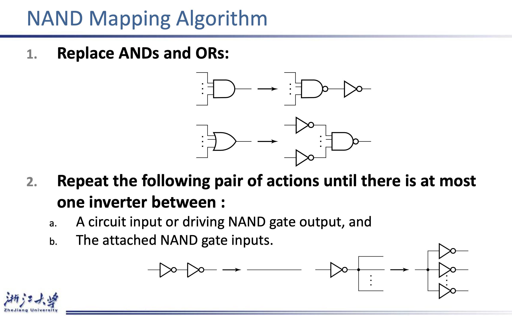
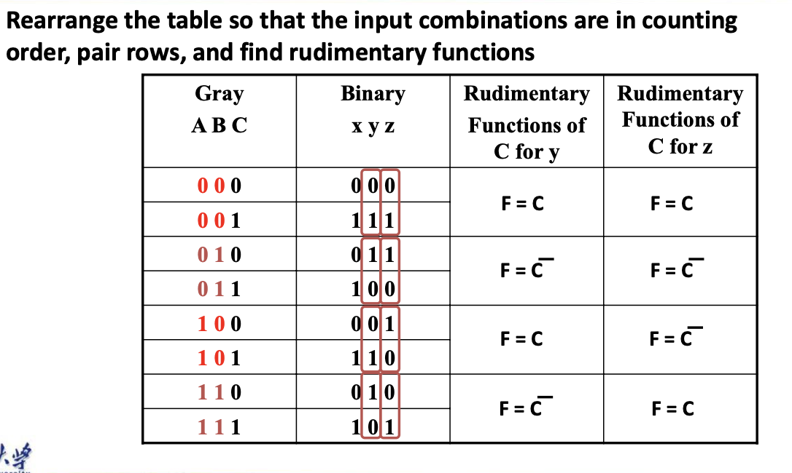

## Design Procedure

### Design Example

* BCD to Excess 3 --**Refer to PPT**

  

* **NOTE**: The '1' comes from -- $\bar{T_1}$

  We can neglect the inversion of input iterals ; but the intermediate varaible’s inversions cannot be neglected

* For the first -- 3级 but high cost -- For the latter-- 4级but low cost

### Technology Mapping

## Decoder

### 3-to-8 line decoder

* Basic Form : eight $(2^3)$ 3-input AND gates. --$2^n， n-input\ gates$

* Split to **2-to-4-line decoder** and **1-to-2-line decoder**. [Simplify]

> Another Example
>
> 
>
> * Basic $128*7$
> * 3-to-8 & 4-to-16 $128*2 + 8*3+16*4$

### Decoder with Enable

* Or to interpret in this way : Use $A_1$ and $A_0$ to decide $EN$ was allocated to which output ($D_0\ D_1\ D_2\ D_3$)

### Decoder and OR gate 

Theoratically realize all logic functions $(SOM)$ 

* Example Refer to PPT

### Display Decoder

#### 7-segment Displayer

> To decrease count of the pins

 

## Encoding

* Example Decimal to BCD

> If two signals are high simultaneously ? -- Meaningless

### Priority Encoder

If **more than one** input value is $1$, then the encoder just designed does not work.

One encoder that can accept all possible combinations of  input values and produce a meaningful result is a priority encoder

* Among the $1s$ that appear, it selects the most significant input position (or the least significant input position)containing a 1 and responds with the corresponding binary code for that position.

> To process **中断事件**

* Could use a K-map to get equations

* Also can be read directly from table and manually optimized if careful

  > $A_2=D_4$
  >
  > $A_1=\bar{D_4}D_3+\bar{D}_4\bar{D}_3D_2=\bar{D_4}F_1. F_1=(D_3+D_2)$
  >
  > $A_0=\bar{D}_4D_3+\bar{D_4}\bar{D_3}\bar{D_2}D_1=\bar{D_4(D_3+\bar{D_2}D_1)}$
  >
  > $V=D_4+F_1+D_1+D_0$

## Multiplexers

### Multiplexer Width Expansion

> GN(22) 

> Three State can connect all output to one line. --GN=18 (a)

> GN=14 (b)

Disadvantages : Takes much time . 

### Example

**Gray to Binary Code*

#### Approach 1

Refer to $PPT$

Note that the multiplexer with fixed inputs is identical to a **ROM** with 3-bit addresses and 2-bit data!

* Full adder

#### Approach 2

## Arithmetic Functions

### Half-Adder

* The most COMMON: $S=X\oplus Y\ C=XY\\S=(X+Y)\bar{C}\ C=\overline{(\overline{XY})}$

### Full-Adder

> $X\oplus Y$ only different from $X+Y$ when $XY=1$ 

### Binary Adders

#### Carry Lookhead

* To get $C_n$ not dependent on $C_{n-1}$

$P_i=A_i\oplus B_i\ \ \ G_i=A_iB_i\\S_i=P_i\oplus C_i\ \ \ C_{i+1}=G_i+P_iC_i$

Thus,we have

#### Group Carry Lookahead Logic

Disadvantages : 

* Too many Fan-Outs(propagation delay increase)
* High Cost

So Simple copy the CLA to more bits is not practical.

* 使用第二层CLA 减少传输延迟

### Unsigned Subtraction 

* TOO Complicated!

#### Complements

* 1's Complement

  

* 2's Complement

#### Subtraction with 2’s Complement

#### Signed Integers

* Signed-Magnitude
* Signed-Complement

### 2’s Complement Adder/Subtractor

#### Overflow Detection

Overflow V = $C_n\oplus C_{n-1}$

 ### Incrementing & Decrementing

#### Incrementing

### Multiplication/Division by $2^n$

* Zero Fill
* Filling usually is applied to the MSB end of the operand, but can also be done on the LSB end
* Extension- increase in the number of bits at the MSB end of an operand by using a complement representation

> Copies the MSB of the operand into the new positions
>
>  Positive operand example - 01110101 extended to 16 bits:0000000001110101
>
> Negative operand example - 11110101 extended to 16 bits:1111111111110101

### Arithmetic Logic Unit(ALU) implementation

$Y_i=B_iS_0+\bar{B_i}S_1$

>The Above Part -- (Basic ALU like above)
>
>The below Part -- AND OR XOR NOT (one bit)

### Combinational Shifter Parameters

