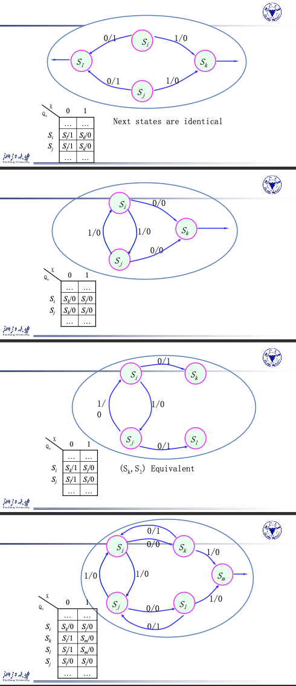
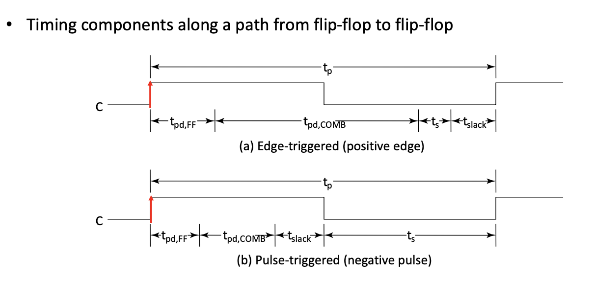
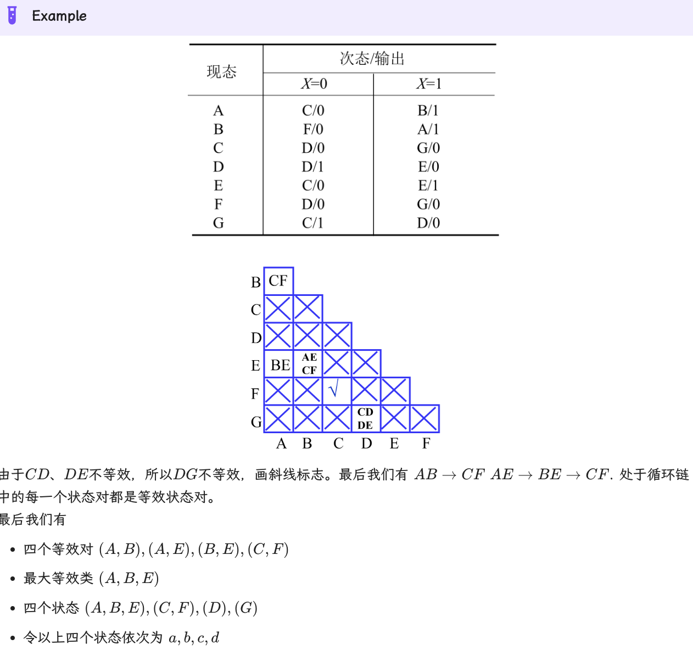
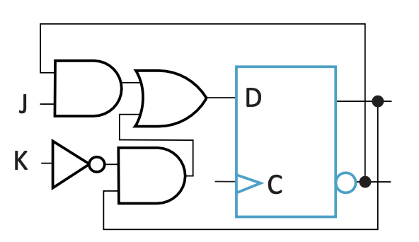
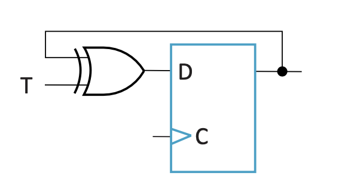
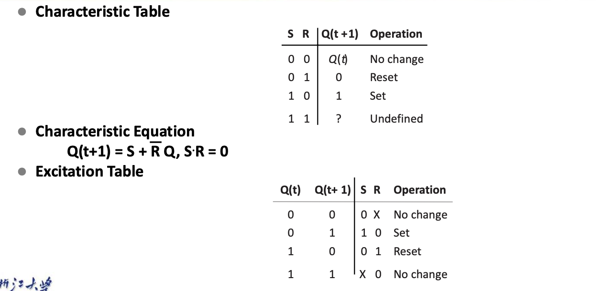
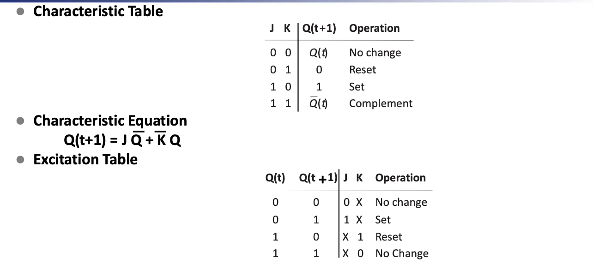
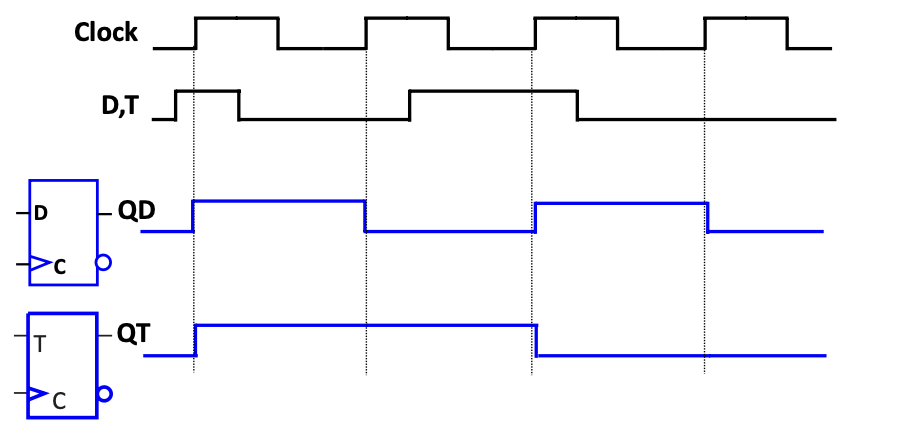
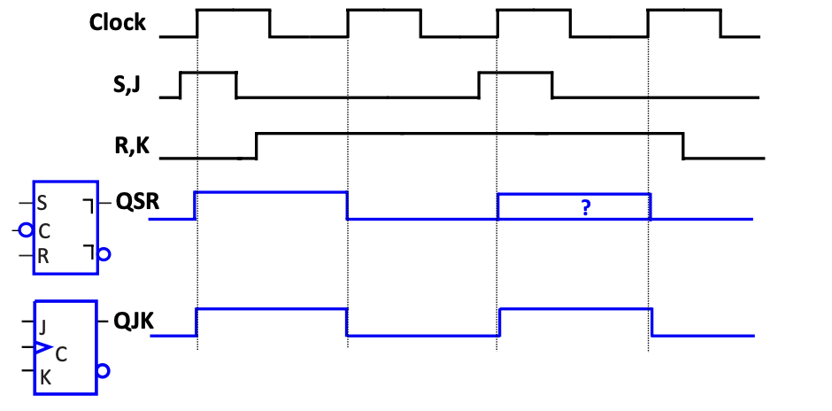

## Storage Elements and Sequential Circuit Analysis

### Types of Sequential Circuits

#### Synchronous

* Behavior defined from knowledge of its signals at discrete instances of time
* Storage elements observe inputs and can change state **only** in relation to a timing signal (clock pulses from a clock)

#### Asynchronous

* Behavior defined from knowledge of inputs an any instant of time and the order in continuous time in which inputs change

* If clock just regarded as another input, all circuits are asynchronous!

* Nevertheless, the synchronous abstraction makes complex designs tractable!

  
Circuit Delay Model

  
  
  
  

### Latches

* Long term maintaining a given stable state
* There are two stable states, "0", "1"
* Under certain conditions, can change state at anytime

#### Basic(NAND) $\bar{S}-\bar{R}$ Latch

* So RS state 00 is forbidden!

#### Basic(NOR) $S-R$ Latch

* So RS state 11 is forbidden!

#### Clocked S-R Latch

* Adding two NAND gates to the basic S - R NAND latch gives the clocked S – R latch
* Has a time sequence behavior similar to the basic **S-R latch** except that the S and R inputs are only observed when the line C is high.

  
Details

  

#### D Latch

*  Adding an inverter to the S-R Latch, gives the D Latch  -- No indeterminate states

  

  <table>
    <tr>
      <td>Q</td>
      <td>D</td>
      <td>Q(t+1)</td>
      <td>Comment</td>
    </tr>
    <tr>
      <td>0</td>
      <td>0</td>
      <td>0</td>
      <td>No Change</td>
    </tr>
    <tr>
      <td>0</td>
      <td>1</td>
      <td>1</td>
      <td>Set Q</td>
    </tr>
    <tr>
      <td>1</td>
      <td>0</td>
      <td>0</td>
      <td>Clear Q</td>
    </tr>
   	<tr>
      <td>1</td>
      <td>1</td>
      <td>1</td>
      <td>No Change</td>
    </tr>
  </table>

### The Latch Timing Problem

* We **CANNOT** be sure what value will Y output when C=0
* This is the Latch Timing Problem.
* In one Clock Pulse, Y can change many times if the Input Changes.

### Flip-Flops

#### S-R Master-Slave Flip-Flop

* The Problem of **1s Catching**

  > While $C=1$ $S$ $and/or$ $R$ are permited to change.
  >
  > * Suppose $Q$ =$0$ and $S$ goes to $1$ and then back to $0$ with $R$ remaining at $0$
  >
  >   The master latch sets to $1$
  >
  >   A $1$ is transferred to the slave
  >
  > * Suppose $Q$ = $0$ and $S$ goes to $1$ and back to $0$ and $R$ goes to $1$ and back to $0$
  >
  >   The master latch sets and then resets
  >
  >   A $0$ is transferred to the slave

* Personally main problem: **The hold state** when $S=R=0$

  
Details

  

#### Edge-Triggered D Flip-Flop

* The delay of the S-R master-slave flip-flop can be avoided since the 1s-catching behavior is not present with D replacing S and R inputs
* The change of the D flip-flop output is associated with the negative edge at the end of the pulse 
* It is called a negative-edge triggered flip-flop

#### Flip-Flop Timing Parameters

* $t_s$ -- Setup Time

  Master-slave - Equal to the width of the **triggering pulse** (Because of the 1's Catching the triggering pulse once arrives is forbidden to change)

  Edge-triggered - Equal to a time interval that is generally much less than the width of the the **triggering pulse**

* $t_h$ Hold Time -- often equal to zero

* $t_w$ Clock Pulse Width

* $t_{px}$

  Same parameters as for gates except that measured from **clock edge that triggers the output change to the output change**.

More Specifically

* 这几个时间点起点/终点都是触发边缘；
* Propagation Time 一定长于 Hold Time，因此在计算电路延迟时只考虑 Propagation Time；
* Pulse-trigger 和 Edge-trigger 在表现上的区别在于 Setup Time，前者需要覆盖整个 pulse(`pos` or `neg`)；

  
Summary

  

## Sequential Circuit Design

### State Table

### State Diagrams

#### Moore Models

Outputs are a function **ONLY** of states

#### Mealy Models

Outputs are a function of inputs **AND** states

  
Details

  
  
  

#### Equivalent State

#### Circuit and System Level Timing

* $t_p$ clock period  --The interval between occurrences of a specific clock edge in a

  periodic clock

* $t_{pd,COMB}$ -- total delay of combinational logic along the path from flip-flop output to

  flip-flop input

* $t_{slack}$ -- extra time in the clock period in addition to the sum of the delays and

  setup time on a path : Must be greater than or equal to zero on all paths for correct operation

* $t_{pd,FF}$ -- Flip-Flop's delay

* Timing Equations

  $t_p=t_{slack}+(t_{pd,FF}+t_{pd,COMB}+t_s)$

  **$t_{stack}$ must be greater than or equal to zero**  so $t_{p} \ge max(t_{pd,FF}+t_{pd,COMB}+t_s)$

  from all paths from flip-flop output to flip-flop input

* Can be calculated more precisely by using $t_{PHL}$ and $t_{PLH}$ values instead of $t_{pd}$ values, but requires consideration of inversions on paths

* Calculation[Refer to PPT]

  
Example Recognize 1101

  <td>Milley Model</td>
  
  <td>Moore Model</td>
  

### State Assignment

* Each of the m states must be assigned a unique code
* Minimum member of bits required is n such that $n\ge[log_2m]$

The task of state assignment involves determining the encoding length and finding an optimal (often challenging) or near-optimal state assignment scheme, leading to different expressions for output functions and activation functions, and consequently varying circuit complexities. The basic principles of state assignment are:

1. Determine the length of the encoding.
2. Seek an **optimal** (difficult to find) or near-optimal state assignment scheme.

The fundamental principles of assignment are as follows:

- Under the same input conditions, states with the same next states should preferably be assigned adjacent binary codes.
- Under adjacent input conditions, the next states of the same current state should preferably be assigned adjacent binary codes.
- Current states with identical outputs should preferably be assigned adjacent binary codes.
- Minimize the occurrence of the most frequently appearing states in the state table, or assign logic 0 to initial states.

Generally, the **first principle** is of greater importance and should be prioritized. Subsequently, consideration should be given to the frequency of occurrence of state pairs resulting from the first three principles, with a preference for assigning adjacent binary codes to state pairs with higher frequencies.

* EXAMPLE -- Refer to the PPT

* Design a sequential modulo 3 accumulator for 2-bit operands

  
Details

  
  
   
   

### Other Flip-Flop Types

#### J-K Flip-Flop

Same as S-R flip-flop with J analogous to S and K analogous to R

* J=K=1 is allowed ; the flip-flop changes to opposite state
* As a master-slave, has same “1s catching” behavior as S-R flip-flop
* To avoid 1s catching behavior,one solution used is to use an edge-triggered D as the core of the flip-flop

#### T Flip-flop

Has a single input T

* For T = 0, no change to state
* For T = 1, changes to opposite state

>  **Same as a J-K flip-flop with J = K = T**

* As a master-slave, has same “1s catching” behavior as J-K flip-flop
* Cannot be initialized to a known state using the T input

* To avoid 1s catching behavior,one solution used is to use an edge-triggered D as the core of the flip-flop

### Basic Flip-Flop Descriptors

* Characteristic Table
* Excitation Table

> Eg.
>
> 
>
> 

#### Flip-Flop Behavior Example

