## Storage Elements and Sequential Circuit Analysis

### Types of Sequential Circuits

#### Synchronous

* Behavior defined from knowledge of its signals at discrete instances of time
* Storage elements observe inputs and can change state **only** in relation to a timing signal (clock pulses from a clock)

#### Asynchronous

* Behavior defined from knowledge of inputs an any instant of time and the order in continuous time in which inputs change

* If clock just regarded as another input, all circuits are asynchronous!

* Nevertheless, the synchronous abstraction makes complex designs tractable!

  
Circuit Delay Model

  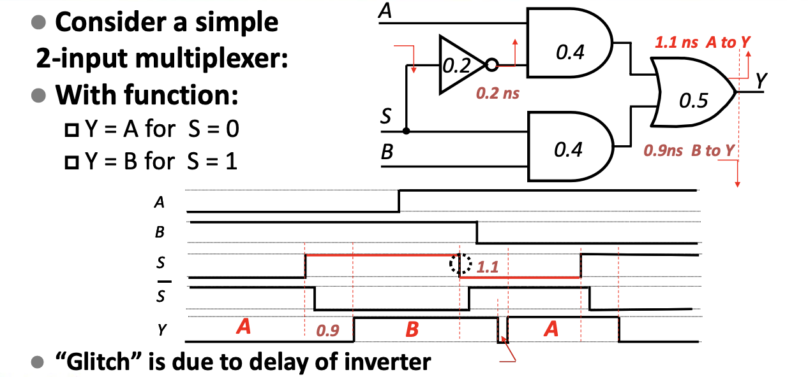
  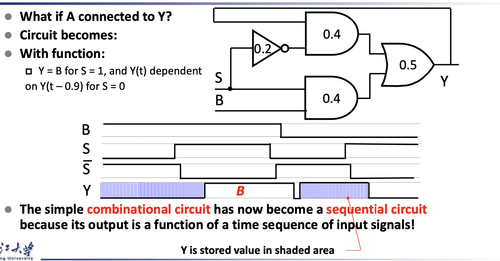
  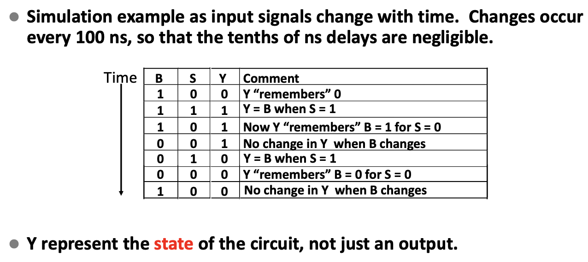
  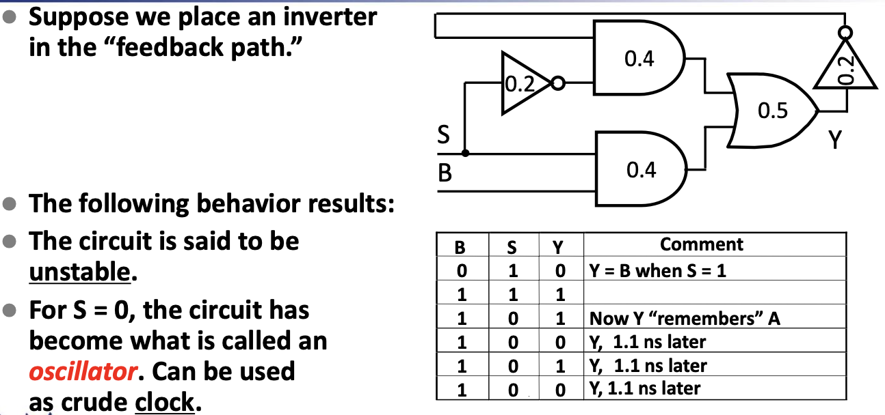

### Latches

* Long term maintaining a given stable state
* There are two stable states, "0", "1"
* Under certain conditions, can change state at anytime

#### Basic(NAND) $\bar{S}-\bar{R}$ Latch

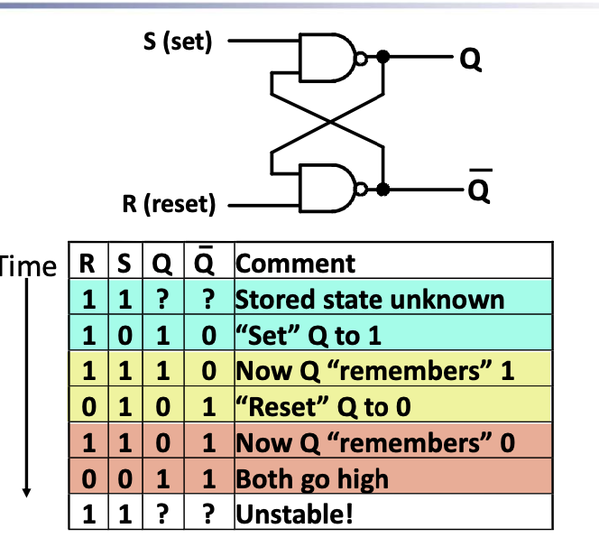

* So RS state 00 is forbidden!

#### Basic(NOR) $S-R$ Latch

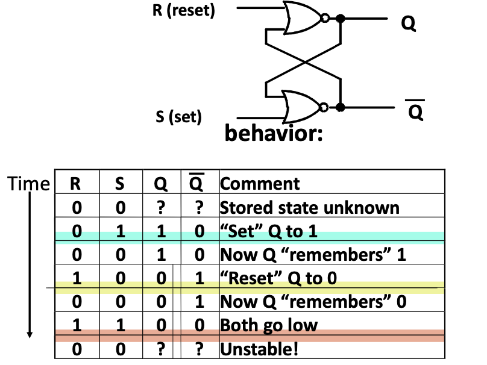

* So RS state 11 is forbidden!

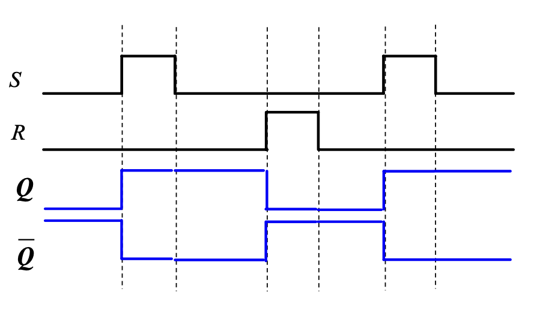

#### Clocked S-R Latch

* Adding two NAND gates to the basic S - R NAND latch gives the clocked S – R latch
* Has a time sequence behavior similar to the basic **S-R latch** except that the S and R inputs are only observed when the line C is high.

  
Details

  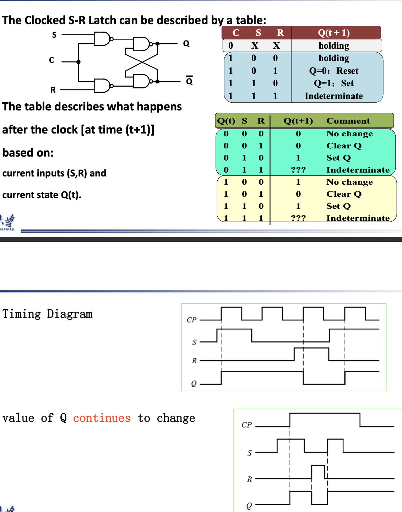

#### D Latch

*  Adding an inverter to the S-R Latch, gives the D Latch  -- No indeterminate states

  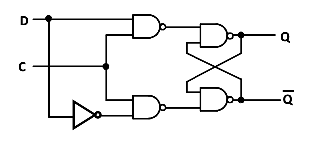

  <table>
    <tr>
      <td>Q</td>
      <td>D</td>
      <td>Q(t+1)</td>
      <td>Comment</td>
    </tr>
    <tr>
      <td>0</td>
      <td>0</td>
      <td>0</td>
      <td>No Change</td>
    </tr>
    <tr>
      <td>0</td>
      <td>1</td>
      <td>1</td>
      <td>Set Q</td>
    </tr>
    <tr>
      <td>1</td>
      <td>0</td>
      <td>0</td>
      <td>Clear Q</td>
    </tr>
   	<tr>
      <td>1</td>
      <td>1</td>
      <td>1</td>
      <td>No Change</td>
    </tr>
  </table>

### The Latch Timing Problem

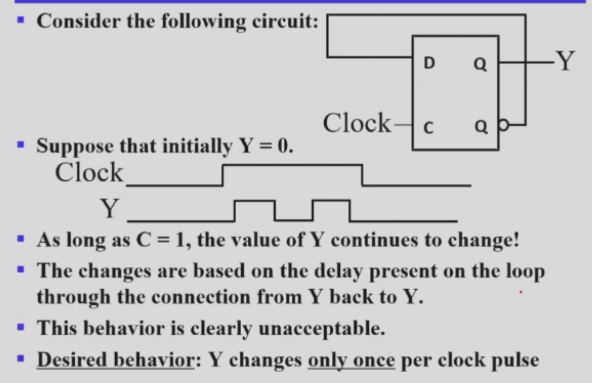

* We **CANNOT** be sure what value will Y output when C=0
* This is the Latch Timing Problem.
* In one Clock Pulse, Y can change many times if the Input Changes.

### Flip-Flops

#### S-R Master-Slave Flip-Flop

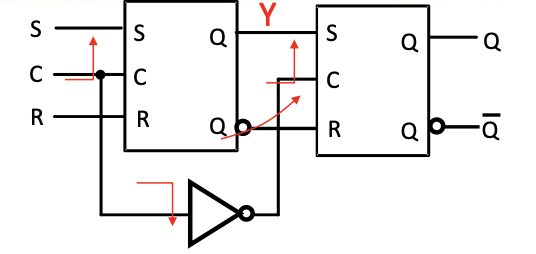

* The Problem of **1s Catching**

  > While $C=1$ $S$ $and/or$ $R$ are permited to change.
  >
  > * Suppose $Q$ =$0$ and $S$ goes to $1$ and then back to $0$ with $R$ remaining at $0$
  >
  >   The master latch sets to $1$
  >
  >   A $1$ is transferred to the slave
  >
  > * Suppose $Q$ = $0$ and $S$ goes to $1$ and back to $0$ and $R$ goes to $1$ and back to $0$
  >
  >   The master latch sets and then resets
  >
  >   A $0$ is transferred to the slave

* Personally main problem: **The hold state** when $S=R=0$

  
Details

  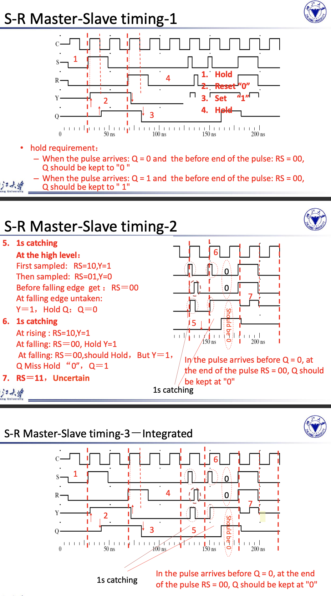

#### Edge-Triggered D Flip-Flop

* The delay of the S-R master-slave flip-flop can be avoided since the 1s-catching behavior is not present with D replacing S and R inputs
* The change of the D flip-flop output is associated with the negative edge at the end of the pulse 
* It is called a negative-edge triggered flip-flop

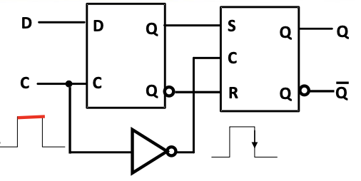

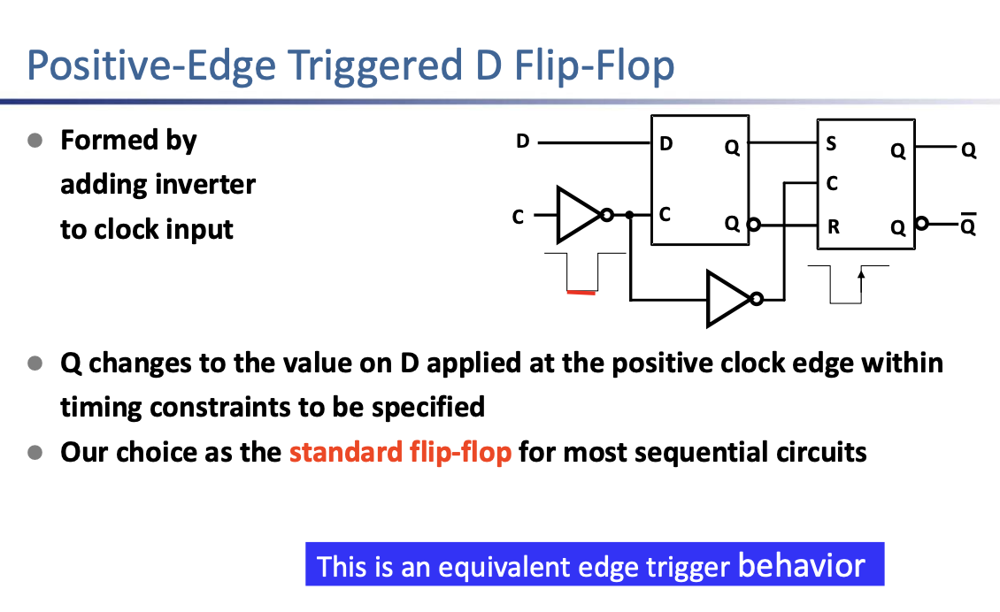

#### Flip-Flop Timing Parameters

* $t_s$ -- Setup Time

  Master-slave - Equal to the width of the **triggering pulse** (Because of the 1's Catching the triggering pulse once arrives is forbidden to change)

  Edge-triggered - Equal to a time interval that is generally much less than the width of the the **triggering pulse**

* $t_h$ Hold Time -- often equal to zero

* $t_w$ Clock Pulse Width

* $t_{px}$

  Same parameters as for gates except that measured from **clock edge that triggers the output change to the output change**.

More Specifically

* 这几个时间点起点/终点都是触发边缘；
* Propagation Time 一定长于 Hold Time，因此在计算电路延迟时只考虑 Propagation Time；
* Pulse-trigger 和 Edge-trigger 在表现上的区别在于 Setup Time，前者需要覆盖整个 pulse(`pos` or `neg`)；

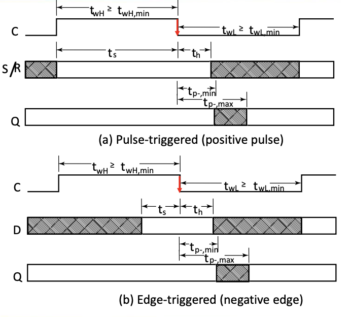

  
Summary

  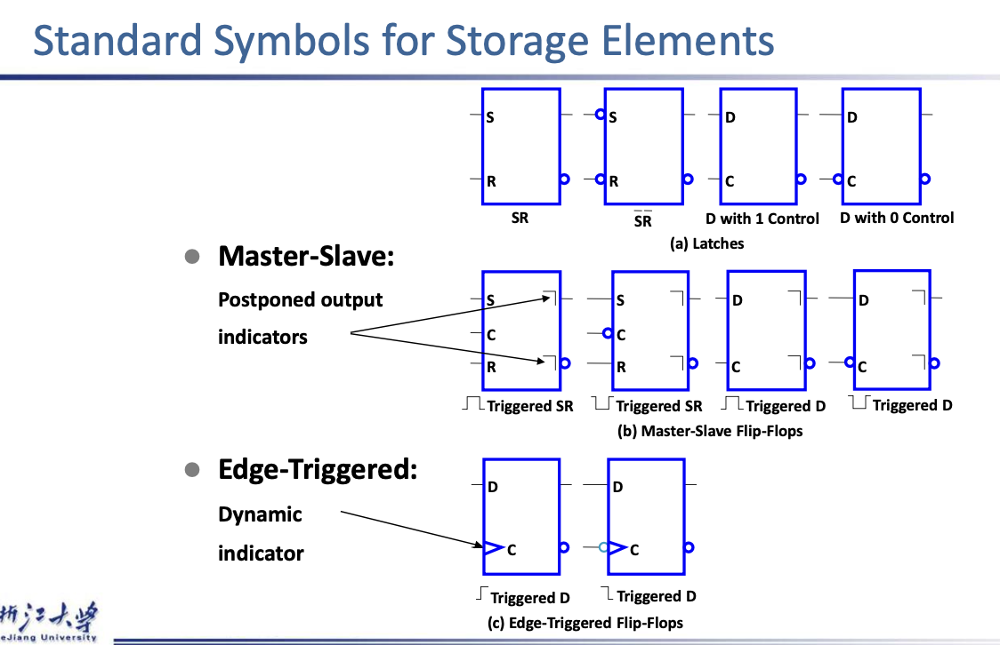

## Sequential Circuit Design

### State Table

### State Diagrams

#### Moore Models

Outputs are a function **ONLY** of states

#### Mealy Models

Outputs are a function of inputs **AND** states

  
Details

  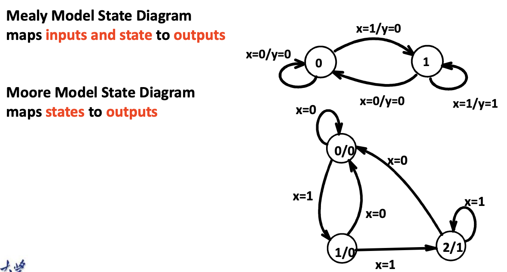
  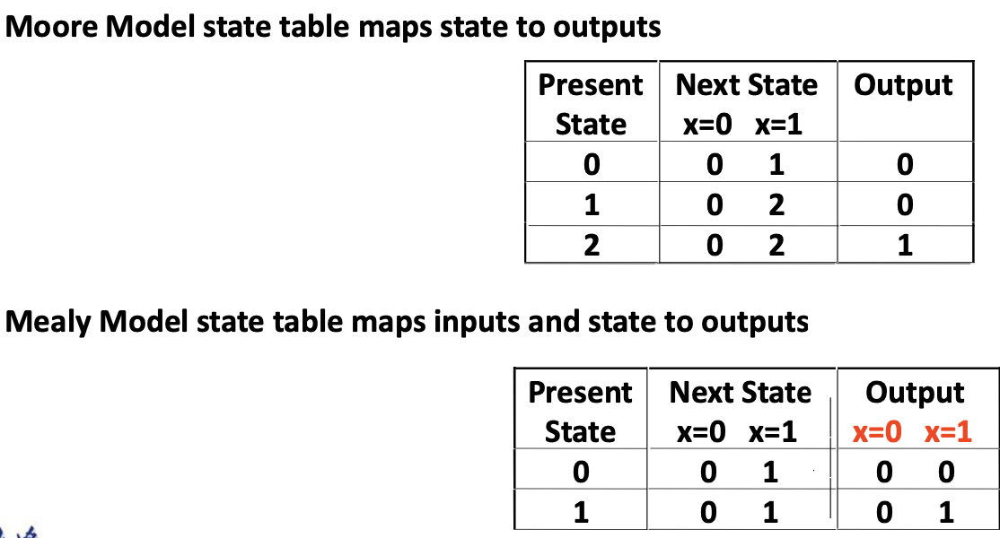
  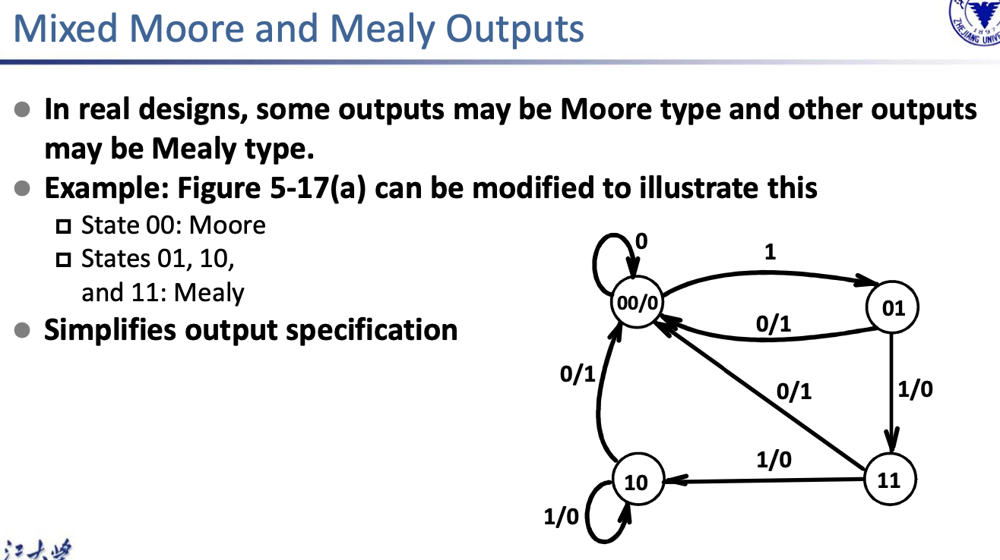

#### Equivalent State

## State Machine Design

