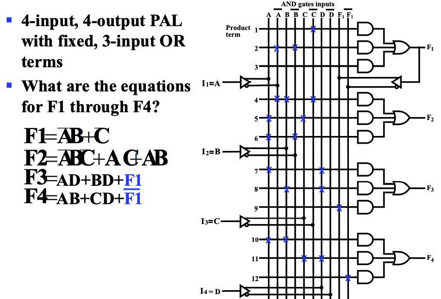

### Programmable Logic

1. Economies of Large-Scale Production: Large-scale production of integrated circuits reduces the cost per chip as production costs can be spread across a greater number of chips. Initial setup and tooling expenses incurred during the production process can be amortized over a larger quantity, resulting in lower costs per chip.
2. **Small-Scale Design Requirements:** While large-scale production is generally more economical, some designs may require only a relatively small number of chips. This could be due to the customized nature of specific applications or limitations in market size.
3. **Need for ICs that can be Produced in Large Volumes and Handle Small-Scale Designs:** This indicates a requirement for integrated circuits that can be both mass-produced efficiently and effectively accommodate multiple designs.
4. **Programmable Logic Devices:** These are a specialized category of integrated circuits that can be programmed after manufacturing. They can be divided into two types: field-programmable logic devices (FPLDs), which can be programmed outside the manufacturing environment, and erasable/reprogrammable logic devices.
5. **Erasable and Reprogrammable Nature:** Most programmable logic devices possess the ability to be erased and reprogrammed. This feature allows for updating devices, correcting errors, and reusing the device for different designs, showcasing a high level of reusability.
6. **Used for Prototyping and Laboratory Teaching:** Programmable logic devices are well-suited for prototyping as they enable engineers to make adjustments and modifications after the initial design is completed. Additionally, they serve as ideal tools in laboratory settings for demonstrating various designs and concepts.
7. **Utilized in Prototype Verification for Design:** Programmable logic devices are often employed to verify design prototypes, allowing for debugging and testing before the final manufacturing of regular integrated circuits. For instance, complete Intel Pentium designs were prototyped using specialized systems based on a large number of VLSI programmable devices.

### programming technologies

### Permanent

* Mask Programming
* Fuse
* Antiques

### Not Permanent

* Volatile - Programming lost if chip power lost

  SIngle-bit-storge element

* Non-volatile

​	Reasable

​	Eletrically erasable

​	Flash

### Read Only Memory(ROM)

* OR Gate Changable

* 也可以将输入看作 addr, 输出看作 data,来作储存功能

### Programmable Array Logic(PAL)

* AND Gate Changable

  

  > 可将首次与或当作输入回到AND gates input 可实现多变量与或.

###  Programmable Logic Array (PLA)

* And Or gates all changable

  

  * $And$ Gates limited

    

    适当取反，将需要**6**个与项--> 需要**4**个与项

### Complex Programmable Logic Device (CPLD) or Field-Programmable Gate Array(FPGA)

#### Look up tables

