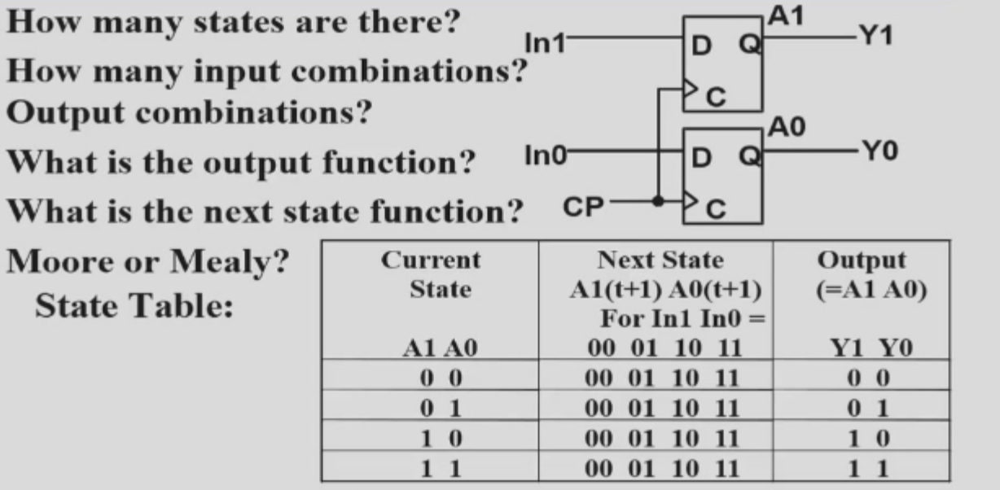
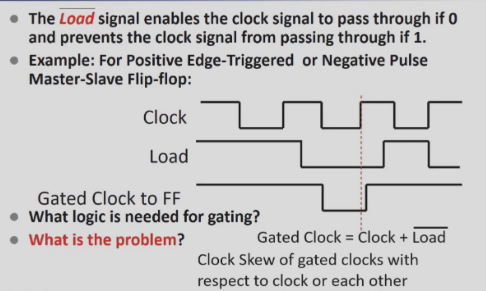
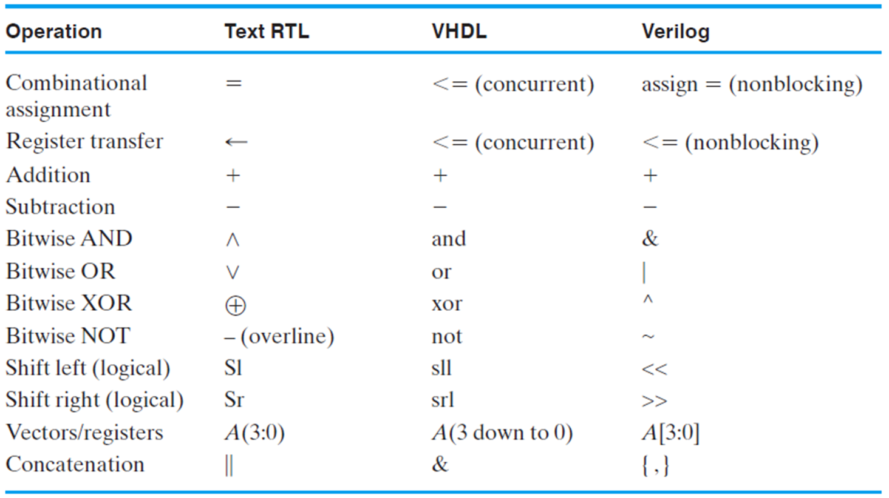
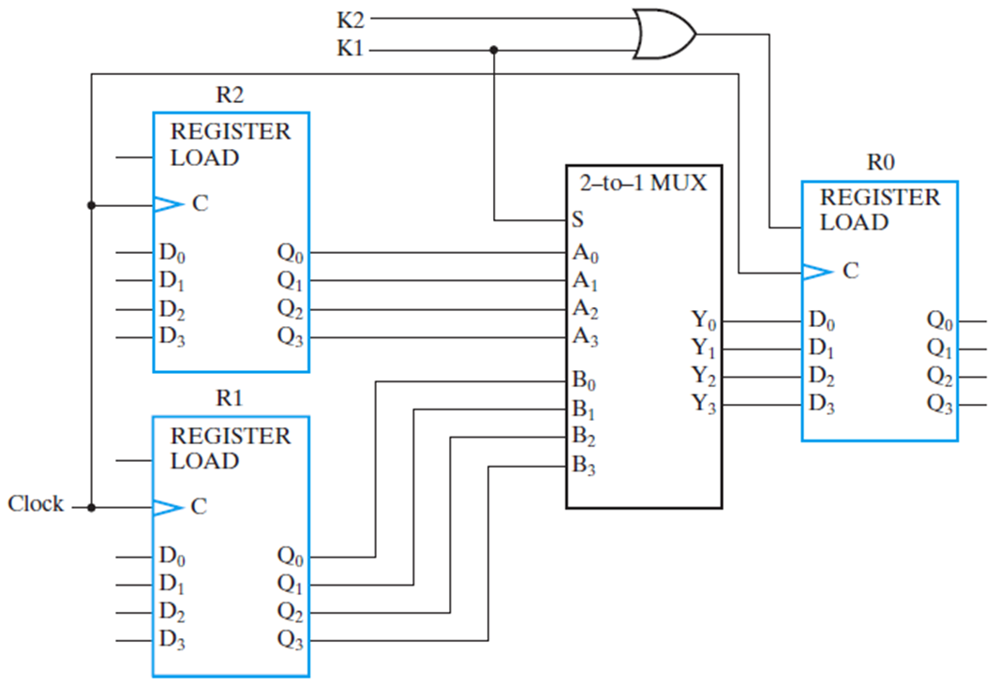
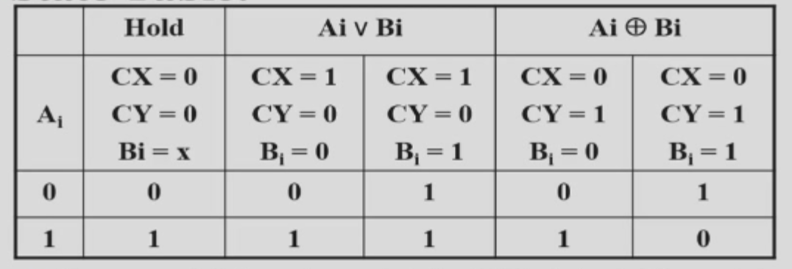

# Registers and Register Transfers

## Registers

??? Example 2-bit
    
  
   

### Storage and Load Enable

* Load = 0  : Store

* Load = 1  :  Load

> The Problem is : **Clock Skew**  「And Gate Delay」
>
> **勘误** Load = 0 时 脉冲消失，寄存器无法被载入
>
> ??? Example
>
>     
  
   

## Register Transfer

### Microoperations

Logical Groupings:

- **Transfer** - move data from one register to another
- **Arithmetic** - perform arithmetic on data in registers 
- **Logic** - manipulate data or use bitwise logical operations
- **Shift** - shift data in registers

> $if\ \ (K_1=1)\ then\ \ (R_2←R_1)$  表示为 $K_1 : R_2←R_1$

### Register Transfer structures

#### Multiplexer-Based Transfers

**note** : clocks are omitted for clarity

$K_1 : R_0←R_1$

$K2\bar{K1}: R_0←R_2$

* $R_0$ 's Load : $K_1+K2\bar{K1}=K_1+K_2$

??? Detailed-Logic

    
  
   

##### Register Cell Design

* Example 1 Not encoded 「one hot code」

* Example 2 Encoded.        「Binary or Gray」

> EG1: Example

Register A (m-bits) Sepecification:

> Data input B
>
> Control input $C_x \ C_y$ with combinations$(0,0)\ (0,1)\ (1,0)$
>
> Register Transfers:
>
> > $C_x : A \leftarrow A\ or\ B$
> >
> > $C_y$  : $ A \leftarrow A\ xor\ B$
> >
> > Hold State : $(0,0)$

**Multiplexer Approach**

Thus , we have :

> $Load = C_x + C_y$
>
> Cost : 6+3+2(or)+8(xor) = 19

**Sequential Circuit Design Approach**

* State table

#### Bus-Based Transfers

#### Three-State Bus

#### Other Transfer Sturctures

## Counters

#### **Ripple Counter**

#### Synchronous Counter

