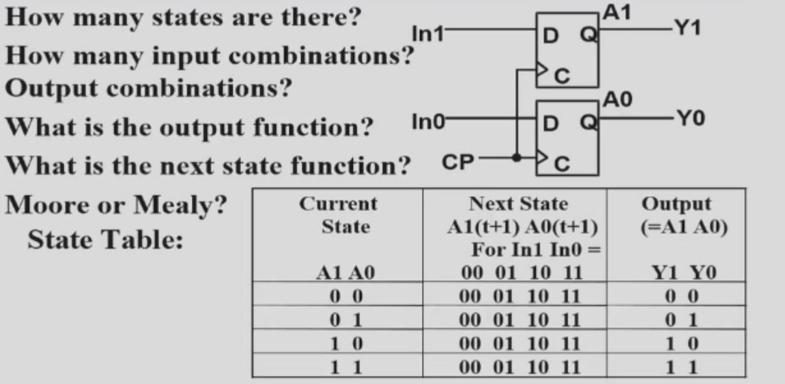
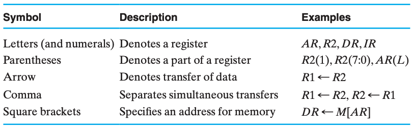
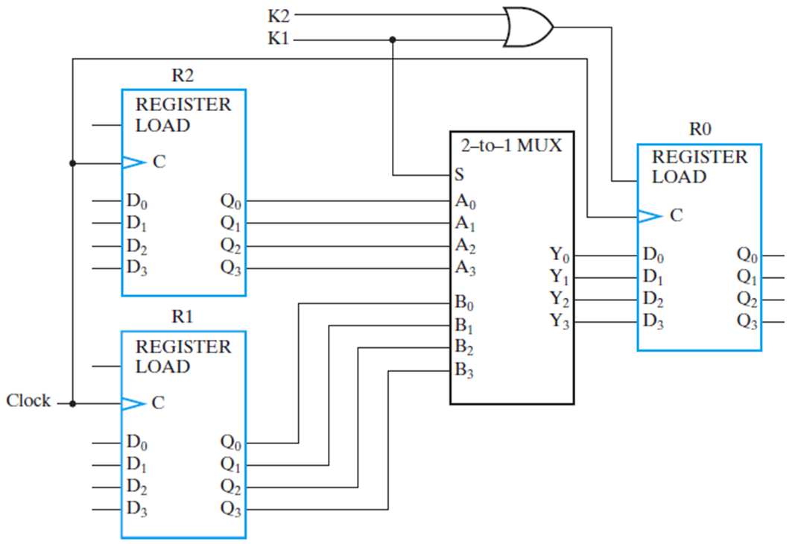
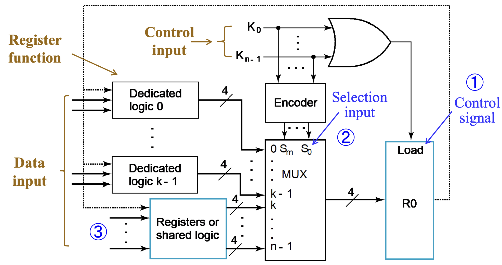

# Registers and Register Transfers

## Registers

??? Example 2-bit
    
  
   

### Storage and Load Enable

* Load = 0  : Store

* Load = 1  :  Load

> The Problem is : **Clock Skew**  「And Gate Delay」
>
> **勘误** Load = 0 时 脉冲消失，寄存器无法被载入
>
> ??? Example
>
>     
  
   

## Register Transfer

### Microoperations

Logical Groupings:

- **Transfer** - move data from one register to another
- **Arithmetic** - perform arithmetic on data in registers 
- **Logic** - manipulate data or use bitwise logical operations
- **Shift** - shift data in registers

> $if\ \ (K_1=1)\ then\ \ (R_2←R_1)$  表示为 $K_1 : R_2←R_1$

### Register Transfer structures

#### Multiplexer-Based Transfers

**note** : clocks are omitted for clarity

$K_1 : R_0←R_1$

$K2\bar{K1}: R_0←R_2$

* $R_0$ 's Load : $K_1+K2\bar{K1}=K_1+K_2$

??? Detailed-Logic

    
  
   

##### Register Cell Design

* Example 1 Not encoded 「one hot code」

* Example 2 Encoded.        「Binary or Gray」

> EG1: Example

Register A (m-bits) Sepecification:

> Data input B
>
> Control input $C_x \ C_y$ with combinations$(0,0)\ (0,1)\ (1,0)$
>
> Register Transfers:
>
> > $C_x : A \leftarrow A\ or\ B$
> >
> > $C_y$  : $A \leftarrow A\ xor\ B$
> >
> > Hold State : $(0,0)$

**Multiplexer Approach**

Thus , we have :

> $Load = C_x + C_y$
>
> Cost : 6+3+2(or)+8(xor) = 19

**Sequential Circuit Design Approach**

* State table**「Cost Less」**

#### Bus-Based Transfers

#### Dedicated Mux-Based Transfers

Similar to using a MUX, the MUX in this case is no longer dedicated logic for a specific register but is shared logic used by three registers. 

The MUX in the bus selects one input among all registers and outputs it to all registers. The bus controls which (or how many) registers receive this signal by manipulating the Load signal.

Advantages:

1. The circuit is more streamlined, resulting in lower costs, and this advantage becomes more apparent as the number of registers increases.
2. Cost-effectiveness is improved with the shared logic, as opposed to dedicated logic for each register.

Disadvantages:

1. At any given moment, the bus can only transmit **one piece** of data, meaning there is only one data source.
2. Only **one data** transfer is possible to other locations within the same clock cycle. For instance, performing a swap operation requires at least **two buses** to implement.「无法做并行传输」
3. Due to these characteristics, the requirements must be carefully evaluated, and the appropriate structure chosen for implementation.

> Gate Cost. (increase linearly)

#### Three-State Bus

The 3-input MUX can be replaced by a 3-state node (bus) and 3-state buffers.

* Cost is further reduced, but **transfers are limited**.
* Characterize the simultaneous transfers possible with this structure.
* Characterize the cost savings and compare.
* The input and output can share the same line, requiring only n pins.

> Gate Cost Only 2n (suppose cost for three-state is 2)

??? Example 
    
  
   

### Shift Registers

#### 串行实现

假设现在我们有 4 个 `FF` 首尾相连，现在串行输入 `1001` 这 4bits 的数据（当然，完全输入需要 4 个时钟周期）。

假设第 1 个周期结束后，`1001` 最右侧的 `1` 被存在了第一个 FF，则：

| 周期 | 待输入 | FF1  | FF2  | FF3  | FF4  | SO     |
| ---- | ------ | ---- | ---- | ---- | ---- | ------ |
| 1    | `100`  | `1`  | ?    | ?    | ?    | `1???` |
| 2    | `10`   | `0`  | `1`  | ?    | ?    | `01??` |
| 3    | `1`    | `0`  | `0`  | `1`  | ?    | `001?` |
| 4    |        | `1`  | `0`  | `0`  | `1`  | `1001` |
| 5    |        | ?    | `1`  | `0`  | `0`  | `?100` |
| 6    |        | ?    | ?    | `1`  | `0`  | `??10` |
| 7    |        | ?    | ?    | ?    | `1`  | `???1` |

* 这里的 SO 指的是从当前轮次开始，读入 4bits 数据得到的串行输出结果，这里的 4bits 当然是对应输入的 4bits。

* 可以发现，在第四轮前后的结果分别是左移和右移的结果，当然，如果是要考虑具有实际计算价值的位移，我们当然需要填充 `?` 的值，不过这都是小事情。

#### Parallel Load Shift Registers「Mux」

#### Shift Registers with Additional Functions

## Counters

#### **Ripple Counter**

#### Synchronous Counter

