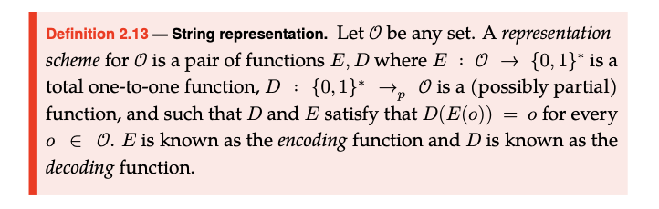
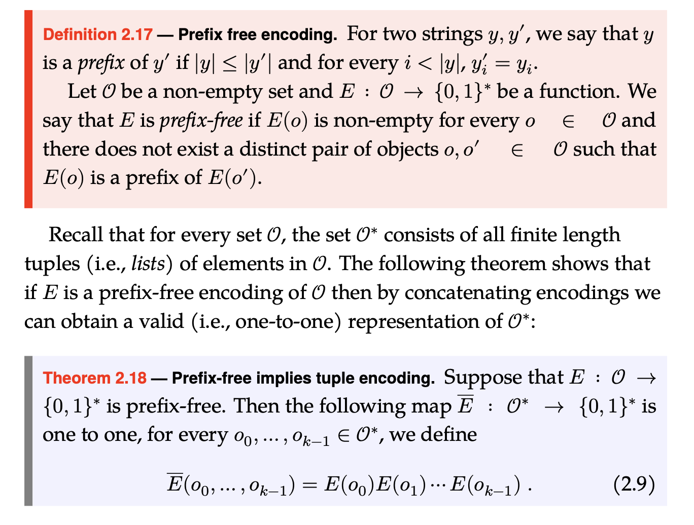
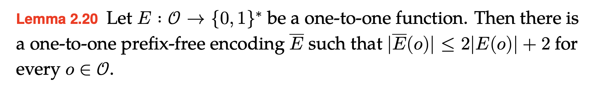

# Lecture 1
## Example :

Given a weighted graph G :

* What's the MST?
* What's the weight of the MST?
* Does G have a ST with wieght at most k(k is a given integer)? -- **Decision Problem**

Given a string w, is $w\in L=\{encode(G,k) | G\ is\ a\ graph,that\ has\ a\ ST\ with\ weight\ at\ most\ k\}$? 

*  **Decision Problem** $\Rightarrow$ **A Laguanage**
*  **A Laguanage** $\Rightarrow$ **A Formal Language**
*  Therefore, a **Decision Problem P**  $\Leftrightarrow$ **A Language L**
  
## Definition :
### Alphabet

* A finite set of symbols
### String

* A finite sequence of symbols from an alphabet $\Sigma$
* concatenation: $w_1w_2$
* exponentiation: $w^n$
* empty string: $e$
* reverse: $w^R$

### Language

* A set of strings over an alphabet $\Sigma$
* concatenation: $L_1L_2 = \{w_1w_2 | w_1\in L_1,w_2\in L_2\}$
* exponentiation: $L^n = \{w^n | w\in L\}$
* $A^0 = \{e\}$
* $A^* = \bigcup_{i=0}^{\infty}A^i$
* $A^+ = \bigcup_{i=1}^{\infty}A^i$
* $\Sigma^* = \bigcup_{i=0}^{\infty}\Sigma^i$
* $\Sigma^+ = \bigcup_{i=1}^{\infty}\Sigma^i$
* $\Sigma^i = \{w | w\ is\ a\ string\ of\ length\ i\}$
* Language Reverse: $L^R = \{w^R | w\in L\}$
* $\{\}$ vs $\{e \}$ : size of $\{\}$ is 0, size of $\{e\}$ is 1
  
### Computable Model
#### Finite Automata
A finite automaton is a 5-tuple $(Q,\Sigma,\delta,q_0,F)$ where:

* $Q$ is a finite set of states
* $\Sigma$ is an alphabet
* $\delta:Q\times\Sigma\rightarrow Q$ is the transition function
* $q_0\in Q$ is the start state
* $F\subseteq Q$ is the set of accept states

A configuration of an FA is a pair $(q,w)$ where $q\in Q$ and $w\in\Sigma^*$ where $q$ is the current state and $w$ is the remaining input.

* yeild in one step: $(q,w)\vdash_M(q',w')$ if $w = aw'$ and $\delta(q,a) = q'$
* yeild in zero or more steps: $(q,w)\vdash_M^*(q',w')$ if $(q,w)\vdash_M(q_1,w_1)\vdash_M(q_2,w_2)\vdash_M\cdots\vdash_M(q',w')$

M accepts a language L if (two conditions):

* M accepts all strings in L
* Or M rejects all strings not in L
* M accepts a **UNIQUE** Language
* $L(M) = \{w | M \ accepts\ w\}$

A language is regular if it is accepted by a finite automaton.

##### Theorem
If A and B are regular languages, so is $A\cup B$.
Proof:

* Let $M_A$ and $M_B$ be FAs that accept A and B respectively.
* $M_A = (K_A,\Sigma,\delta_A,s_A,F_A)$
* $M_B = (K_B,\Sigma,\delta_B,s_B,F_B)$
* Construct a new FA $M$ that accepts $A\cup B$:
  * $K_v = K_A\times K_B$
  * $s_v = (s_A,s_B)$
  * $F_v =(F_A\times K_B)\cup(K_A\times F_B)$
  * $\delta_v((q_A,q_B),a) = (\delta_A(q_A,a),\delta_B(q_B,a))$ for any $(q_A,q_B)\in K_A\times K_B$ and $a\in\Sigma$

If A and B are regular languages, so is $A\cdot B$.
Proof:

* Let $M_A$ and $M_B$ be FAs that accept A and B respectively.

## Complemetary Material
### Cantor's Theorem, Countable Sets, and String Representations of the Real Numbers
#### Cantor's Theorem

* There does not exits a one-to-one function RtS: $\mathbb{R}\rightarrow\{0,1\}^*$
* (equivalently) The Real numbers are uncountable.That is, there does not exist a one-to-one function $f:\mathbb{N}\rightarrow\mathbb{R}$

**Proof**:

* See Book page 94

### Boolean functions are uncountable

The set of all boolean functions(mapping $\{0,1\}^*\rightarrow\{0,1\}$) is uncountable.
* Proof see book page 99
  
#### Equivalent conditions for countability
* The set S is countable
* There exits a one-to-one map from  $\mathbb{N}$ to S
* There exits an onto map from $\{0,1\}^*$ to S
* There exits a one-to-one map from S to $\{0,1\}^*$
* There exits a one-to-one map from S to $\mathbb{N}$
* There exits an onto map from some countable set T to S
* There exits a one-to-one map from S to some countable set T

### Representing Objects Beyond Numbers

>

**Lemma**:
Suppose that $E: O \rightarrow \{0,1\}^*$ is a one-to-one function. Then there exists a function $D:\{0,1\}^*\rightarrow O$ such that $D(E(o)) = o$ for all $o\in O$.
> Proof:
> Let $o_0$ be an arbitrary object in O. Let $w_0 = E(o_0)$. Let $w_0 = w_1w_2\cdots w_n$ be the string representation of $w_0$. Let $o_1 = D(w_1)$, $o_2 = D(w_1w_2)$, $\cdots$, $o_n = D(w_1w_2\cdots w_n)$. Then $D(w_0) = o_n$.

#### Finite Representations 
if $O$ is finite, then we can represent every object in $O$ as a string of length at most some number $n$ if and only if $|O|\leq 2^{n+1}-1$.

**Lemma**:
For every two finite sets S and T, there exists a one-to-one function $E:S\rightarrow T$ if and only if $|S|\leq|T|$.

* Proof see book page 101

#### Prefix-Free encoding

* Proof see book page 103

#### Making Representations prefix-free

> 

* Proof see book page 104
