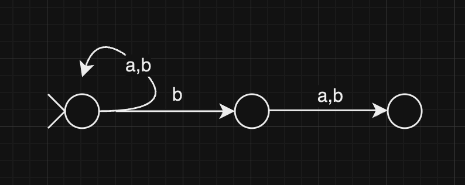
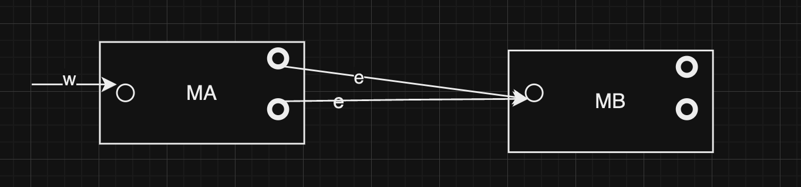
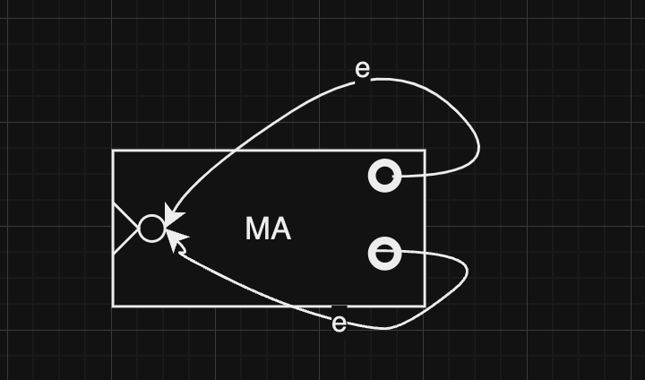
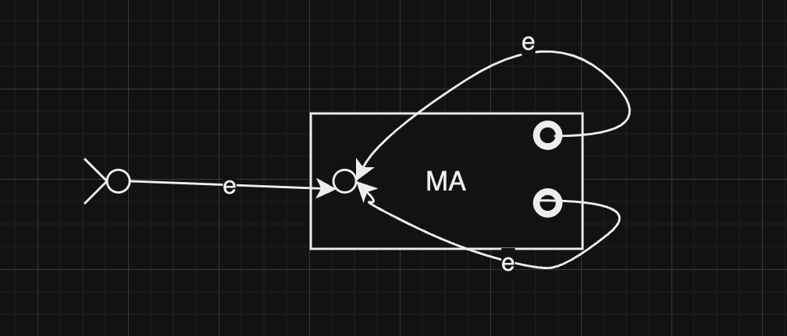

# Lecture 1 - Finite Automata
## Example :

Given a weighted graph G :

* What's the MST?
* What's the weight of the MST?
* Does G have a ST with wieght at most k(k is a given integer)? -- **Decision Problem**

Given a string w, is $w\in L=\{encode(G,k) | G\ is\ a\ graph,that\ has\ a\ ST\ with\ weight\ at\ most\ k\}$? 

*  **Decision Problem** $\Rightarrow$ **A Laguanage**
*  **A Laguanage** $\Rightarrow$ **A Formal Language**
*  Therefore, a **Decision Problem P**  $\Leftrightarrow$ **A Language L**
  
## Definition :
### Alphabet

* A finite set of symbols
### String

* A finite sequence of symbols from an alphabet $\Sigma$
* concatenation: $w_1w_2$
* exponentiation: $w^n$
* empty string: $e$
* reverse: $w^R$

### Language

* A set of strings over an alphabet $\Sigma$
* concatenation: $L_1L_2 = \{w_1w_2 | w_1\in L_1,w_2\in L_2\}$
* exponentiation: $L^n = \{w^n | w\in L\}$
* $A^0 = \{e\}$
* $A^* = \bigcup_{i=0}^{\infty}A^i$
* $A^+ = \bigcup_{i=1}^{\infty}A^i$
* $\Sigma^* = \bigcup_{i=0}^{\infty}\Sigma^i$
* $\Sigma^+ = \bigcup_{i=1}^{\infty}\Sigma^i$
* $\Sigma^i = \{w | w\ is\ a\ string\ of\ length\ i\}$
* Language Reverse: $L^R = \{w^R | w\in L\}$
* $\{\}$ vs $\{e \}$ : size of $\{\}$ is 0, size of $\{e\}$ is 1
  
### Computable Model
#### Finite Automata
A finite automaton is a 5-tuple $(K,\Sigma,\delta,s,F)$ where:

* $K$ is a finite set of states
* $\Sigma$ is an alphabet
* $\delta:K\times\Sigma\rightarrow K$ is the transition function
* $s \in K$ is the start state
* $F\subseteq K$ is the set of accept states

A configuration of an FA is a pair $(q,w)$ where $q\in Q$ and $w\in\Sigma^*$ where $q$ is the current state and $w$ is the remaining input.

* yeild in one step: $(q,w)\vdash_M(q',w')$ if $w = aw'$ and $\delta(q,a) = q'$
* yeild in zero or more steps: $(q,w)\vdash_M^*(q',w')$ if $(q,w)\vdash_M(q_1,w_1)\vdash_M(q_2,w_2)\vdash_M\cdots\vdash_M(q',w')$

M accepts a language L if (two conditions):

* M accepts all strings in L
* And M rejects all strings not in L
* M accepts a **UNIQUE** Language
* $L(M) = \{w | M \ accepts\ w\}$

A language is regular if it is accepted by a finite automaton.

##### Theorem
If A and B are regular languages, so is $A\cup B$.
Proof:

* Let $M_A$ and $M_B$ be FAs that accept A and B respectively.
* $M_A = (K_A,\Sigma,\delta_A,s_A,F_A)$
* $M_B = (K_B,\Sigma,\delta_B,s_B,F_B)$
* Construct a new FA $M$ that accepts $A\cup B$:
  * $K_v = K_A\times K_B$
  * $s_v = (s_A,s_B)$
  * $F_v =(F_A\times K_B)\cup(K_A\times F_B)$
  * $\delta_v((q_A,q_B),a) = (\delta_A(q_A,a),\delta_B(q_B,a))$ for any $(q_A,q_B)\in K_A\times K_B$ and $a\in\Sigma$

#### Non-deterministic Finite Automata

* next state is not uniquely determined by the current state and the input symbol
* e-transitions: $\delta(q,e)$

A NFA is a 5-tuple $(K,\Sigma,\Delta,s,F)$ where:

* K is a finite set of states
* $\Sigma$ is an alphabet
* $\Delta:K\times(\Sigma\cup\{e\})\times K$ is the transition relation
* $s\in K$ is the start state
* $F\subseteq K$ is the set of accept states

**Acceptance of a string by a NFA**:

* M on input w accepts if $(s,w)\vdash_M^*(q,e)$ for some $q\in F$
* M accepts a language L if M accepts every string w in L

**Example**:
Construct a NFA that accepts the language $\{w | w \in \{a,b\}^*$,the second symbol from the end of w is b$\}$

##### Theorem

* Given a NFA M, there exists a DFA M' such that $L(M) = L(M')$.
* Given a DFA M, there exists a NFA M' such that $L(M) = L(M')$.

* DFA M simulates "tree-like" computation of NFA M.

> A NFA $M = (K,\Sigma,\Delta,s,F)$ can be simulated by a DFA $M' = (K',\Sigma,\delta,s',F')$ where:
>
>  * $K' = 2^K$ 
>    * $2^K = \{q_1,q_2,\cdots,q_n,\{q_1\},\{q_2\},\cdots,\{q_n\},\{q_1,q_2\},\cdots,\{q_1,q_2,\cdots,q_n\}\}$
> 
>  * $F' = \{q\in K' | q\cap F \neq \emptyset\}$
> 
>  * $\delta(q,a) = \bigcup_{p\in q}\Delta(p,a)$ for any $q\in K'$ and $a\in\Sigma$
> 
>  * $s' = E(s)$ where $\forall q \in K, E(q)=\{p \in K:(q,e)\vdash_M^*(p,e)\}$
> 
>  * $\delta(Q,a) = \bigcup_{q\in Q}\bigcup_{p:(q,a,p)\in\Delta}E(p)$ for any $Q\subseteq K'$ and $a\in\Sigma$

* A language is regular if and only if it is accepted by a NFA.

##### Proof
* If A and B are regular languages, so is $AB$.
  
  
> Let $M_A$ and $M_B$ be FAs that accept A and B respectively.
> 
> $M_A = (K_A,\Sigma,\delta_A,s_A,F_A)$
> 
> $M_B = (K_B,\Sigma,\delta_B,s_B,F_B)$
> 
> Construct a new FA $M$ that accepts $A\cdot B$:
> 
> $M = (K,\Sigma,\delta,s,F)$ where
> 
> * $K = K_A\bigcup K_B$
> 
> * $s = s_A$
> 
> * $F = F_B$
> 
> * $\delta(q,a) = \delta_A(q,a)\bigcup\delta_B(q,a)\bigcup\{(q,e,s_B):q\in F_A\}$

* If A is a regular language, so is $A^+$.
  
  
  
* If A is a regular language, so is $A^*$.
  
  
