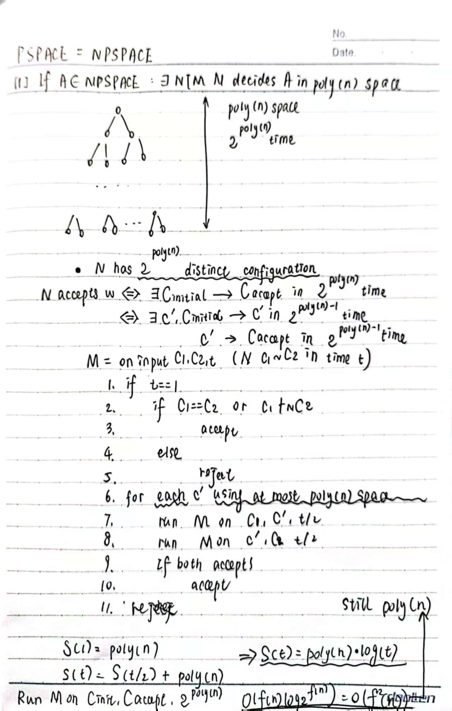
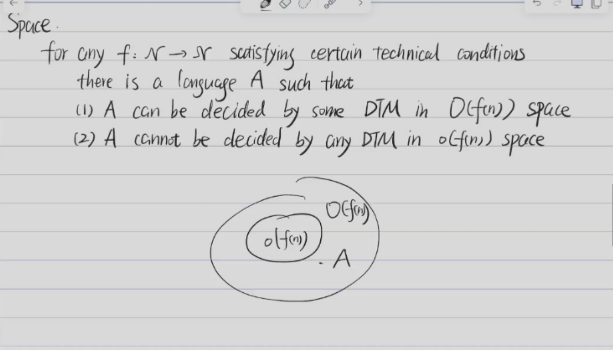
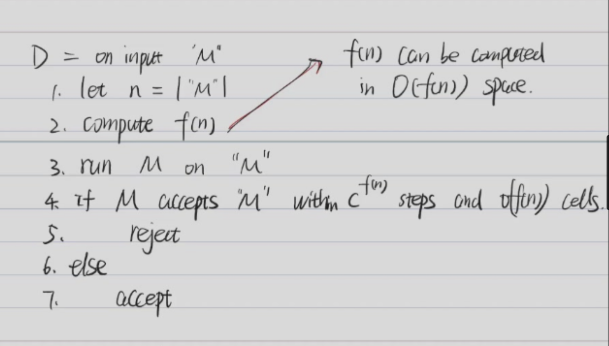
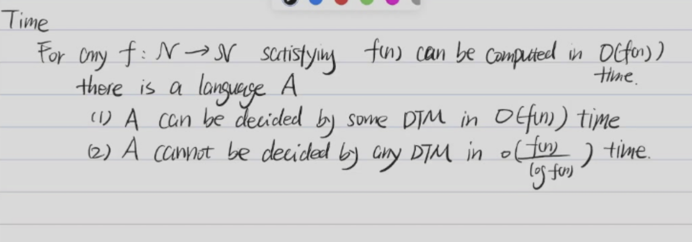
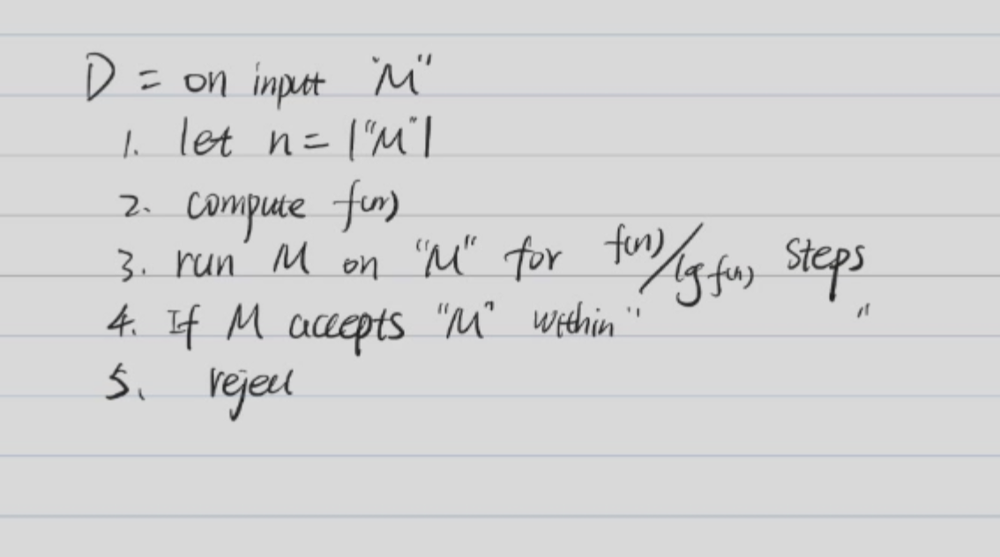
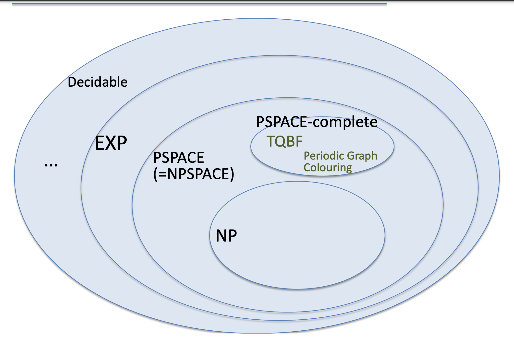

<font face = "Times New Roman">

# Lecture 10: Complexity Theory -- Space Complexity

Let M be a standard DTM. M runs in space $S(n)$ if, for any input of length $n$, M uses at most $S(n)$ tape cells.

Let N be a standard NTM. N runs in space $S(n)$ if, for any input of length $n$, every branch of N uses at most $S(n)$ tape cells.

PSPACE = $\{A | A$ is decided by some DTM using a polynomial amount of space $\}$

NPSPACE = $\{A | A$ is decided by some NTM using a polynomial amount of space $\}$

EXP = $\{A | A$ is decided by some DTM using within 2<sup>p(n)</sup> time $\}$

> Because the number of configurations of a DTM is at most 2<sup>p(n)</sup>, where p(n) is a polynomial.
>
> More specifically, the number of configurations of a DTM is at most 2<sup>p(n)</sup>  because the number of tape cells is at most p(n)

* P $\subseteq$ PSPACE $\subseteq$ EXP
> If a problem can be solved in polynomial time, it can be solved in polynomial space.

* NP $\subseteq$ PSPACE $\subseteq$ NPSPACE

> NP $\subseteq$ PSPACE
> 1. $\exists$ NTM N that decides A in polynomial time 
>
> 2. Simulate every branch of N : Polynomial space
>
> 3. Mark 分支的选择情况(每个结点一个)：Polynomial space()


### Theorem 1

NPSPACE = PSPACE

#### Savitch's Theorem



#### Space Hirachical Theorem

${\displaystyle {\mathsf {SPACE}}\left(o(f(n))\right)\subsetneq {\mathsf {SPACE}}(f(n))}$



Construct a DTM D

1. D decides some language A in space $O(f(n))$
2. For any DTM M that decides A in space $o(f(n))$

D and M differs on at least one input

```
We want to construct D such that

    M1  M2 M3  M4  M5  M6  ...
M1  +  
M2  -   +
M3  -   -   -
M4  -   -   -   +
M5  -   +   -   -   -
M6  -   -   -   -   -   +
...
D   -   -   +   -   +   -   ...
```



D runs in space $O(f(n))$
D decides some language  -- will halt

#### Time Hierarchy Theorem

${\displaystyle {\mathsf {DTIME}}\left(o\left(f(n)\right)\right)\subsetneq {\mathsf {DTIME}}(f(n){\log f(n)})}$



* Have to update COUNTER every time -- $log f(n)$ time






</font>