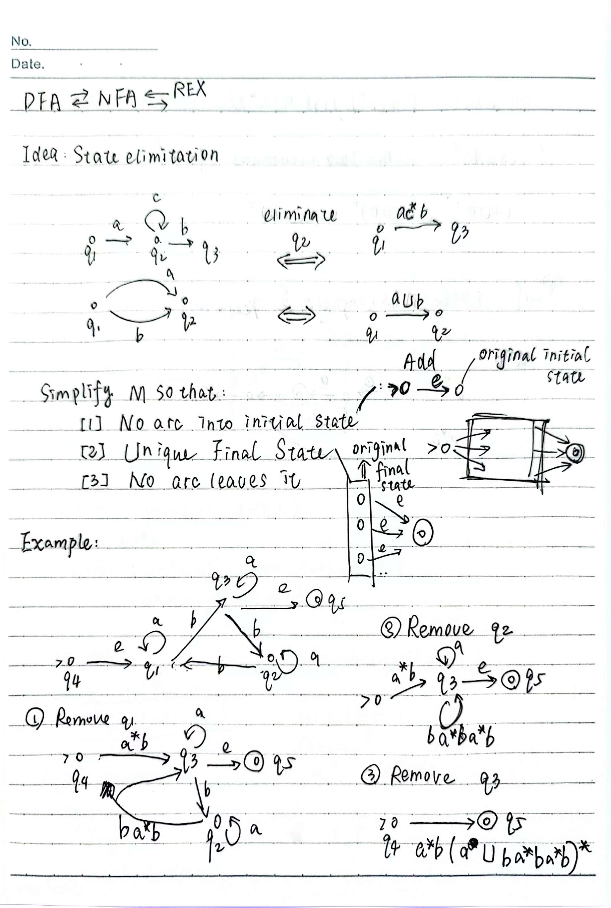
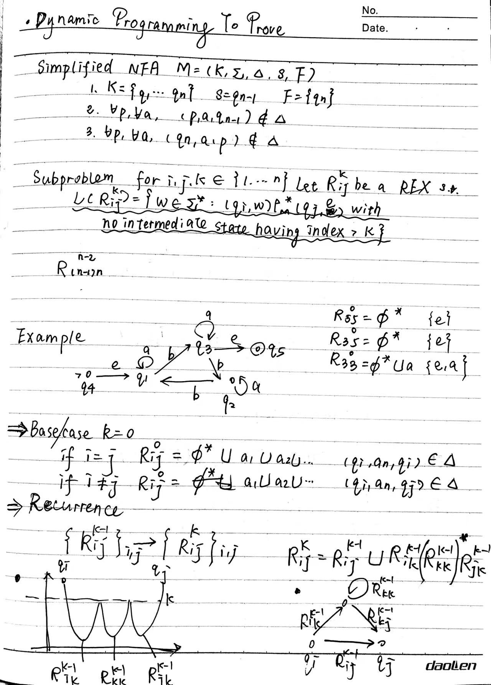

# Lecture 2 - Regular Expressions
## Definition :
### Regular Expression
$a(a\cup b)^nb$ is a regular expression over $\{a,b\}$

$L(R) = \{w \in \{a,b\}^* | w\ is\ a\ string\ that\ starts\ with\ a\ and\ ends\ with\ b\}$

#### Automic Regular Expression

* $\emptyset$ : $L(\emptyset) = \emptyset$
* $a\in \Sigma$ : $L(a) = \{a\}$

#### Composition of Regular Expression

* $R_1\cup R_2$ : $L(R_1\cup R_2) = L(R_1)\cup L(R_2)$
* $R_1R_2$ : $L(R_1R_2) = L(R_1)L(R_2)$
* $R_1^*$ : $L(R_1^*) = [L(R_1)]^*$

#### Precedence of Regular Expression
* $* >  \cdot > \cup$

### State Elimination

### Proof
#### Theorem 1: 

$RE \rightarrow NPA$

* We can simply prove that $RE \rightarrow NPA$ by constructing a NPA from a regular expression.

$NPA \rightarrow RE$

* Prove by using the idea of `state elimination` and `dynamic programming`.

#### Theorem 2:

Let $L$ be a **regular language**,there must exist an integer $p\geq 1$ such that every string $w\in L$ with $|w|\geq p$ can be written as $w = xyz$ with 

* $|xy|\leq p$
* $|y|\geq 1$ 
* for all $i\geq 0$, $xy^iz\in L$.

Here $p$ is called the **pumping length**.
**Proof**

If $L$ is a regular language and it is finite, then we can set $p$ to be the maximum length +1 of the strings in $L$.

If $L$ is a regular language and it is infinite, there exits a NFA $N$ that accepts $L$. Let $N = (Q,\Sigma,\delta,q_0,F)$, where $Q = \{q_0,q_1,\cdots,q_n\}$.

* Suppose $N$ has $n$ states, then we can set $p = n+1$.
* consider $q_0 \ to\ q_p$ [$q_i$ is state after reading $a_i$], then there must $\exists i,j$ such that $i\neq j$ and $q_i = q_j$. Then we can set $x = w[0,i-1]$, $y = w[i,j-1]$, $z = w[j,p-1]$.

**Example**
$L = \{0^n1^n | n\geq 0\}$ is not a regular language.

* Proof by contradiction
* Assume $L$ is a regular language, then there must exist a pumping length $p$.
* Consider $w = 0^p1^p$, then $w = xyz$ with
  1. $|xy|\leq p$
  2. $|y|\geq 1$ 
  3.  $xy^iz\in L$.
* from i and ii, we can know that $y = 0^k$ for some $k\geq 1$.
* from iii, we can know that $xy^2z = 0^{p+k}1^p \notin L$, which is a contradiction.

**Example**

$L = \{w\in \{0,1\}^* | w\ contains\ an\ equal\ number\ of\ 0's\ and\ 1's\}$ is not a regular language.

Assume $L$ is a regular language, then $L \cap 0^*1^* = \{0^n1^n | n\geq 0\}$ is a regular language, which is a contradiction.

