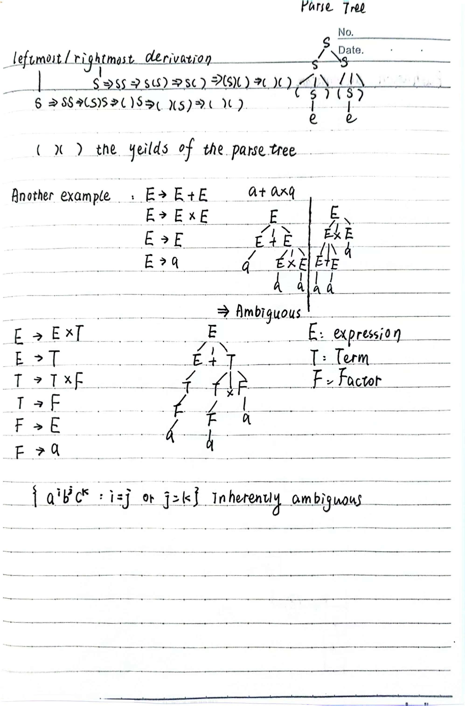

# Lecture 3 - Context-Free Grammar CFG

A context-free grammar (CFG) is a set of recursive rules used to generate patterns of strings. 
A CFG $G = (V, \Sigma, R, S)$ consists of:

- A finite set of variables (non-terminal symbols) $V$.
- A finite set of terminal symbols $\Sigma$.
- S $\in$ $V-\Sigma$ is the start symbol.
- R $\in$ $(V-\Sigma) \times (V)^*$ is a finite set of rules.

**Define in one step** $\Rightarrow$.

For any $x,y,u \in V^*$, for any $A \in V - \Sigma$,  $xAy \Rightarrow xuy$ if $(A,u) \in R$.

**Define in multiple steps** $\Rightarrow^*$.

For any $x,y,u \in V^*$, for any $A \in V - \Sigma$,  $w \Rightarrow^* u$ if $w=u$ or $w \Rightarrow u_1 \Rightarrow u_2 \Rightarrow \cdots \Rightarrow u_k \Rightarrow u$.

G generates $w\in \Sigma^*$ if $S \Rightarrow^* w$.
  * L(G) = {w $\in \Sigma ^*$| G generates w} is a context-free language.

**Example:**

* $\{a^nb^n|n\geq 0\}$ is a context-free language.
  * Rule: $S \rightarrow aSb | e$.
* $\{w\in {a,b}^*|w = w^R\}$ is a context-free language.
  * Rule: $S \rightarrow aSa | bSb | e | a | b$.

### Leftmost Derivation

## Pumping Theorem for CFL

If L is a context-free language, then there exists a positive integer p such that any string $s \in L$ with $|s| \geq p$ can be written as $s = uvxyz$ such that:

1. $|vxy| \leq p$.
2. $|v|+|y| \geq 1$.
3. $uv^ixy^iz \in L$ for all $i \geq 0$.

### Proof

* See [link](https://www2.lawrence.edu/fast/GREGGJ/CMSC515/chapt02/Pumping.html)
* See [link](https://courses.grainger.illinois.edu/cs373/fa2012/) 

### Example

* $\{a^nb^nc^n|n\geq 0\}$ is not a context-free language.

If L is a context-free language, then there exists a positive integer p such that any string $s \in L$ with $|s| \geq p$ can be written as $s = uvxyz$ such that:

1. $|vxy| \leq p$.
2. $|v|+|y| \geq 1$.
3. $uv^ixy^iz \in L$ for all $i \geq 0$.

From 2. and 1., we have $vxy$ contains at most two types of symbols from $\{a,b,c\}$.

* Suppose $v$ and $y$ contain only one type of symbols or two types of symbols.
  * $uv^2xy^2z$ will not have the same number of $a,b,c$.

