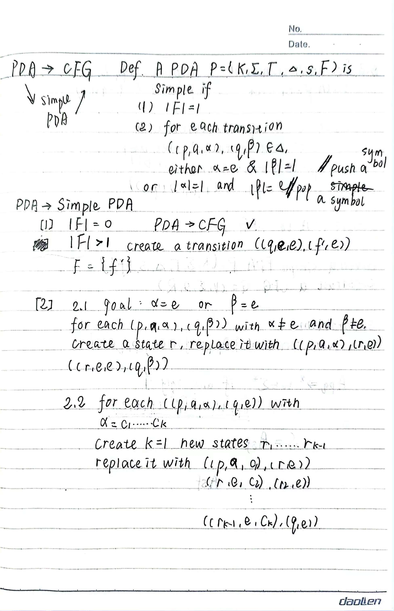
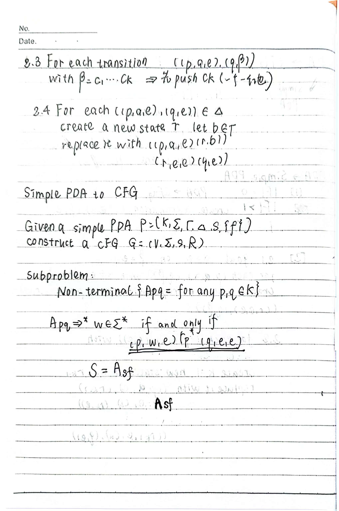
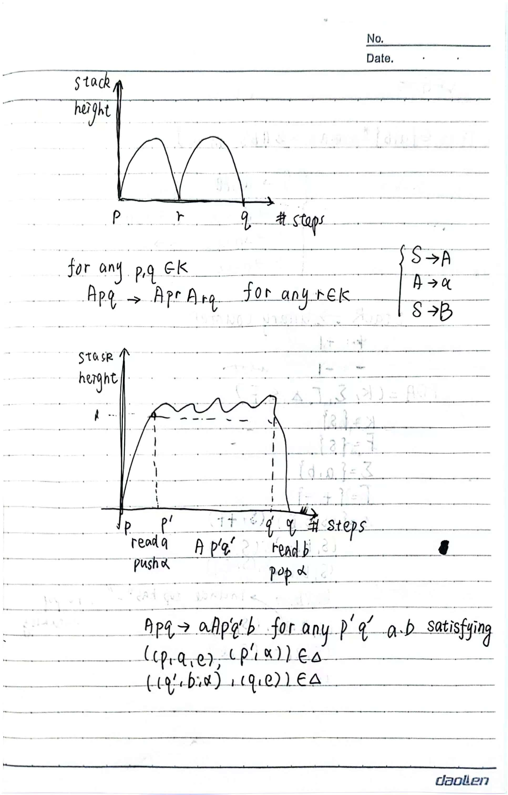
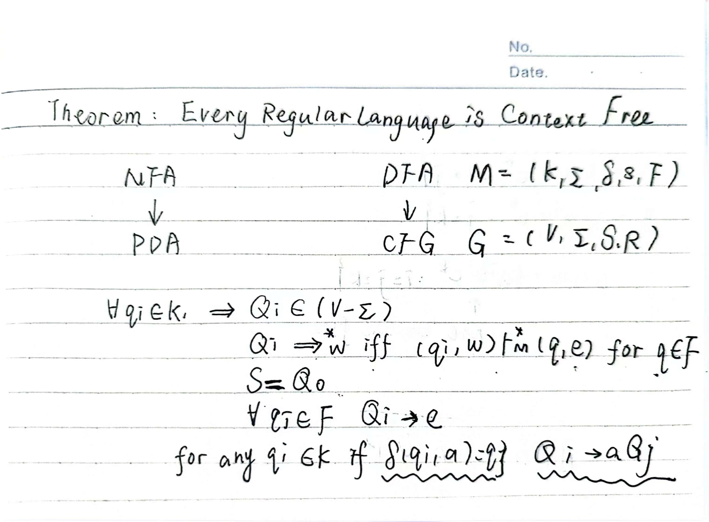

# Lecture 4 - Pushdown Automata

## Pushdown Automata

* Pushdown automata (PDA) is a non-deterministic finite automaton with a stack.

A PDA is a 6-tuple $P = (K, \Sigma, \Gamma, \Delta, s, F)$, where 
* $K$ is a finite set of states.
* $\Sigma$ is tape alphabet.
* $\Gamma$ is stack alphabet.
* $\Delta$ is a set of transition rules.
* $s$ is the initial state.
* $F$ is the set of final states.

### $\Delta$ Transition Rules

$\Delta$ is a "finite" subset of $K \times ((\Sigma \cup \{\epsilon\}) \times \Gamma^*) \times (K \times \Gamma^*)$. where
* $K$ is the current state.
* $\Sigma \cup \{\epsilon\}$ is the current input symbol.
* $\Gamma^*$ is the current stack top symbol.
* $K$ is the next state.
* $\Gamma^*$ is the stack top symbol to be pushed.

### Configuration of PDA

A configuration of PDA is a member of $K \times \Sigma^* \times \Gamma^*$.

#### yeild in one step

$(q, x, \alpha) \vdash_P (p, y, \beta)$ if $\exists( (q, a, r), (p, b) ) \in \Delta$ such that $x = ay$ and $\alpha = r\tau$ and $\beta = b\tau$. for some $\tau \in \Gamma^*$.

#### yeild in multiple steps

$(q, x, \alpha) \vdash_P^* (p, y, \beta)$ if $(q, x, \alpha) \vdash_P (p_1, y_1, \beta_1) \vdash_P \cdots \vdash_P (p, y, \beta)$ or $(q, x, \alpha) = (p, y, \beta)$.

PDA accepts a string $x$ if $(s, x, \epsilon) \vdash_P^* (p, \epsilon, \epsilon)$ for some $p \in F$.

Language of PDA $P$ is $L(P) = \{x \in \Sigma^* | (s, x, \epsilon) \vdash_P^* (p, \epsilon, \epsilon) \text{ for some } p \in F\}$.

### Example

Construct a PDA that accepts the language $\{w \in \{0, 1\}^* | \#0's = \#1's\}$.

* $K = \{s,q,f\}$.
* $S = s$.
* $F = {f}$.
* $\Sigma = \{0, 1\}$.
* $\Gamma = \{ \$, 0, 1\}$.

$$\begin{align*} \Delta = \{ &((s, \epsilon, \epsilon) , (q, \$)), \\ &( (q, 0, \$), (q, 0\$)), \\ &( (q, 0, 0), (q, 00)), \\ &( (q, 0, 1), (q, \epsilon)), \\ &( (q, 1, \$), (q, 1\$)), \\ &( (q, 1, 0), (q, \epsilon)), \\ &( (q, 1, 1), (q, 11)), \\ &( (q, \epsilon, \$), (f, \epsilon)) \} \end{align*}$$

## CFG and PDA

$CFG \Rightarrow PDA$. and $PDA \Rightarrow CFG$.

### CFG $\Rightarrow$ PDA

#### Only Give an Example

Given a CFG with $R = \{S \rightarrow aSb | \epsilon\}$, construct a PDA $P$ that accepts $L(G)$.

* $K = \{s, f\}$.
* $S = s$.
* $F = \{f\}$.
* $\Gamma =V$.
  
$$\begin{align*} \Delta = \{ &((s, e, e), (f, S)), \\ &((f,e,A),(f,u)) \text{ for all } (A,u) \in R \  (\text{generate step}) \\ &((f, a, a), (f, \epsilon)) for all a \in \Sigma   \  (\text{Matching step}) \}\end{align*}$$

### PDA $\Rightarrow$ CFG

The idea is to first convert the PDA to a **simple PDA**, then convert the simple PDA to a CFG.

* See notes

## Theorem
### Theorem 1

Every Regular Language is a Context-Free Language.
* NFA $\Rightarrow$ PDA. [simple]
* DFA $\Rightarrow$ CFG. 

### Theorem 2
The family of context-free languages is closed under $\cup, \cdot, *$. but not closed under $\cap, -$.

#### $\cup$
* Add $S \rightarrow S_1 | S_2$.
  
#### $\cdot$
* Add $S \rightarrow S_1S_2$.

#### $*$
* Add $S \rightarrow SS_A | \epsilon$.

#### $\cap$

* $A = \{a^ib^jc^k:i = j\}$ is a context-free language.
* $B = \{a^ib^jc^k:i = j = k\}$ is a context-free language.
* $A \cap B = \{a^ib^jc^k:i = j = k\}$ is not a context-free language.

**Proof:**
$A \cap B = \overline{\bar{A} \cup \bar{B}}$.

## Examples
### Example 1

Construct a PDA that accepts the language $\{w \in \{a, b\}^* | \#a's = 2\#b's\}$.

Idea: Stack $\Rightarrow$ Unary Counter.

* $K = \{s\}$.
* $S = s$.
* $F = \{s\}$.
* $\Sigma = \{a, b\}$.
* $\Gamma = \{+,-\}$.

$$\begin{align*} \Delta = \{ &((s, b, e),(s,++)), \\ &((s, b, -),(s,+)), \\ &((s, b, --),(s,e)), \\ &((s, a, e),(s,-)), \\ &((s, a, +),(s,e)) \} \end{align*}$$

