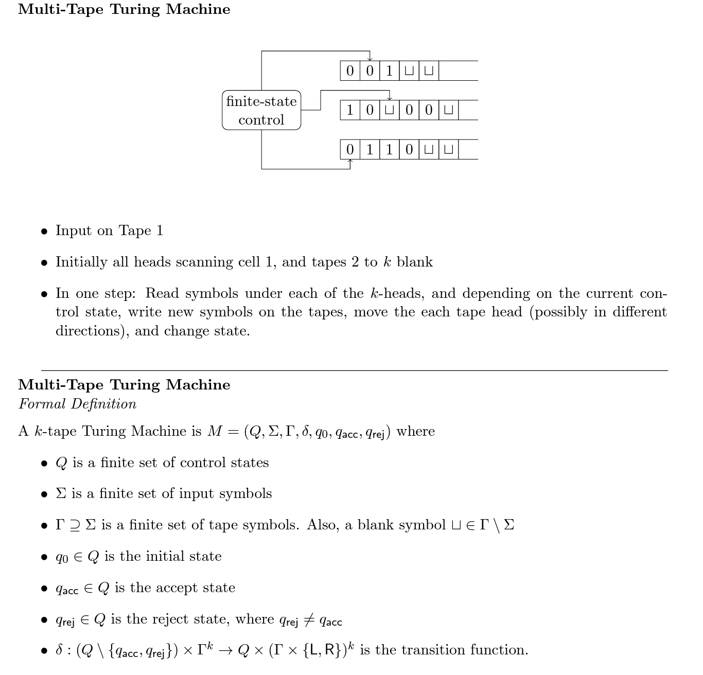
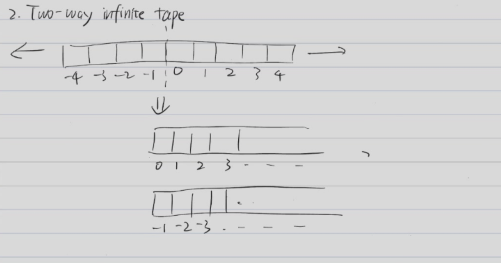
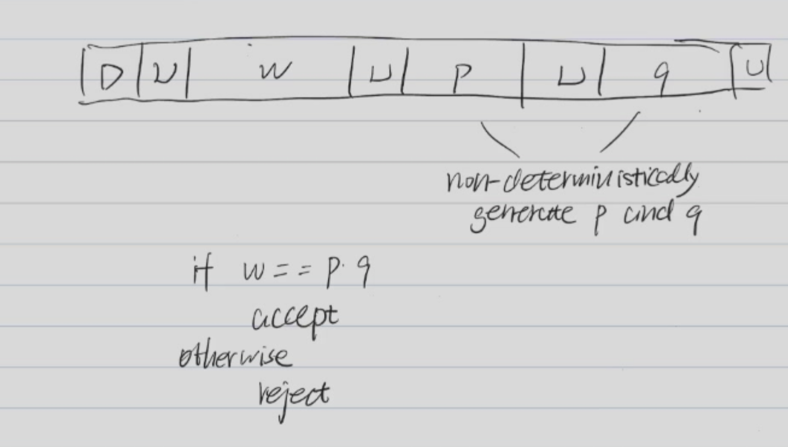
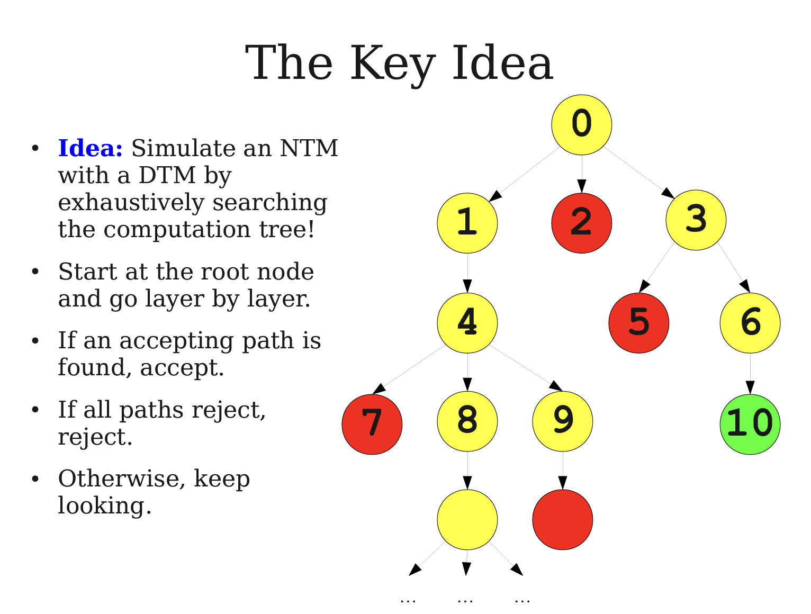
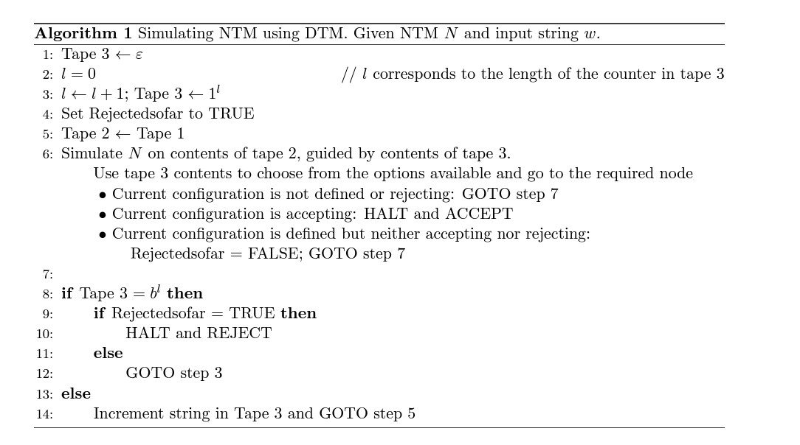
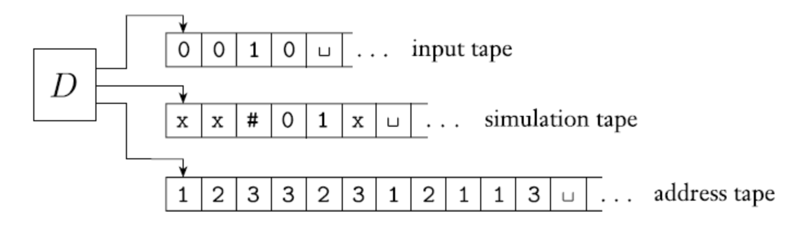
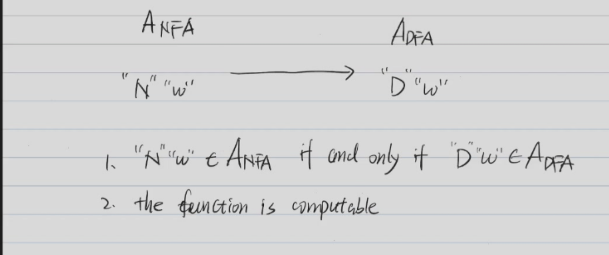

# Lecture 5 - Turing Machine

## Turing Machine

A Turing machine is a mathematical model of computation that defines an abstract machine. It was invented by Alan Turing in 1936. A Turing machine can simulate the logic of any computer algorithm, and is therefore the theoretical foundation of all modern computers.

A Turing machine is a 5-tuple $(K, \Sigma, \delta, s, H)$, where:

- $K$ is a finite set of states.
- $\Sigma$ is a finite set of symbols.
- s $\in$ $K$ is the start state.
- $H$ $\in$ $K$ is the halt state.
- $\delta$ is the transition function, which maps $(K - H)(\text{current state}) \times \Sigma$ to $K (\text{next state})\times (\Sigma(\text{write})\cup\{L,R\}(\text{moving}))$.

The transition function $\delta$ satisfies the following properties:

* $\forall q \in K - H, \delta(q,\triangleright) = (p,L)$ for some $p \in K$.
* $\forall q \in K - H, \forall a \in \Sigma, if\ \delta(q,a) = (p,b,D)$, then $b \neq \triangleright$.

leftend $\triangleright$ is a special symbol that is used to indicate the left end of the tape.

blank symbol $\cup$ is a special symbol that is used to indicate the blank symbol.
### configuration

A configuration of a Turing machine is a member of 

$$(K \times \triangle(\Sigma-\{\triangleright\})^*) \times ((\Sigma-\{\triangleright\})^* (\Sigma - \{\triangleright,\cup\})\cup \{e\}).$$

* $\Sigma - \{\triangleright,\cup\}$ is the last symbol that is not $\cup$
* {e} represents the following all symbols are $\cup$.

We say $(q,\triangleright w_1au_1) \vdash_M (q_2,\triangleright w_2a_2u_2)$ if 

* writing : $\delta(q_1,a_1) = (q_2,a_2) and a_2 \in \Sigma - \{\triangleright\}$ and $w_2 = w_1$ and $u_2 = u_1$.

* moving left : $\delta(q_1,u_1) = (q_2,L)$ and $w_1=w_2a_2$ and $u_2 = a_1u_1$.

M halts if it reaches **a halting configuration**

### Acceptance and Rejection

A Turing machine M accepts a string w if $(s,\triangleright\cup w) \vdash^* (yes,\triangleright\cup aw)$ 

A Turing machine M rejects a string w if $(s,\triangleright\cup w) \vdash^* (no,\triangleright\cup aw)$

Given a Turing machine M, we can define the language accepted by M as $L(M) = \{w \in \Sigma^* | M \text{ accepts w}\}$.

* M seme-decides L
* But M does not decide L
* Adding a condition: If M **halts** on all inputs, then M decides L.

M decides a language $L$ if M accepts all strings in L and rejects all strings not in L.

M **semi-decides** a language $L$ if M accepts all strings in L and may loop (or reject) on strings not in L.

#### Reccursive Language

A language $L$ is recursive if there exists a Turing machine that decides $L$.

Every recursive language is **recursively enumerable**.

* Explanation: A language $L$ is recursively enumerable if there exists a Turing machine that **semi-decides** $L$.

### Multi-tape Turing Machine

* [link](chrome-extension://efaidnbmnnnibpcajpcglclefindmkaj/https://courses.grainger.illinois.edu/cs373/fa2012/Lectures/lec20.pdf)

A multi-tape Turing machine is a Turing machine with multiple tapes. Each tape has its own head and can move independently.

$$\delta: (K - H) \times \Sigma^k \rightarrow K \times ((\Sigma -\triangleright)\cup \{L,R\})^k.$$

### Two-way Infinite Tape

### Multi-head Turing Machine

A multi-head Turing machine is a Turing machine with multiple heads on a single tape.
### 2D-Tape Turing Machine

* Simulate a 2D-Tape Turing machine with a 1D-Tape Turing machine.

### Random Access Turing Machine

* A Turing machine which can move to any position on the tape in a single step.
### Example

* $L = \{a^nb^nc^n|n\geq 0\}$ can be decided by a Turing machine.

## Non-deterministic Turing Machine (NTM)

* Deterministic TM: At each step, there is one possible next state, symbols to be written and direction to move the head, or the TM may halt. 
* Nondeterministic TM: At each step, there are finitely many possibilities. 
* So formally, $M = (Q,\Sigma,\Gamma,\delta,q_0,q_{acc},q_{rej})$, where
  * $Q,\Sigma,\Gamma,q_0,q_{acc},q_{rej}$ are as before for 1-tape machine
  * $\delta : (Q- \{q_{acc},q_{rej}\}) \times \Gamma \rightarrow P(Q \times \Gamma \times \{L,R\})$

### Decides

* If there is a computation path that leads to $q_{acc}$, then $M$ accepts $w$.
* If every computation path leads to $q_{rej}$, then $M$ rejects $w$.

M decides a language $L$ if 

* Fir all $w \in L$, there is a integer $N$, depending on $w$ and $M$ such that every branch **halts in at most N steps**.
* If $w \in L$, then there exists a branch that **halts in an accepting state**.
* If $w \notin L$, then every branch **halts in a rejecting state**.

### Semi-decides

M semi-decides a language $L$ if for any $w \in L$:

* If $w \in L$, then there exists a branch that **halts in an accepting state**.
* If $w \notin L$, then **no branch halts in a accepting state**. -- No branch accepts $w$.

### Example

Let $C = {100,110,1000,...}$ C is composed of all binary numbers **that are not prime**. -- Construct a NTM that semi-decides C.

### Theorem

#### Theorem 1
Every NTM can be simulated by a DTM.

>A NTM semi-decides a language $L$ if and only if there exists a DTM that semi-decides $L$.

* A NTM semi-decides a language $L$  $\Rightarrow$ There exists a DTM that semi-decides $L$.

* Use a three-tape DTM to simulate a NTM.

## Church-Turing Thesis

* Every algorithm can be simulated by a Turing machine.
* Intuition of Algorithm is equivalent to Turing machine.

#### Description of a Turing Machine

A Turing machine can be described by high-level pseudocode.

### Fact

* Any Finite Set can be encoded.
* Any Finite Tuple whose elemnets are finite stes can be encoded.

### Example

* $G = (V,E)$ is a graph. $V$ is a finite set of vertices and $E$ is a finite set of edges.
* $L = \{G|G \text{ is connected}\}$

M on input $G$:

0. If the input is illegal (not a graph), reject.
1. select a node of G and mark it.
2. repeat the following until no new nodes are marked:
   * For each marked node, mark all its neighbors.
3. If all nodes are marked, accept; otherwise, reject.

### Exercise

#### $A_{DFA}$
Input: $\langle B,w \rangle$, where $B$ is a DFA and $w$ is a string.

Output: Accept if $B$ accepts $w$; reject otherwise.

>Solution:Construct a Turing machine that simulates the DFA $B$ on input $w$.

$M_{R_1}$ = on input $\langle B,w \rangle$:

1. run D on input $w$.
2. If D accepts $w$, accept; otherwise, reject.

#### $A_{NFA}$

Input: $\langle B,w \rangle$, where $B$ is a NFA and $w$ is a string.

Output: Accept if $B$ accepts $w$; reject otherwise.

>Solution: Construct a Turing machine that simulates the NFA $B$ on input $w$.

$M_{R_2}$ = on input $\langle B,w \rangle$:

1. Convert NFA $B$ to a DFA $B'$.
2. run $M_{R_1}$ on input $\langle B',w \rangle$.
3. If $M_{R_1}$ accepts, accept; otherwise, reject.

This involves the process of reduction.

#### $A_{REX}$
Input: $\langle R,w \rangle$, where $R$ is a regular expression and $w$ is a string.

Output: Accept if $R$ accepts $w$; reject otherwise.

>Solution: Construct a Turing machine that simulates the NFA $B$ on input $w$.

* A REX can be converted to a NFA.
* Use $M_{R_2}$ to simulate the NFA.

$M_{R_3}$ = on input $\langle R,w \rangle$:

1. Convert REX $R$ to a NFA $B$.
2. run $M_{R_2}$ on input $\langle B,w \rangle$.
3. If $M_{R_2}$ accepts, accept; otherwise, reject.

#### $E_{DFA}$

Input: $\langle B \rangle$, where $B$ is a DFA.

Output: Accept if $L(B) = \emptyset$; reject otherwise.

>Solution: Construct a Turing machine that simulates the DFA $B$ on input $w$.

$M_{R_4}$ = on input $\langle B \rangle$:

1. Run DFS on the state diagram of $B$.
2. If there is a path from the start state to an accepting state, reject; otherwise, accept.

#### $EQ_{DFA}$

Input: $\langle B_1,B_2 \rangle$, where $B_1$ and $B_2$ are DFAs.

Output: Accept if $L(B_1) = L(B_2)$; reject otherwise.

>Solution: Construct a Turing machine that simulates the DFA $B$ on input $w$.

* Symmetric difference -- $(L(B_1) \cup L(B_2) )- (L(B_1) \cap L(B_2))$
* Convert the problem to whether the symmetric difference is empty.

$M_{R_5}$ = on input $\langle B_1,B_2 \rangle$:

1. Construct a DFA $B$ that recognizes the symmetric difference of $L(B_1)$ and $L(B_2)$. $(L(B) = (L(B_1) \cup L(B_2)) - (L(B_1) \cap L(B_2))$
2. Run $M_{R_4}$ on input $\langle B \rangle$.

