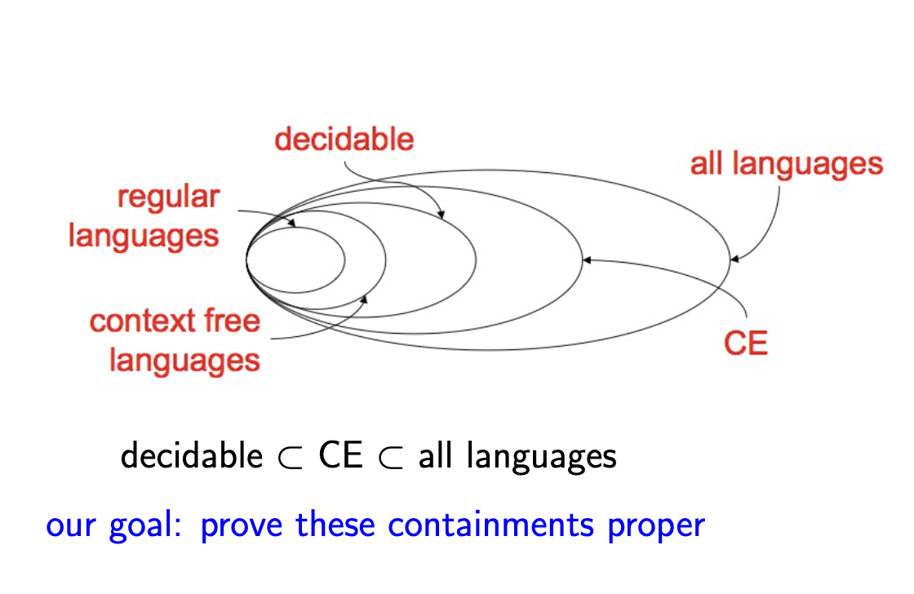
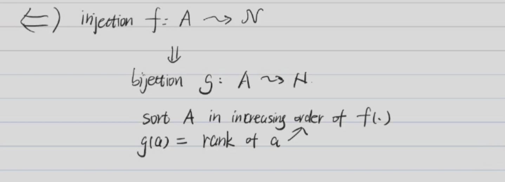
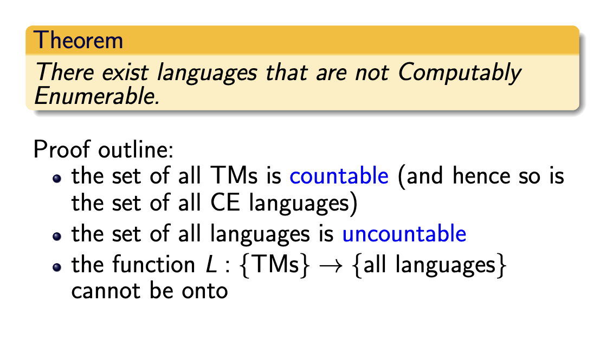
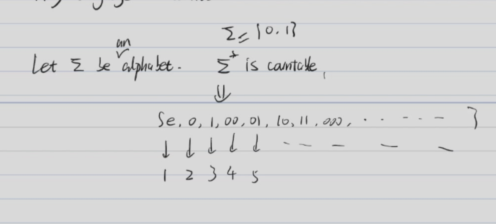
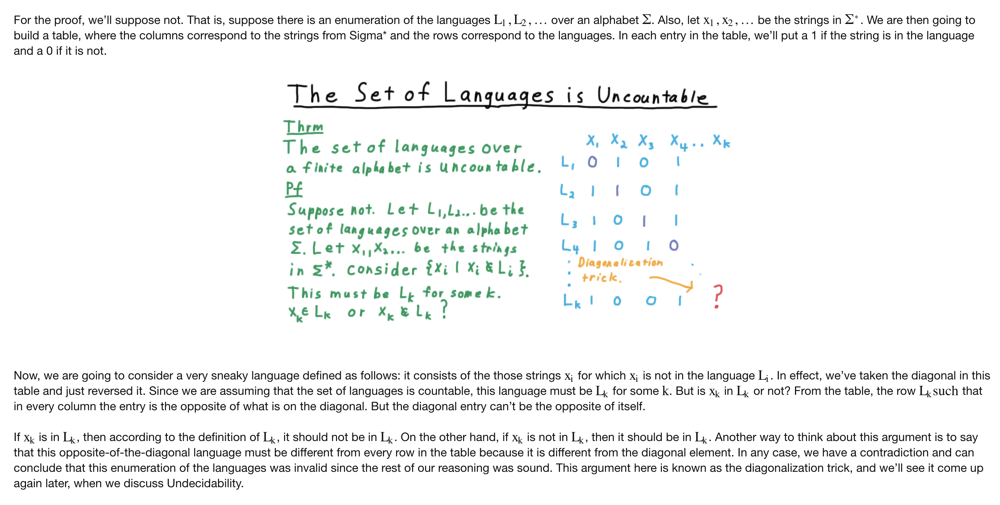
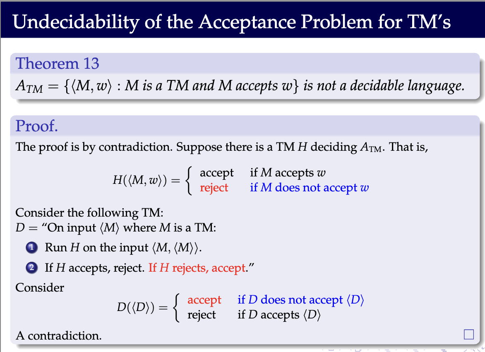
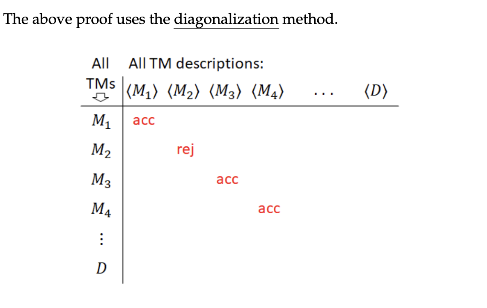

# Containments properties of languages

#### Summary

$\text{regular languages}\in \text{context-free languages} \in \text{recursively languages} \in \text{recursively enumerable languages}(semi-decidable)$

* from regular languages to context-free languages:real subset
  $L = \{a^nb^n|n\geq 0\}$
* from context-free languages to recursively languages:real subset
  $L = \{a^nb^nc^n|n\geq 0\}$

## Proof of the containments

#### Countable:

A set A is countable if it is finite or $\exists$ a bijection between A and $\mathbb{N}$.

#### Lemma 1

A set A is countable if and only if there is an **injection** from A to $\mathbb{N}$. 

* injection: $f:A \rightarrow \mathbb{N}$ is an injection if $f(a) = f(b) \Rightarrow a = b$.

* ($\Leftarrow$)  If bijection exists, then injection exists.
* ($\Rightarrow$)  
  First, suppose there exists an injection \( f: A \to \mathbb{N} \) from \( A \) to \( \mathbb{N} \). 
  Then, we can "sort" the elements of \( A \) according to the values of \( f \) (in increasing order). 
  Based on this order, we can define a bijection \( g \) from \( A \) to \( \mathbb{N} \). Specifically, we map the \( k \)-th element of \( A \) (in the sorted order) to \( g(a) = k \).

#### Collary 1

Any subset of a countable set A is countable.

Proof:

* $\exists$ an injection from A to $\mathbb{N}$.
* Therefore, any subset of A can be mapped to a subset of $\mathbb{N}$. 

#### Lemma 2

**Any language $\Sigma^*$ is countable.**

Proof:

* See [link](https://cs.uwaterloo.ca/~watrous/ToC-notes/ToC-notes.02.pdf#page=1.59) -- Proposition 2.1.

#### Collary 2

$\{M: \text{M is a Turing Machine}\}$ is countable.

* See [link](https://cs.stackexchange.com/questions/10780/why-is-this-true-there-are-countably-many-turing-machines)

#### Lemma 3

Let $\Sigma$ be an alphabet. Let $L$ be a language over $\Sigma$. Then, $L$ is **uncountable**.

* See [link](https://cs.stackexchange.com/questions/10780/why-is-this-true-there-are-countably-many-turing-machines)

* Another Proof: 
  

#### From Lemma 3 and Collary2, we can conclude that some languages are not recursively enumerable.

### ATM

$A_{TM} = \{<M,w>|M \text{ is a TM and M accepts w}\}$

#### Theorem1
$A_{TM}$ is recursively enumerable.

Proof:

Suppose $A_{TM}$ is recursively enumerable. Then, there exists a TM $E$ that semi-decides $A_{TM}$.

E = On input <M,w>:
1. Simulate M on w.
2. If M accepts w, accept; if M rejects w, reject.
3. Loop if M loops on w.
4. If M rejects w, reject.

#### Theorem2

$A_{TM}$ is not recursive.

Proof:

Suppose $A_{TM}$ is recursive. Then, there exists a TM $H$ that decides $A_{TM}$.

H = On input <M,w>:
1. Run M on w.
2. If M accepts w, accept; if M rejects w, reject.

Consider the following TM D:

D = On input <M>:
1. Run H on <M,\<M\>>.
2. If H accepts, reject; if H rejects, accept.

> In this condition, it means that D can decide D so D is recursive. --  $A_{TM}$ is recursive $\Rightarrow$ $D (A_d)$ is recursive.

Consider what happens when we run D on \<D\>.

1. If D accepts \<D\>, then H rejects <D,\<D\>>.
2. If D rejects \<D\>, then H accepts <D,\<D\>>.
3. Therefore, D cannot exist.

So, $A_{TM}$ is not recursive.

### Ad

$A_d = \{<"M">|M \text{ is a TM that does not accept "M"}\}$ -- See Above.

#### Theorem3

$A_d$ is not recursively enumerable.

Proof:

Suppose $A_d$ is recursively enumerable. Then, there exists a TM $D$ that semi-decides $A_d$.

D = On input <M>:
1. Accept if $M \in A_d$. (M rejects "M")
2. Reject or Loop if $M \notin A_d$." (M accepts "M")

Consider what happens when we run D on \<D\>.

1. If D accepts \<D\>, then $D \in A_d$. -- D rejects "D".
2. If D rejects or loops on \<D\>, then $D \notin A_d$. 

### Summary

$A_{TM}$ is recursively enumerable but not recursive.
$A_d$ is not recursively enumerable.

#### Theorem4

If $L$ and $\overline{L}$ are both recursively enumerable, then $L$ is recursive.

**Proof:** 

1. Let $M_1$ be a TM that semi-decides $L$.
2. Let $M_2$ be a TM that semi-decides $\overline{L}$.

D = On input w:
1. Run $M_1$ and $M_2$ parallelly on w.
2. If $M_1$ accepts w, accept; if $M_2$ accepts w, reject.

#### Theorem5

$\overline{A_{TM}}$ is not recursively enumerable.

**Proof:**

Suppose $\overline{A_{TM}}$ is recursively enumerable. Then, there exists a TM $D$ that semi-decides $\overline{A_{TM}}$.

Also we know that $A_{TM}$ is recursively enumerable. Then, there exists a TM $E$ that semi-decides $A_{TM}$.

But $A_{TM}$ is not recursive. So, $\overline{A_{TM}}$ is **not recursively enumerable**.

