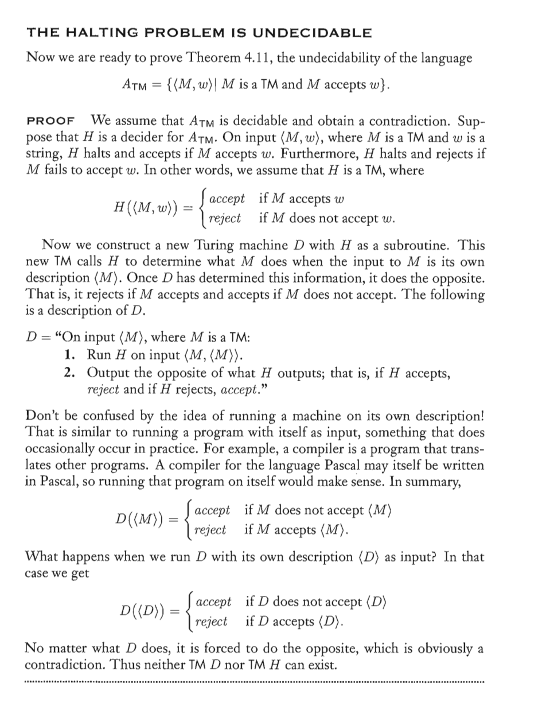
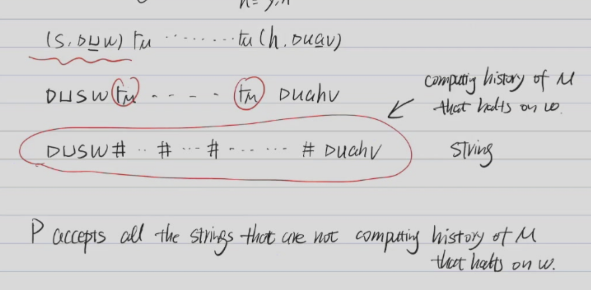
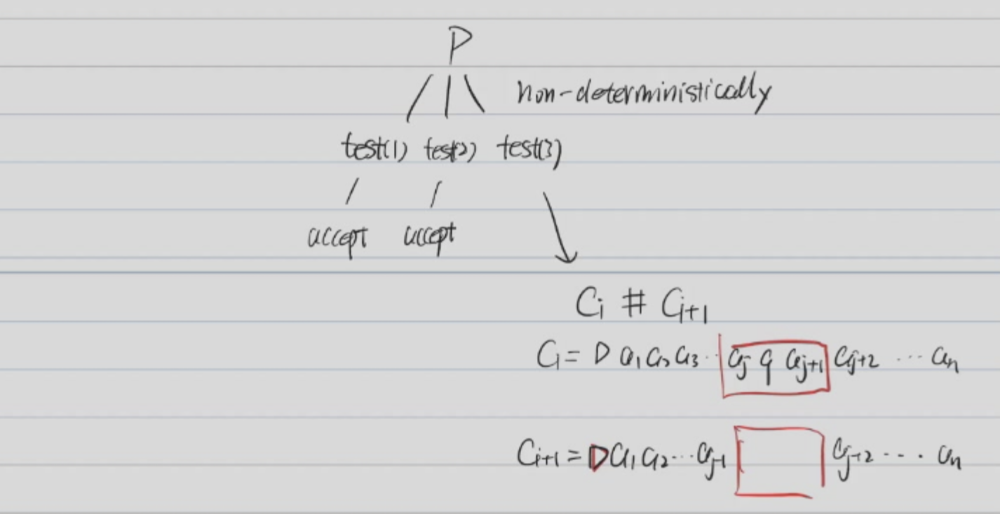

# Problems That Are Not Recursive 

## Examples

### 1. The Halting Problem
#### Proof 1

#### Proof 2
$A_{TM} = \{<M, w>|M\text{ is a TM and M accepts w}\}$
* $A_{TM}$ is not recursive

Construct a TM $M^*\  H_{TM}$ to solve $A_{TM}$:

$H_{TM} = {<M, w>|M\text{ is a TM and M halts on w}}$

$M^* = $ On input x:
1. run M on w
2. If M accepts w, accept
3. If M rejects w, reject
4. If M loops on w, $M^*$ is looping on w

Suppose $M^*$ is a recursive TM, then we can construct a TM $M_{H}$ to decide $H_{TM}$:

$M_{A} = $ On input <M, w>:
1. Construct a TM $M^*$ as above using M 
2. Run $M_{H}$ on $M^*$, w
   1. If $M_{H}$ accepts, accept
   2. If $M_{H}$ rejects, reject

If all this is true, then $M_A$ can decide $A_{TM}$ 
* But $A_{TM}$ is not recursive
* So $M^*$ is not recursive
* So the halting problem is not recursive

### 1. $L = \{"M"|\text{M is a TM that accepts e}\}$ is not recursive

* Use $A_{TM}$ to prove this

A Turing machine $M$ accepts $w$ if and only if $M^*$ accepts $e$

$M^* = $ On input x:
1. Run M on w
2. If M accepts w, accept
3. If M rejects w, reject

If M accepts w, then $M^*$ accepts all inputs, including e

If M rejects or loops on w, then $M^*$ rejects all inputs, including e

Suppose $L$ is recursive, then we can construct a TM $M_{L}$ to decide $L$:

$M_{A} = $ On input <M, w>:
1. Construct a TM $M^*$ as above using M 
2. Run $M_{L}$ on $M^*$, w
   1. If $M_{L}$ accepts, accept
   2. If $M_{L}$ rejects, reject

If all this is true, then $M_A$ can decide $A_{TM}$ 
* But $A_{TM}$ is not recursive
* So $M_L$ is not recursive
* So $L$ is not recursive

### 2. $L_2 = \{"M"|\text{M is a TM that accepts all strings}\}$ is not recursive

* Same as above

A Turing Machine accepts w if and only if $M^*$ **accepts all strings**

### 3. $L_3 = \{"M1, M2"|\text{M1 and M2 accept the same set of strings}\}$ is not recursive

Suppose that $L_3$ is recursive, $\exist M_3$ that decides $L_3$

**Use $M_3$ to construct $M_2$ that deides $L_2$**

$M_2$ = on input "M"
1. construct $M_E$ as follows:
   $M_E$ = on input x
      1. Accept
2. Run $M_3$ on "$M$","$M_E$" -- check whether $M$ and $M_E$ accepts the same set of strings
3. If $M_3$ accepts, accepts $M$
4. If $M_3$ rejects, rejects $M$

So $M_2$ decides $L_2$ but $L_2$ is not recursive

### 4. $L_4 = \{"M"|\text{M is a TM with L(M) is regular}\}$ is not recursive

Proof: $L_4$ is not recursive

Suppose that $L_4$ is recursive, $\exist M_4$ that decides $L_4$

1. **Construction of \( M^* \)**:
   - Define a modified Turing machine \( M^* \) which takes two inputs: a string \( w \) and a separate input \( x \).
   - \( M^* \) operates as follows: On input x
     1. It first runs \( M \) on \( w \).
     2. If \( M \) accepts on \( w \), \( M^* \) then runs a universal Turing machine \( U \) on \( x \).
        1. If U accepts,accept
        2. If U rejects, reject
     3. If \( M \) does not halt on \( w \), \( M^* \) does nothing (or rejects all inputs).

> Universal Turing Machine
> U : On input <M, w>:
> 1. Run M on w
> 2. If M accepts w, accept
> 3. else reject

2. **Language of \( M^* \)**: The language \( L(M^*) \) is constructed so that:
   - \( L(M^*) \) is non-empty if \( M \) accepts \( w \).
   - \( L(M^*) \) = $L(U)$ = $A_{TM}$ Not regular/Not Context-Free /Not Recursive
   - \( L(M^*) = \emptyset \) if \( M \) does not accept \( w \). -- Regular/Contex-Free/Recursive

5. **Conclusion**:
   - If \( L(M^*) \) is non-regular, it implies that \( M \) accepts \( w \).
   - If \( L(M^*) \) is regular, then \( M \) does not accept \( w \).
   - Since determining whether \( L(M^*) \) is regular would solve the **Halting Problem**, it follows that \( R_{TM} \) is undecidable.

The undecidability of \( R_{TM} = \{ \langle M \rangle : M \text{ is a Turing machine with } L(M) \text{ regular} \} \) (i.e., determining if a Turing machine \( M \) has a regular language \( L(M) \)) stems from the fact that if we could decide \( R_{TM} \), we could also decide the Halting Problem, which is known to be undecidable.

#### Here’s a step-by-step explanation of why this leads to undecidability:

1. **Assume \( R_{TM} \) is Decidable**:
   Suppose there exists a Turing machine \( D \) that decides \( R_{TM} \), meaning that \( D \) can take as input any Turing machine \( M \) and decide if \( L(M) \) is regular.

2. **Reduction from the Halting Problem**:
   We know that the Halting Problem (determining whether a Turing machine \( M \) halts on an input \( w \)) is undecidable. To show that \( R_{TM} \) is also undecidable, we construct a new Turing machine \( M^* \) based on \( M \) and \( w \) and show that if we could decide whether \( L(M^*) \) is regular, we could solve the Halting Problem.

3. **Construction of \( M^* \)**:
   Define \( M^* \) as a Turing machine that:
   - First simulates \( M \) on \( w \).
   - If \( M \) halts on \( w \), \( M^* \) then simulates a universal Turing machine \( U \) on any additional input \( x \).
   - If \( M \) does not halt on \( w \), \( M^* \) simply rejects all inputs or does not accept any string beyond a certain structure.

4. **Behavior of \( L(M^*) \)**:
   - If \( M \) halts on \( w \), then \( L(M^*) \) becomes non-regular (since it depends on \( L(U) \), the language of a universal Turing machine, which is non-regular).
   - If \( M \) does not halt on \( w \), \( L(M^*) \) is regular (e.g., it could be empty or finite, depending on the construction).

5. **Implication**:
   If we had a way to determine whether \( L(M^*) \) is regular using the hypothetical decider \( D \) for \( R_{TM} \), we could answer whether \( M \) halts on \( w \):
   - If \( D \) tells us that \( L(M^*) \) is regular, then \( M \) does not halt on \( w \).
   - If \( D \) tells us that \( L(M^*) \) is non-regular, then \( M \) halts on \( w \).

6. **Contradiction**:
   Since this method would solve the Halting Problem (which is known to be undecidable), the assumption that \( R_{TM} \) is decidable must be incorrect. Therefore, \( R_{TM} \) is undecidable.

In short, if we could decide whether \( L(M) \) is regular for any Turing machine \( M \), we could also solve the Halting Problem by constructing \( M^* \) as described. This leads to a contradiction, proving that \( R_{TM} \) is undecidable.
#### 5. $L_5 = \{"M"|\text{M is a TM with L(M) is context-free}\}$ is **not recursive**

#### 6. $L_6 = \{"M"|\text{M is a TM with L(M) is recursive}\}$ is **not recursive**

### Rice's Theorem

* See [Link](https://courses.grainger.illinois.edu/cs373/sp2013/Lectures/lec25.pdf)

### $All_{PDA}$ is not recursive

$All_{PDA} = \{<M>|M\text{ is a PDA and }L(M) = \Sigma^*\}$ 

* Turn into proving $NOTAll_{PDA} = \{<M>|M\text{ is a PDA and }L(M) \neq \Sigma^*\}$ is not recursive

Construct a TM $M$ to solve $NOTAll_{PDA}$:
* M halts on w if and only if $L(P) \neq \Sigma^*$

* Turn the computing history of M that halts on w to a **string**

Construct **P** accepts all strings that are not computing history of M **that halts on w**.

* Given a string $C_1\#C_2\#...\#C_k$, where $C_i$ is a configuration.
* The string is not a computing history of M if:
  1. $C_1$ is not the start configuration of M
  2. $C_k$ is not the accept configuration of M
  3. There exists $C_i$ and $C_{i+1}$ such that $C_i$ does not lead to $C_{i+1}$

If $NOTAll_{PDA}$ is recursive, then $H_{TM}$ is recursive, which is not true.

### Reduction

Let A, B be two languages, A reduces to B if there is a computable function f $\Sigma^* \to \Sigma^*$ such that:

$x \in A \Leftrightarrow f(x) \in B$

#### Lemma 1

Suppose $\exist f$ that reduces A to B:

1. If B is recursive, then A is recursive

* B is recursive, then we can construct a TM $M_B$ to decide B
* $\exist f$ that reduces A to B
* $M_A$ = On input x:
  1. Compute f(x)
  2. Run $M_B$ on f(x)
  3. If $M_B$ accepts, accept
  4. If $M_B$ rejects, reject

2. If A is not recursive, then B is not recursive

* If B is recursive, then A is recursive, which is not true(Clearly)

