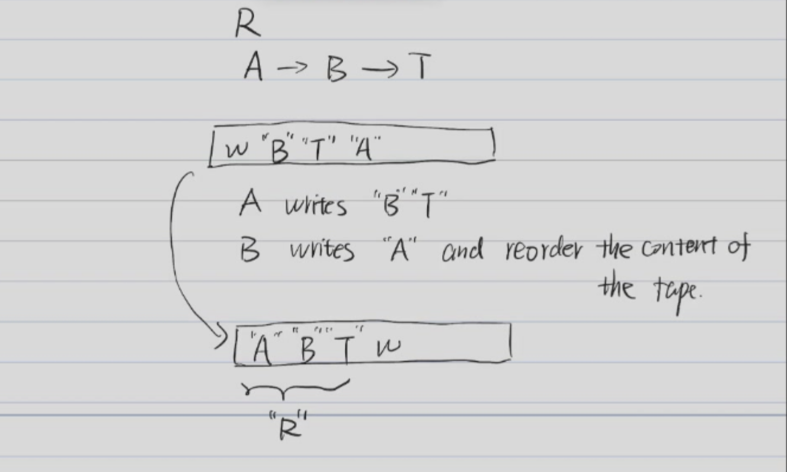
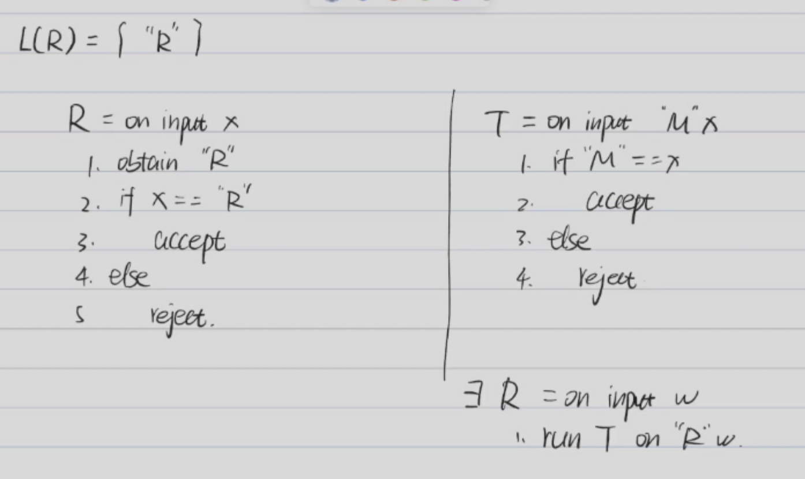
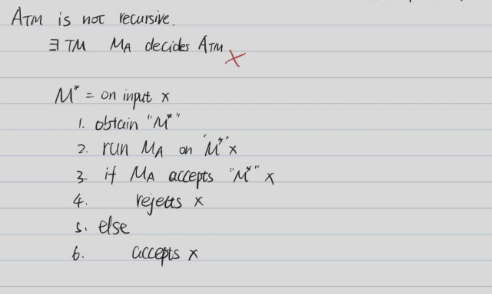
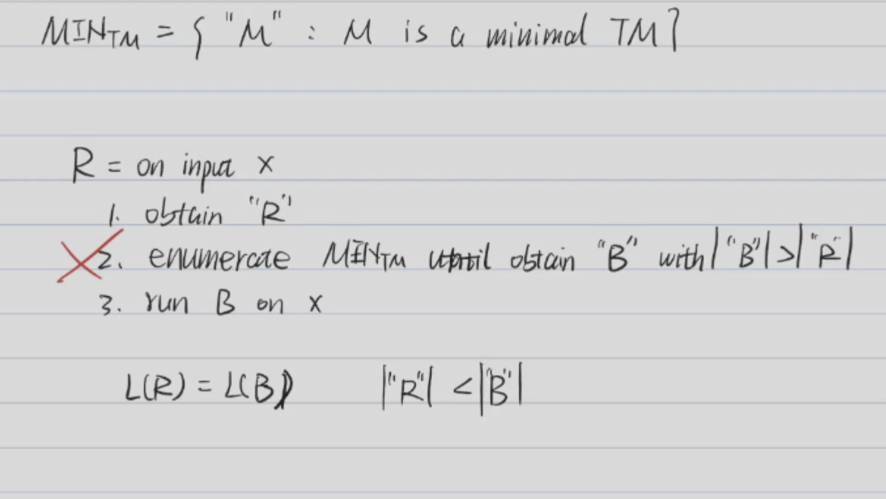

<font face = "Times New Roman">

# Gödel's Incompleteness Theorems

Construct a Turing machine $M$ prints "M" itself on its tape.

* A  -- Write B on the tape
* B  -- Write A on the tape and swap it with B
function q : $\Sigma^* \rightarrow \Sigma^*$ such that $q(w) = "M_w"$ 
* $M_w$ = on any input x:
  1. Print w on the tape

Given any string w"
1. Construct $M_w$ as above
2. Return $M_w$

B = on input w
1. Compute $q(w)$
2. write $q(w)$ on the tape and swap it with w

A = on input w
1. Write "B" on the tape

### Recursion Theorem

For any TM **T**, there exists a TM **R** such that for any input w, the computation of R on w is equivalent to the computation of T on $<R, w>$.

> T = on input M,w: ...
> 
> R = on input w : 
> 
>   1. Run T on <R, w>

#### Proof



#### Another Proof of $A_{TM}$ not recursive



## Gödel's Incompleteness Theorems

$V(x,t) = \begin{cases} 1 & \text{if t is a valid for x} \\ 0 & \text{otherwise} \end{cases}$

Let $\Tau$ be a language (the set of statements) A proof system for $\Tau$ is a TM V such that

* 1. Effectiveness : For x,y $\in \Sigma^*$, V either accepts or rejects $V(x,y)$
* 2. Soundness : For x $\notin \Tau$, $\forall y, V(x,y) = 0$

V is a complete proof system for $\Tau$ if for x $\in \Tau$, $\exists y, V(x,y) = 1$
### Theorem 1

Some language $\Tau$ does not have a complete proof system.

#### Lemma 1

A has a complete proof system **if and only if** A is recursively enumerable

$\Rightarrow$ : $\exists$ a complete proof system V for A

> M = on input x:
> 
> 1. For y $\in \Sigma^*$ in increasing order of length:
> 
> 2. If $V(x,y) = 1$, accept

$\Leftarrow$ : $\exists$ a TM M that semi-decides A

> V = on input x,y:
> 
> 1. Run M on x for y steps
> 
> 2. If M accepts x within y steps, accept

### Theorem 2

$\overline{A_{TM}}$ is not recursively enumerable

* Or $\overline{A_{TM}}$ does not have a complete proof system

#### Proof

If $\overline{A_{TM}}$ is recursively enumerable, then $\overline{A_{TM}}$ has a complete proof system

Suppose $\overline{A_{TM}}$ has a complete proof system V

> R = on input x:
> 
> 1. Obtain "R"
> 
> 2. For y $\in \Sigma^*$ in increasing order of length:
> 
> 3. If $V("R"x,y) = 1$, halt and accept x

If V is a complete proof system for $\overline{A_{TM}}$, then R is a complete proof system for $A_{TM}$

* $R$ accepts x if and only if $\exists y, V("R"x,y) = 1$
* $V("R"x,y) = 1$ if and only if $"R"x$ $\in \overline{A_{TM}}$


### Enumerator

We say a TM M enumerates a language L if for some state q, $L = \{w: (s\triangleright U) \vdash^*_M (q,DUw)\}$
where q is output state and w is output w 

#### Theorem 3

A is Turing enumerable if and only if A is recursively enumerable

##### Proof

Assume that A is a finite set.

$\Rightarrow$ : 
By definition, A is recursively enumerable
$\Leftarrow$ :

$\exists$ a TM M that semi-decides A

for s $\in \Sigma^*$ in increasing order of length:
    1. Run M on s
    2. If M accepts s, output s

```
For i = 1,2,3,...
    For j = 1,2,3,...,i
        Run M on s_j for i steps
        If M accepts s_j, output s_j
```
    
#### Theorem 4

A TM M is minimal if $|N|$ < $|M|$ implies $L(N) \neq L(M)$



</font>