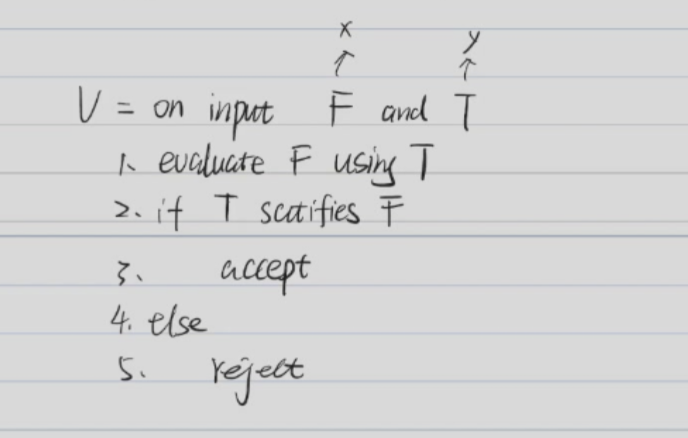
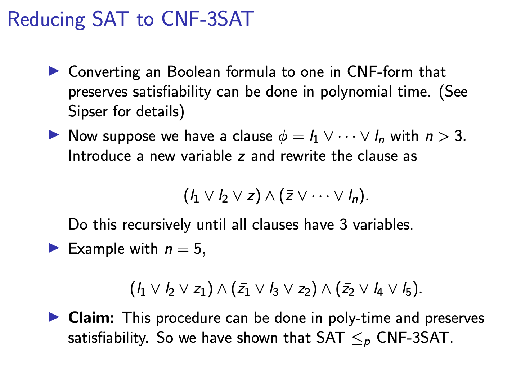
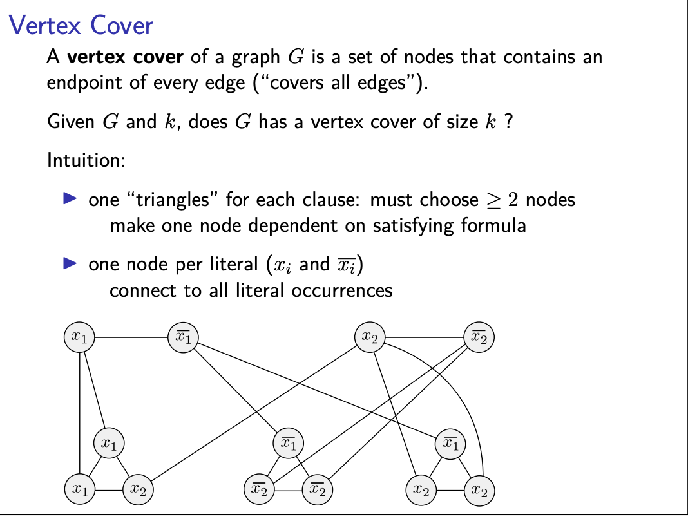
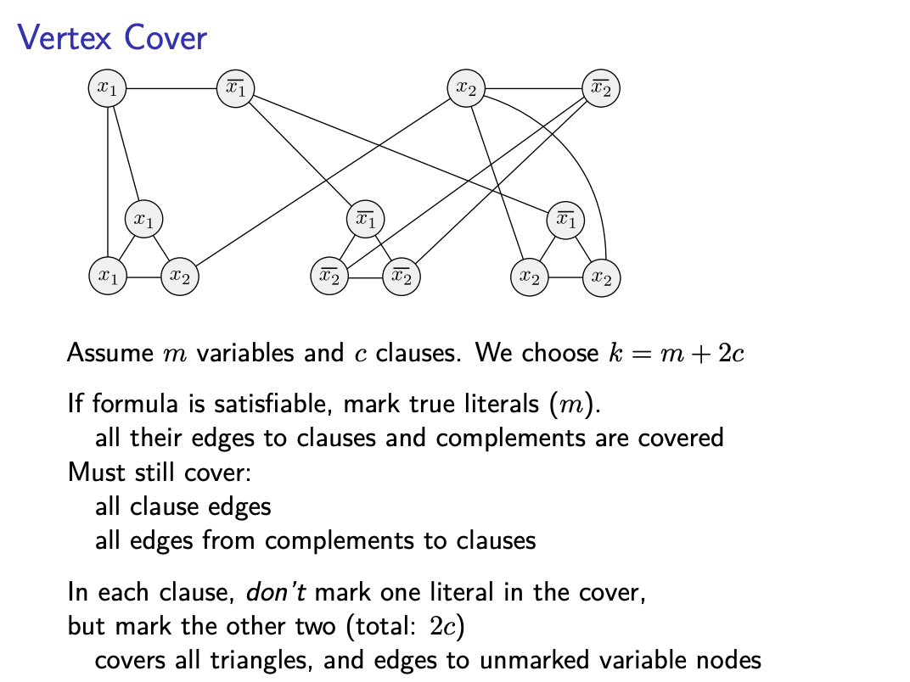
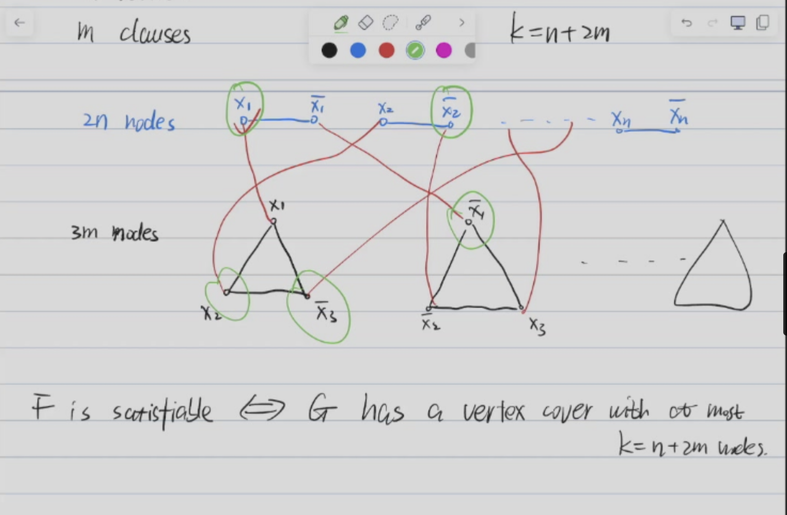

# Lecture 9: Complexity Theory -- Time Complexity

Let M be a standard DTM that halts on all inputs. 

* The running time of M is the function $f: \mathbb{N} \to \mathbb{N}$ [input length] $\to$ [number of steps]. 
* On any input of length $n$, M halts within $f(n)$ steps.

## Theorm

#### $DTIME(f(n)) = \{L | L$ is decided by some standard DTM with running time $O(t(n))\}$

1. $\{0^k1^k | k \geq 0\}$ $\in$ $DTIME(nlogn)$
2. $\{0^k1^k | k \geq 0\}$ $\in$ $DTIME(n)$

#### The Cobham-Edmonds Thesis

Any "reasonable" and "general" deterministic model of computation is polynomially related.

* $P = \{L | L$ is decided by some standard DTM with running time $O(n^k)\}$
* $P = \cup_{k \geq 0} DTIME(n^k)$

### 1. Every context-free language is in P.

**Step 1: Chonsky Normal Form**

For any CFG G, there is an equivalent CFG G' in Chonsky Normal Form.

> Chonsky Normal Form: Every production is of the form $A \to BC$ or $A \to a$.

Given a string $x = x_1x_2...x_n$, we want to know whether $x \in L(G)$.

* Enumerate all derivations of length $\leq 2|w|-1$.
* We can determine in $|R|^{2|w|-1}$ steps.
> 这可以用二叉树的性质证明

* But we cannot determine whether $x \in L(G)$ in polynomial time.

**Step 2: Use Dynamic Programming**

Subproblem: For $1 \leq i \leq j \leq n$ Define, $T[i,j] = \{A \in V-\Sigma | A \to^* a_{i}...a_j\}$

> 这是可以生成子串的非终结符的集合

* Base Case: $T[i,i] = \{A \in V-\Sigma | A \to a_i\}$
* Recurrence: $T[i,j] = \cup_{i \leq k < j} \{A \in V-\Sigma | A \to BC, B \in T[i,k], C \in T[k+1,j]\}$

Subproblem: $O(n^2)$ subproblems, 
* each subproblem can be solved :
  * Enumerate k from i to j-1: $O(n)$
  * $A \to BC$ can be checked in $O(|R|)$
  * $B \in T[i,k]$ and $C \in T[k+1,j]$ can be checked in $O(|V|-|\Sigma|)$

* Total time: $O(n^3|R|(||V|-|\Sigma|)^2)$
* Therefore, we can determine in $O(n^3)$ time.

### 2. NP

Let U be a non-deterministic TM, running time of U is a function $f: \mathbb{N} \to \mathbb{N}$.

For any input of length $n$, Every **branch** of U halts within $f(n)$ steps.

NP = $\{L | L$ is decided by some non-deterministic TM U with polynomial running time $O(n^k)\}$

### 3. Polynomial Verifiable

A language L is polynomial verifiable if there exists a polynomial time verifier V such that:

* It Satisfies: Efficient, Soundness, Completeness
* $V$ must have polynomial running time.
* For any $x \in A$, there exists a $y$ such that $V(x,y) = \text{accept}$ **WITH $|y| \leq poly(|x|)$**

### 4. A language L is in NP if and only if L is polynomial verifiable.

**4.1 A language L is in NP $\Rightarrow$ L is polynomial verifiable**

If L is in NP, there exists a non-deterministic TM U that decides L in polynomial time.

Construct a verifier V:

* certificate y = the branch of U that accepts x

V = on input x, y:

1. Run U on x deterministically on the guidance of y
2. If U accepts, accept
3. Else, reject

**4.2 A language L is polynomial verifiable $\Rightarrow$ L is in NP**

If L is polynomial verifiable, Construct a non-deterministic TM U:

U = on input x:

1. Non-deterministically generate a certificate y of length $\leq poly(|x|)$
2. Run V on x, y
3. If V accepts, accept
4. Else, reject

Since V is polynomial time, U can decide L in polynomial time.

## SAT Problem

Let X be a set of boolean variables

* literal: $x_i$ or $\overline{x_i}$
* clause: disjunction of literals: $x_1 \vee x_2 \vee \overline{x_3}$
* boolean formula: conjunction of clauses: $(x_1 \vee x_2) \wedge (\overline{x_1} \vee x_3)$
* Truth assignment of X is a function $f: X \to \{0,1\}$
* T satisfies F if F is true under T

**SAT Problem:** Given a boolean formula F, does there exist a truth assignment T that satisfies F?

**2.1 Non-deterministic Polynomial Time**

M = on input F:

1. Non-deterministically guess a truth assignment T
2. If T satisfies F, accept
3. Otherwise, reject

**2.2 Polynomial Verifiable**

### 1. SAT is in P if and only if P = NP

#### Polynomial Time Reduction

Let A, B be two languages, A can be polynomially reduced to B [$A \leq_p B$] if there is a computable function f: $\Sigma^* \to \Sigma^*$ such that:

1. $x \in A \Leftrightarrow f(x) \in B$
2. $f$ is computable in polynomial time

#### Lemma 1

If A $\leq_p B$ and B is in P, then A is in P.  

$x \rightarrow f(x) \rightarrow$ B $\rightarrow$ P

#### NP-Completeness

A language A is NP-complete if:
1. A is in NP
2. For any language B in NP, $B \leq_p A$

#### Cook Levin Theorem

SAT is NP-complete.

Proof:

* See [link](https://www.cs.ubc.ca/~condon/cpsc506/handouts/Cook-Levin.pdf)

<iframe src="https://drive.google.com/viewerng/viewer?url=https%3A//www.cs.toronto.edu/~ashe/cook-levin-handout.pdf&amp;embedded=true" allowfullscreen="" frameborder="0" height="780" width="600" title="" class="eo n ff dy bg" scrolling="no" style="box-sizing: inherit; top: 0px; width: 680px; height: 884px; left: 0px;"></iframe>

#### Lemma 2    

If A is NP-complete and $A$ $\leq_p B$, then B is NP-complete.

Proof:

1. B is in NP
2. For any language C in NP, $C \leq_p A \leq_p B$
3. Therefore, B is NP-complete.

#### 3-SAT

#### Cliques

Given a graph G = (V, E), a clique is a subset of V such that every pair of vertices in the subset is connected by an edge.

* CLIQUES = $\{<G, k> | G$ has a clique of size $k\}$

**Theorem:** CLIQUES is NP-complete.

* Proof: 3-SAT $\leq_p$ CLIQUES See [link](https://opendsa-server.cs.vt.edu/ODSA/Books/Everything/html/threeSAT_to_clique.html)

#### Vertex Cover

Given a graph G = (V, E), a vertex cover is a subset of V such that every edge in E is incident to at least one vertex in the subset.

* VERTEX-COVER = $\{<G, k> | G$ has a vertex cover of size $k\}$

