<font face = 'Times New Roman'>

# Chap2:Language of the Computer(RISC V)

#### Instruction Characteristics
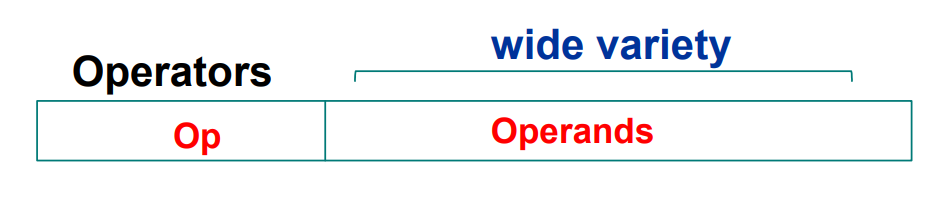
* 操作数位宽可以不同，可以是立即数/寄存器/内存
* Load/Store 结构
  * 指令分类：Load/Store结构将指令分为两类：加载（Load）指令和存储（Store）指令。这两类指令分别用于从内存中加载数据到寄存器或将寄存器中的数据存储到内存中
  * 数据传输：在Load/Store结构中，**只有**Load和Store指令能够直接访问内存。其他指令，如算术运算指令或逻辑指令，必须首先将数据加载到寄存器中，然后执行操作，最后再将结果存回内存
## Operations of the Computer Hardware

!!! Example
    * C code
    ``` C
    f = (g + h) - (i + j);
    ```
    * RISC-V code
    ``` C
    add t0, g, h
    add t1, i, j
    sub f, t0, t1
    ```

```assembly
;Not good for parallel opeartions
add t0, g, h
sub t0, t0, i
sub f, t0, j
```

### Regisers

* 32 registers in RISC-V
* 64 bits for each register in RISC-V

??? "Sumary"

    <div align=center>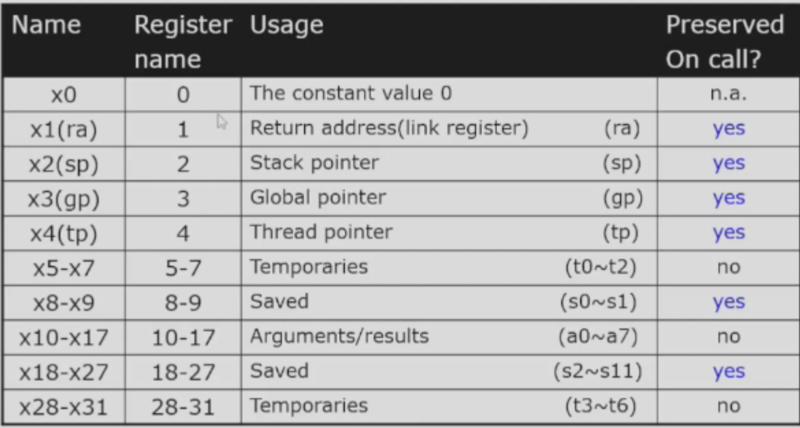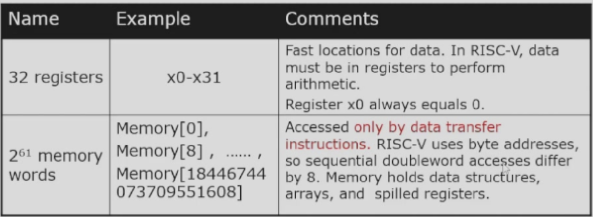</div>  

* 为什么内存是 $2^{61}$ 个 doublewords?  
  可以表示的地址有这么多，因为我们以 64 位寄存器为基址，可以表示的双字就是 $2^{64}/2^3=2^{61}$ (这里 $2^3$ 表示 8 个字节，即双字). 即我们的 `load` 指令可以访问的范围有这么大。 
* for `x0` : 因为经常有 0 参与计算，将其存在一个寄存器中，便于计算

```assembly
add x5,x20,x21
add x6,x22,x23
sub x19,x5,x6
```

### Memory Operands

Data transfer instructions
* Load: Load values from memory to register
* Store: Store result from register to memory; store doubleword

**Memory is *byte addressed*.**

* RISC-V is **Little Endian**  

    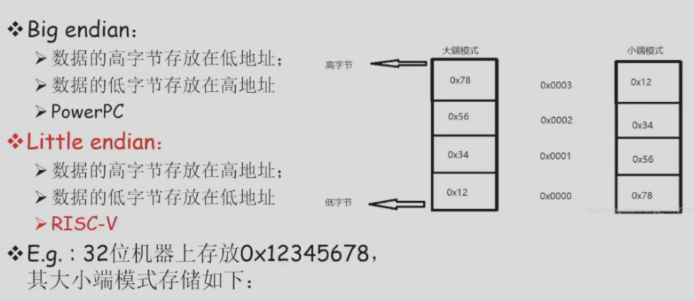

* RISC-V dose not require words to be aligned in memory  : **To Save Memory**

  > words align: A word is 4 byte
  >
  > 我们要求字的起始地址一定要是 4 的倍数 : 访存更加方便

  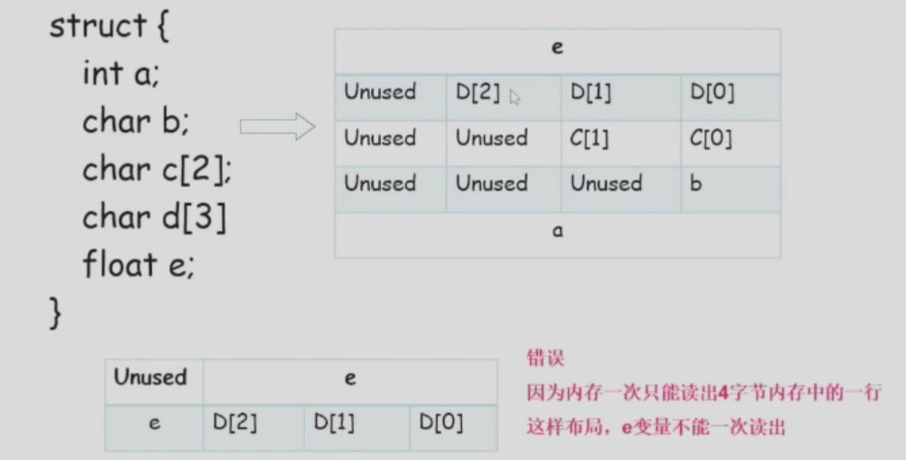

```assembly
LW t0,[0,4,8,...] 
LD t0,[0,8,16,32...]
```

#### Data Transfer instruction

* store 指令没有目的寄存器.
* Array are in the memory -- Stack.

??? "Example"

    <div align=center> 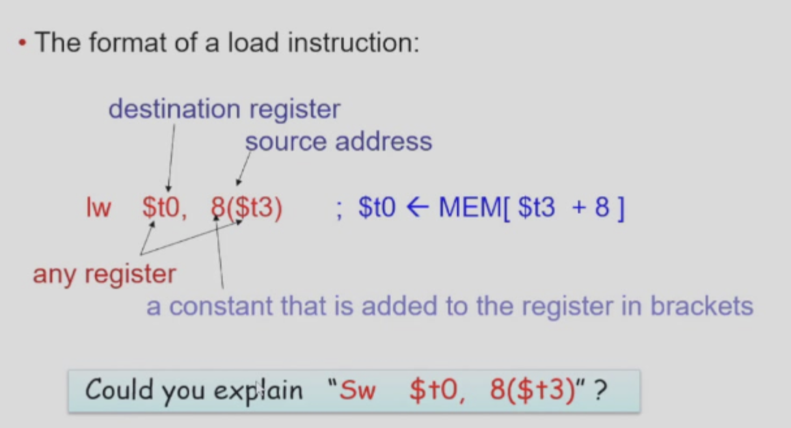 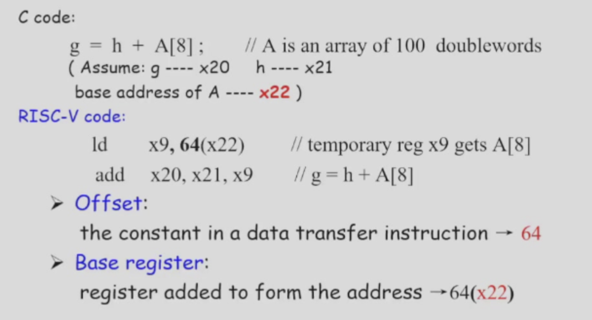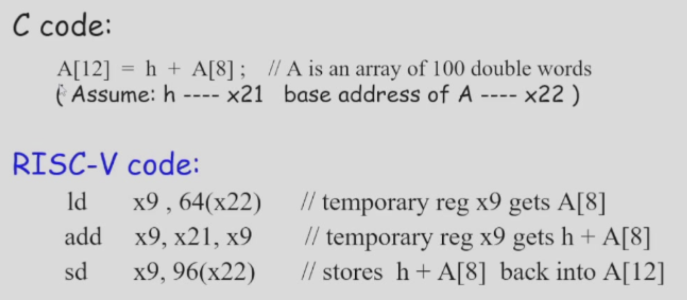</div>  

```c
g = h + A[i]
//assume g,h,i - x18,x19,x20 base address of A -x22
```

* note `0(x5)` `x5` is for 偏移

```assembly
add x5,x20,x20
add x5,x5,x5
add,x5,x5,x5
add,x5,x5,x22
ld,x6,0(x5) 
add x18,x19,x6
```

### Registers vs. Memory

* Registers are faster to access than memory  
* Operating on memory data requires loads and stores  
* Compiler must use registers for variables as much as 
possible  
* Spilling Registers : putting less comonly used variables into memory

### Constant or Immediate Operands

**Immediate**: Other method for adding constant  

* Avoids the load instruction  

* Offer versions of the instruction   
  ***e.g.*** `addi x22, x22, 4`  

  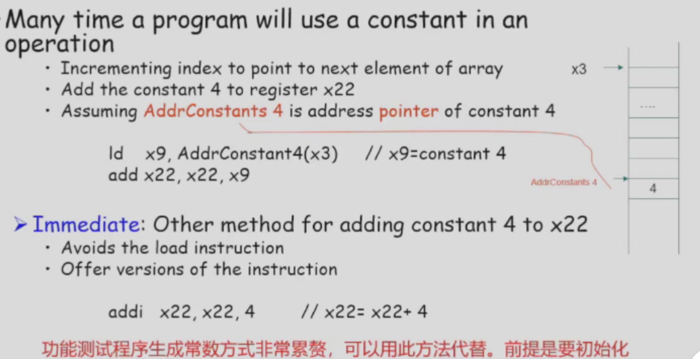  

* Design Principle 3 - Make the common case fast.  

## Representing Instructions in the Computer

??? "Translating assembly into machine instruction"

    <div align=center>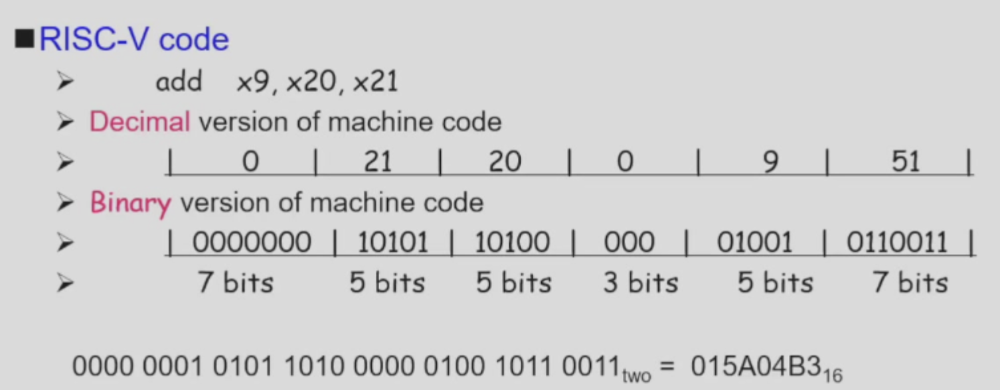</div>  

### R-format instructions

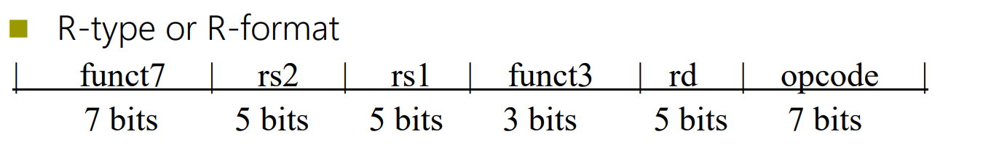

* *opcode*: operaion code
* *rd*: destination register number
* *funct3*: 3-bit function code(additional opcode)   
eg. `load byte / load half`
* *rs1/rs2*: the first/second source register number
* *funct7*: 7-bit function code(additional opcode)

#### I-format Instructions

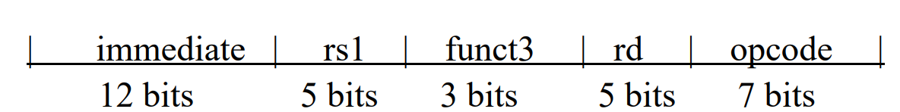

  * Immediate arithmetic and load instructions  

  ***e.g.*** `addi`, `ld`  

* *rs1*: source or base address register number

* *immediate*: constant operand, or offset added to base 
address  `将 rs2, funct7 合并了，得到 12 位立即数`


### S-format

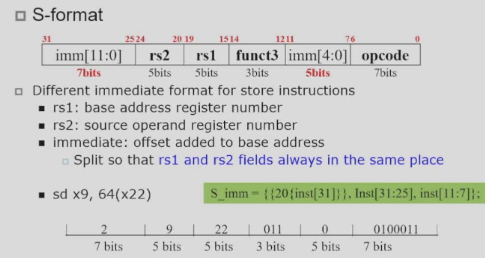

* *rs1*: base address register number
* *rs2*: source opearand register number
* immediate:  Split so that *rs1* and *rs2* fields always in the same place.  

??? "Sumary"

    <div align=center>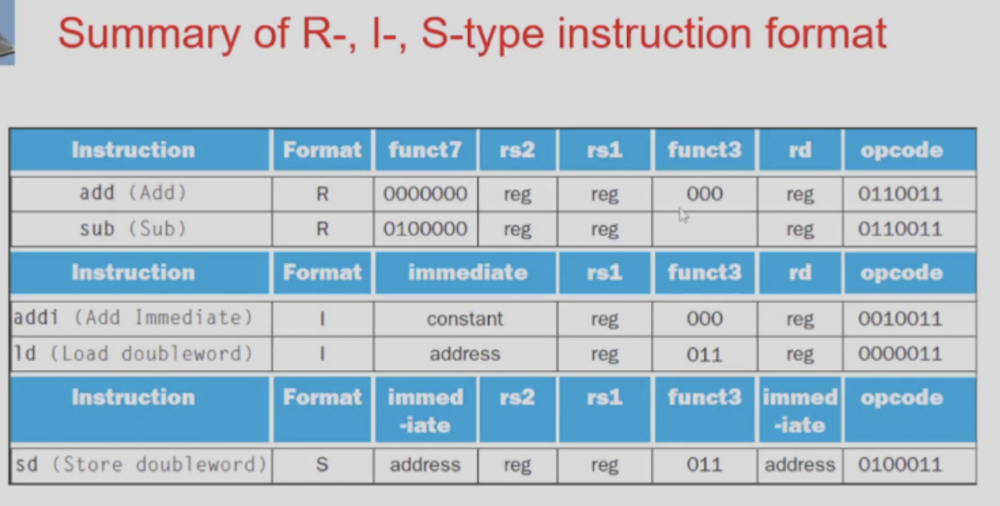 </div>  

??? Example
    <div align=center>  </div>
    <div align=center>  </div>

**Stored Program Computer**  

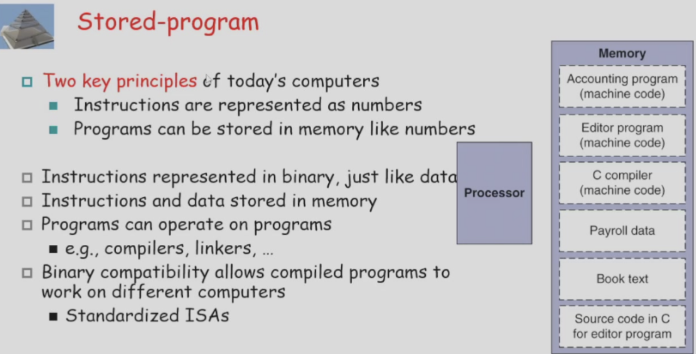

* See Slides Trojan 密码窃取 拳击游戏

??? "Sumary"

    <div align=center>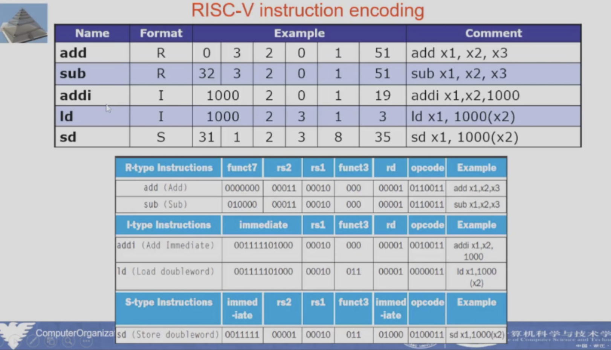</div>  

## Logical Operations

| Operation     | C    | Java | RISC-V      |
| :------------ | ---- | ---- | ----------- |
| Shift left    | <<   | <<   | `slli`      |
| Shift right   | >>   | >>>  | `srli`      |
| Bit-by-by AND | &    | &    | `and, andi` |
| Bit-by-by OR  | \|   | \|   | `or, ori`   |
| Bit-by-by XOR | ^    | ^    | `xor, xori` |
| Bit-by-by NOT | ~    | ~    | -           |

* note `0(x5)` `x5` is for 偏移

### Shift

<div align=center>  </div>  

* I 型指令
* 为什么还有 `funct6` : 移位不需要这么多立即数，只要六位 ($2^6=64$) 即可。
* 左移 i 位相当于乘 $2^i$, 右移 i 位相当于除 $2^i$.  

### AND

<div align=center>  </div>  

### OR

<div align=center>  </div>  

### XOR

<div align=center>  </div>  

* Useful for `not--xor 1111111...`

## Instructions for making decisions

### Branch instructions

```assembly
 beq  register1, register2, L1
 bne  register1, register2, L1
```

> RISC-V assembly code

```assembly
bne 		x22, x23, ELSE   ; go to ELSE if  i != j
add     x19, x20, x21    ; f = g  + h  ( skipped if  i  not equals  j)
beq     x0, x0,  EXIT    ; as  jump  (unconditional branch)
ELSE: sub   x19, x20, x21; f  =  g  -  h  ( skipped if  i  equals  j )
EXIT:
```

```assembly
bne  
beq
blt rs1, rs2, L1;if (rs1 < rs2) branch to instruction labeled L1
bge rs1, rs2, L1;if (rs1 >= rs2) branch to instruction labeled L1
```

??? "Example"

    <div align=center>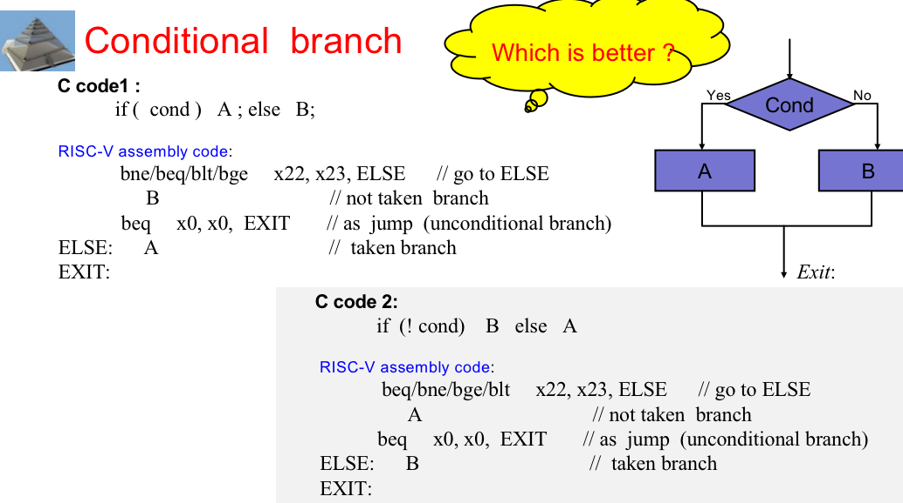 </div>  

### 

* Decide by considering which part (A or B) is more likely to be executed.

### Compare Operations

```assembly
Signed integer
slt  ：Set on less than
slti ：Set on less than immediate
Unsigned integer
sltu  ： Set on less than
sltiu ： Set on less than immediate 
```

> Slt还有与立即数的比较
>
> Slt, slti针对有符号数，sltu sltiu针对无符号数不同的比较指令运行到同一个操作数上，结果也是不一样的将有符号数作为无符号数来处理，是检验0<=x<y的低开销方法，常用于检查数组的下标是否越界。

* MIPS里进行分支判断是用`slt` 根据比较结果设置寄存器，然后用`beq` 或者`bne` 来进行分支判断，`blt`, `bge`这些指令是作为伪指令
* MIPS的这种方法可以使处理器数据通路简单一些，但是需要更多的指令来执行程序
* Mips体系结构没有包括专门的“小于时分支”指令，因为它太复杂了，不符合**设备简单性**：它不仅会延长时钟周期，也会增加平均执行每个指令的周期数: 两条更快的指令（beq, bne）更有用

```assembly
slt x5, x6, x7        ; x5 = 1  if  x6  < x7   ( a < b)    
bne x5, x0, Less     ; go to Less  if  x5 !=  0 (that is,  if  a  <  b)
       ……  
Less:
```

**Reduce an index-out-of-bounds check**

将有符号数当作无符号数处理，给我们提供了一种低成本的方式检查是否`0<=x<y`常用于检查数组下标是否越界

* 无符号数比较`x<y`，在检测`x<y`的同时，也检测了`x`是否为负数
* RISC-V version:  `bgeu x20, x11,   IndexOutofBounds`

```assembly
sltu $t0, $a1, $t2	   ; x20 < x11   
beq  $t0, $zero, IndexOutofBounds	
```

### Loop statements

??? "Example"

    <div align=center>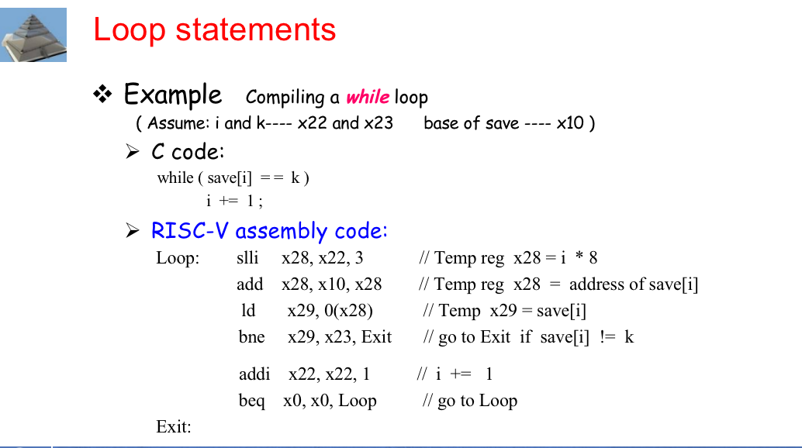 </div>  

### Case/Switch

* 实现switch的一种方法是借助一个条件判断序列,把switch转化为一系列的 `if-then-else`

* 另一种更有效的方法是通过编码形成一个转移地址表，就是分支指令序列地址表；程序通过查找转移地址表来获取目标地址，并跳转到相应的分支指令序列

  转移地址表就是一个字数组，数组中的元素对应于代码中各个标号的地址

  为支持这种情况，有一条间接跳转指令，`jalr` : 无条件地转移到某个寄存器指定的地址.

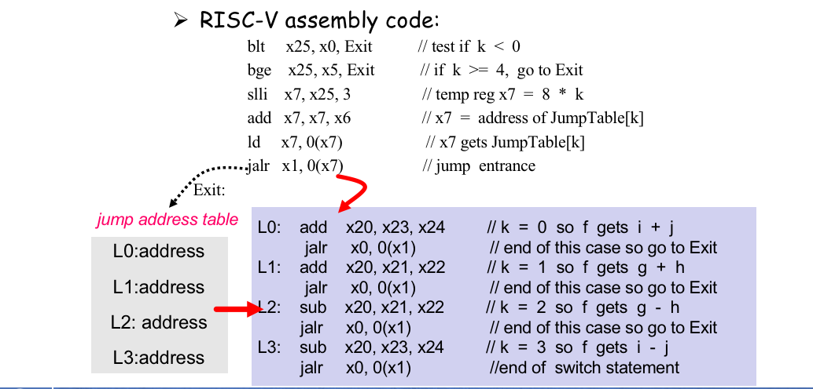

A **basic block** is a sequence of instructions with

* No embedded branches (except at end)
* No branch targets (except at beginning)

A compiler identifies basic blocks for optimization.

An advanced processor can accelerate execution of basic blocks.

## Supporting Procedures in Computer Hardware

### Procedure Call Instructions

Procedure call: jump and link	

`jal x1`, ProcedureLabe

* lAddress of following instruction put in x1
* Jumps to target address

> 如果我们有一个过程的标签为 `MyProcedure`，则 `jal x1, MyProcedure` 将会将当前地址保存到寄存器 `x1` 中，并跳转到 `MyProcedure` 标签所代表的代码处执行

Procedure return: jump and link register	

`jalr x0, 0(x1)`

* Like jal, but jumps to 0 + address in x1
* Use `x0` as `rd` (x0 cannot be changed)
* Can also be used for computed jumpse.g., for case/switch statements

> 无条件跳转： `jal x0, Label`，因为x0硬连线到0，效果等同于丢弃返回地址
>
> 使用 `x0` 寄存器作为目标寄存器（`rd`），即返回地址将被存储在 `x0` 中。由于 `x0` 寄存器的值永远是 `0`，因此实际上这个操作可以视为将返回地址丢弃

#### Using More Registers

Registers for procedure calling 

`x10~ x17`: 8 argument registers to pass parameters or return values 

`x1`: one return address register to return to origin point.

* 把数据放入栈叫push，移除数据称为出栈,pop，栈指针，一个特殊的寄存器，sp（x2)，用于保存被调用者所需的寄存器

  栈是内存里的一块存储结构，栈底是高地址，栈增长是地址**从高到低**，push的时候，sp减小，pop, sp增大

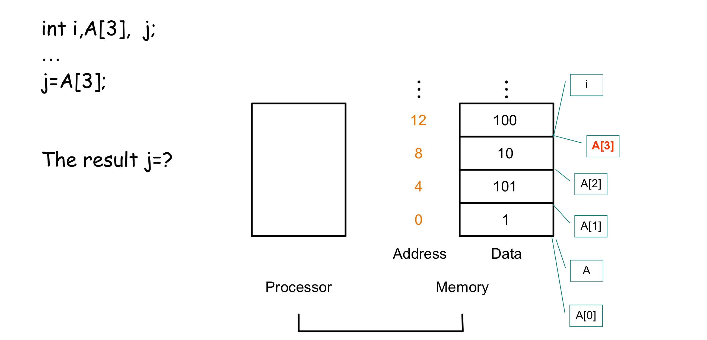

* 先放 i 然后 A[2] A[1].. ---符合高级语言访问顺序

> C code

```C
long long int leaf_example (
  long long int g, long long int h,
  long long int i, long long int j) {
  long long int f;
  f = (g + h) - (i + j);
  return f;
}
```

Arguments `g, …, j`  in  `x10, …, x13`.

`f`in `x20` temporaries .

`x5`, `x6` .

Need to save `x5`, `x6`, `x20` on stack.

> Assembly

```assembly
leaf_example:
  ;Save x5, x6, x20 on stack
	addi sp,sp,-24
	sd   x5,16(sp)
	sd   x6,8(sp)
	sd   x20,0(sp)
	
	add  x5,x10,x11  ;x5 = g + h
	add  x6,x12,x1   ;x6 = i + j
	sub  x20,x5,x6   ;f = x5 – x6
	addi x10,x20,0   ;copy f to return register
	
	;Restore x5, x6, x20 from stack
	ld   x20,0(sp)
	ld   x6,8(sp)
	ld   x5,16(sp)
	addi sp,sp,24
	jalr x0,0(x1)
```

#### Non-Leaf Procedures

**Caller save：** 

* return address 
*  arguments  
* important temporaries ( **T**  registers) that will be used after call

**Callee save**:  any `S` registers used  for local variables

`x5 – x7, x28 – x31`:  temporary registers. Not preserved by the callee.

`x8 – x9, x18 – x27:`  saved registers. If used, the callee saves and restores them.

* Nested:

```C
long long   fact ( long long   n )   {
       if ( n  <  1 )   return  ( 1 ) ;
           else  return   ( n  *  fact ( n  -  1 ) ) ;
} 
```

```assembly
Main:
....
;n is reg x28
add x10,x0,x28
Jal fact

;Nonleaf : save return address
fact:    addi sp, sp,-16    ;adjust stack for 2 items
         sd   x1, 8(sp)     ;save the return address
         sd   x10, 0(sp)    ;save the argument  n
         addi x5, x10, -1   ;x5 = n  -  1
         bge  x5, x0, L1    ;if  n  >=  1, go to L1(else)
		     addi x10, x0, 1    ;return 1 if n <1
         addi sp, sp, 16    ;Recover sp (Why not recover x1and x10 ?)
         jalr x0, 0(x1)     ;return to caller
         
L1:  		 addi x10, x10, -1  ;n  >=  1: argument gets ( n - 1 )
         jal  x1, fact      ;call fact with ( n - 1 )
         
		     add  x6, x10, x0   ;x6 = fact(n-1)
         ld   x10, 0(sp)    ;restore argument n
         ld   x1, 8(sp)     ;restore the return address
         addi sp, sp, 16    ;adjust stack pointer to pop 2 items
         
         mul  x10, x10, x6  ;return  n*fact ( n - 1 )
         jalr  x0,  0(x1)   ;return to the  caller
```

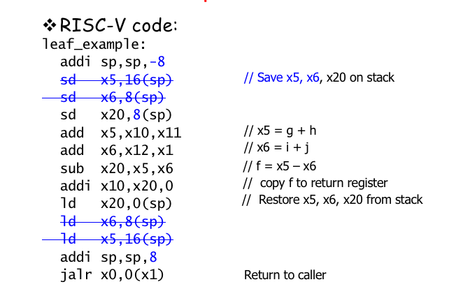

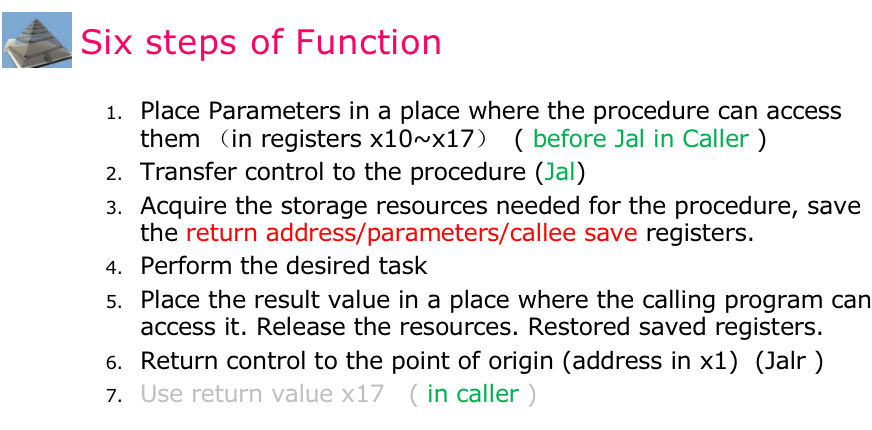

> 7. `X10-x17` returen

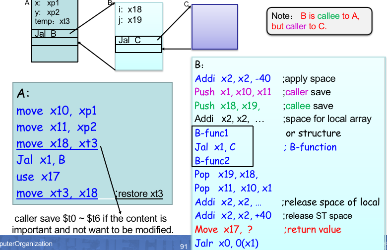

#### Summaries of procedure(MIPS)

* The `jal` instruction is used to jump to the procedure and  save the current PC+4 into the return address register `X0`
* Arguments are passed in `$a0-$a3` return values in `$v0-$v1`
* Since the callee may over-write the caller’s registers,   relevant values may have to be copied into memory 
* Each procedure may also require memory space for local variables – a stack is used to organize the memory   needs for each procedure

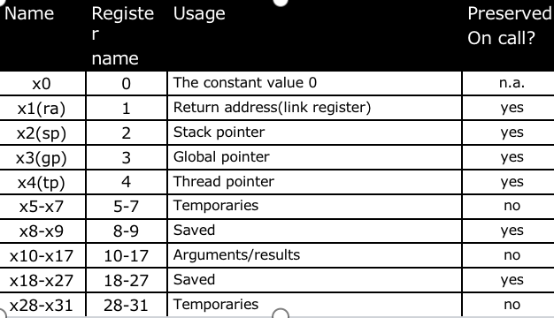

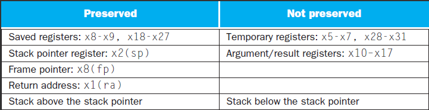

栈还需要存储一些局部变量，例如局部数组或结构, 这些变量时局部于过程，不适用于寄存器，而是保存在栈中

栈中包含过程保存的寄存器和局部变量的段称为过程帧(frame)或者活动记录(activation record)

在过程中栈指针可能改变，如果利用栈指针和地址运算来完成对局部变量的引用，非常不方便,因此，定义一个帧指针`fp(x8)`，指向过程帧的第一个双字，这样帧指针就提供了一个稳定的基寄存器，对局部变量的引用就变得非常简单

如果过程中栈内没有局部变量，编译器一般不设置和不恢复帧指针以节省时间,当使用帧指针时，在调用中使用sp来进行初始化，且可以使用`fp` 恢复 `sp`.

注意, 不管是否使用显式的帧指针，栈上都会显示一条活动记录。我们可以通过维护稳定的sp来减少对fp的使用

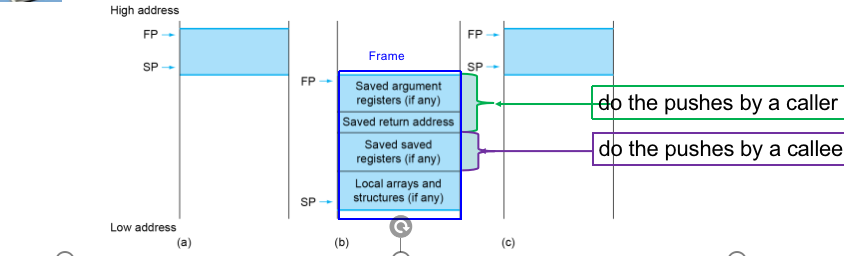

* Have to **PUSH FP**
* Then, we access local variables or.. by accessing **FP pointer**

### Memory Layout

除了动态变量，C程序员还需要为静态变量和动态数据结构分配内存空间

这个图展示了运行linux OS时程序和数据在RISC-V内存分配的约定,这些地址只是一种软件规定，并不是RISC-V体系结构的一部分。

栈由内存高地址开始，向下增长:内存低地址段先是保留区域，然后时机器代码的存储区域，称为正文段，之上是静态数据段，用于存储常量和其他静态变量的空间。类似链表的数据结构通常会随着生命期增长或者缩短，这类数据结构对应的段称为堆(heap),它放在内存中,位于静态数据之后

栈和堆相互增长，在两个段此消彼长的过程中达到内存的高效使用,C语言通过显示函数malloc(), free()分配和释放空间，容易导致漏洞。忘记释放会导致“内存泄漏”（消耗掉太多内存导致操作系统崩溃），过早的释放会导致“悬空指针”（指针指向程序从未访问的位置）

Jave使用自动内存分配和垃圾回收机制来避免这类错误

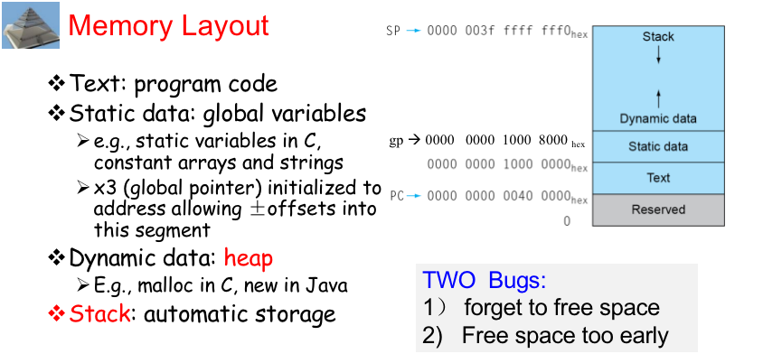

## communication with people


</font>