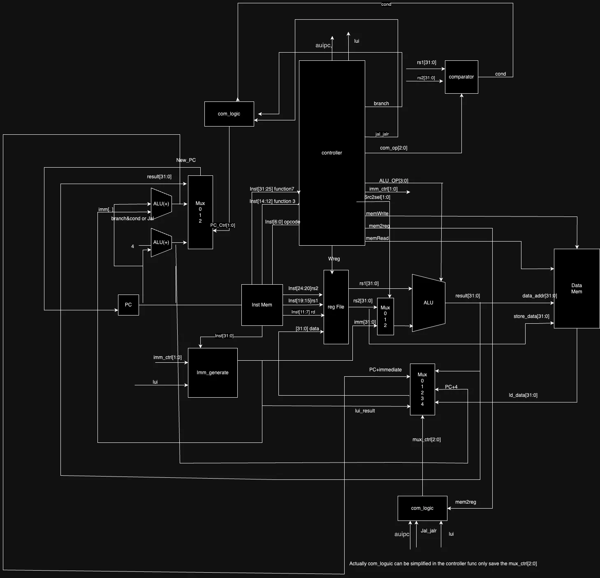
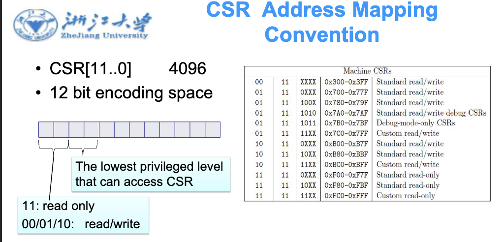
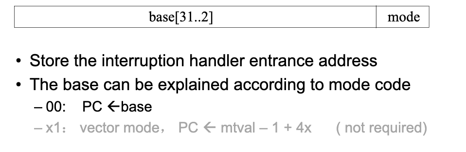
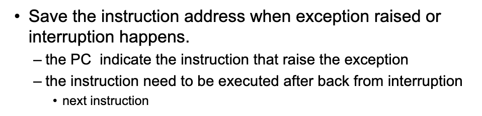
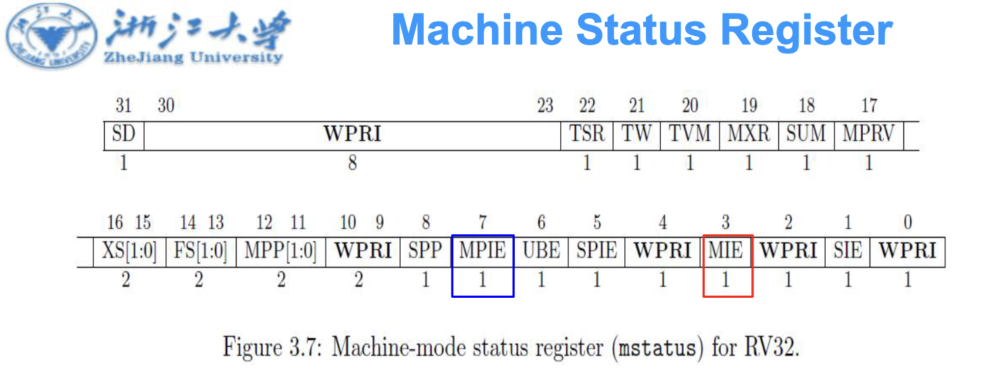
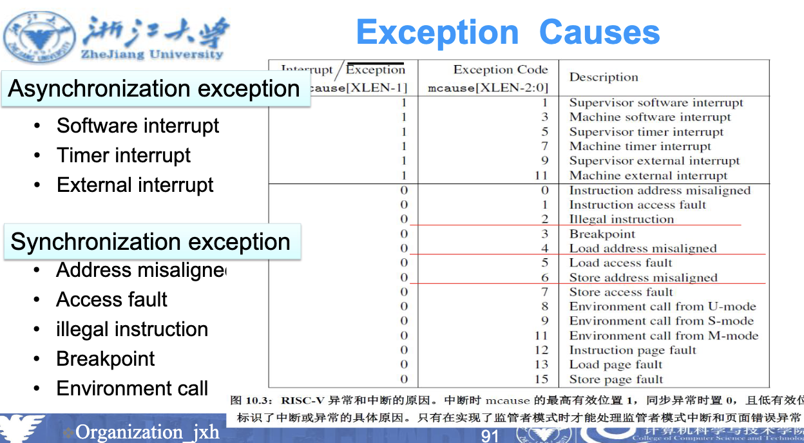
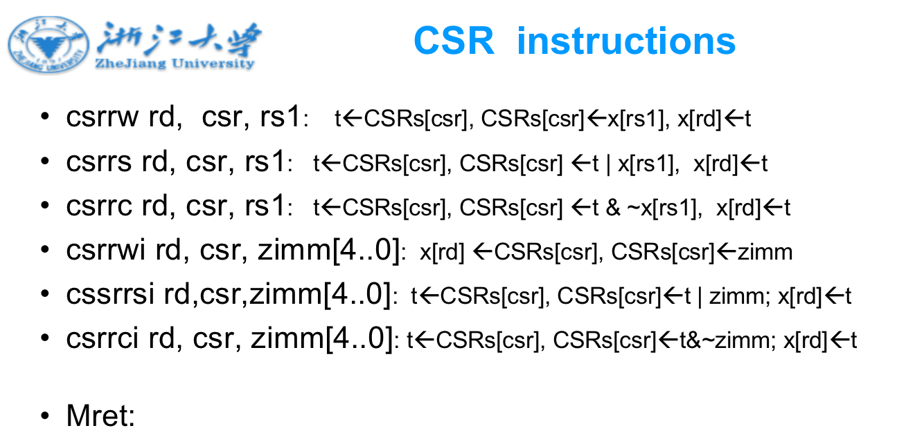
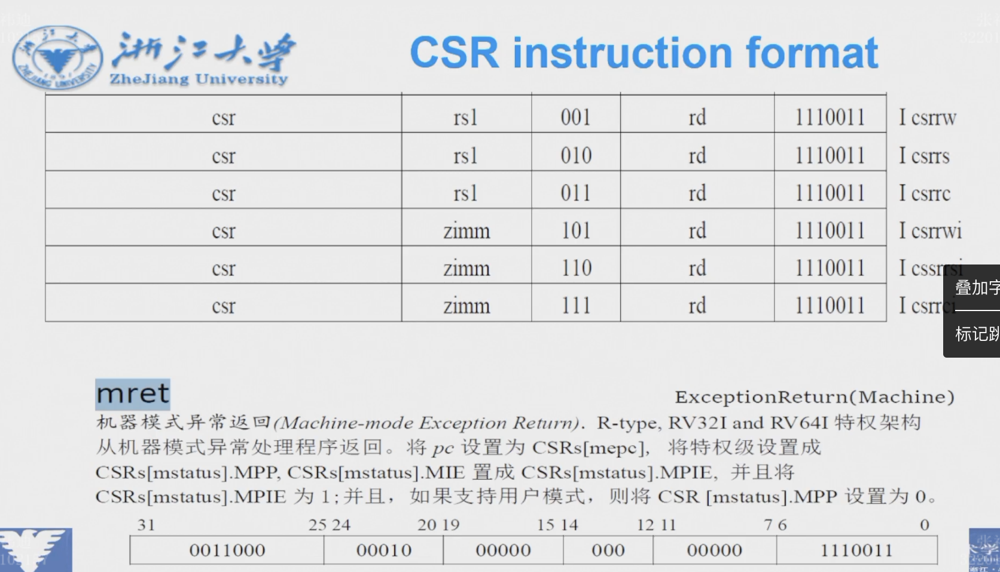

## Basic Operations

## Interruption & Exception

### Handling Exceptions
* Save PC of offending (or interrupted) instruction  
> In RISC-V: Supervisor Exception Program Counter (SEPC) (P316, 7th  line)
* Save indication of the problem
> In RISC-V: Supervisor Exception Cause Register (SCAUSE) 64 bits, but most bits unused
  * Exception code field: 2 for undefined opcode, 12 for hardware malfunction, ...
* Jump to handler
> Assume at 0000 0000 1C09 0000hex
> Entry address in a special register  :Suptervisor Trap Vector (STVEC), which can be loaded by OS.

### Vectored Interrupts
* Handler address determined by the cause

### Handler Actions
> Close interrupts
* Read cause, and transfer to relevant handler
* Determine action required
* If  restartable
    – Take corrective action
    – use **SEPC** to return to program  (mret)
* Otherwise
    – Terminate program
    – Report error using SEPC, SCAUSE, ...
    – OS  make the choice to transfer to another ready process

### CSR

#### 8 important CSR for exception handling

1. `mtvec`
   * ( Machine Trap Vector): jump to this address when exception 
   
2. `mepc`
   *  (Machine Exception PC): the instruction raise the exception
   *  When Interruption or Exception, the current PC will be saved in `mepc`
   
3. `mcause`
* (Machine Cause): the cause of the exception,which kind
4. `mie`
* (Machine Interrupt Enable): enable or disable the interrupt
5. `mip`
* (Machine Interrupt Pending): the interrupt is pending or not
6. `mtval`
* (Machine Trap Value): the value of the exception
* error address , illegal instruction, or  0
7. `mscrach`
* (Machine Scratch): a temporary register
8. `mstatus`
* (Machine Status): the status of the machine

* MPIE: Machine Previous Interrupt Enable
> Save the previous status of the interrupt
* Exceptions 立刻处理，没有exception 才考虑 interrupts

#### CSR for Supervisor Mode

### How Control Checks for Exceptions

* Add test logic
– illegal  instruction, load address misaligned, store address misaligned 
* add control signal
– CauseWrite for mcause 
– EPCWrite for mepc
– TVALWrite for mtval
* process of control 
– mepc <- PC( exception / interruption) 
– mcause  <-  set  correspondent bit  
– mtval <- memory address  or  illegal instruction 
– mstatus.mpie <- Mstatus.mie;  mstatus.mie<-0;    mstatus.mpp<-mp;  mp<-11
– PC<-address of process routine ( mtvec, ex. 1c090000)
* jump when  
`mstatus.MIE = 1  &&  mie[i] = 1 &&  mip [i]= 1`
 
