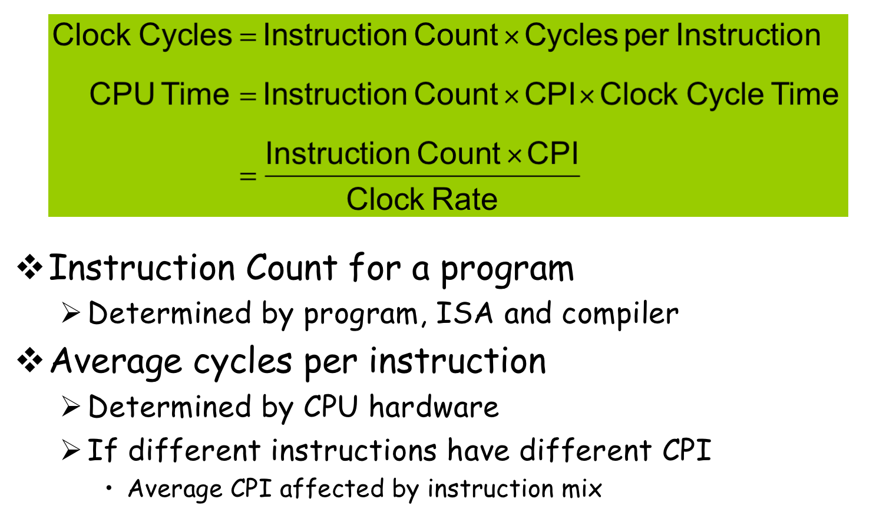
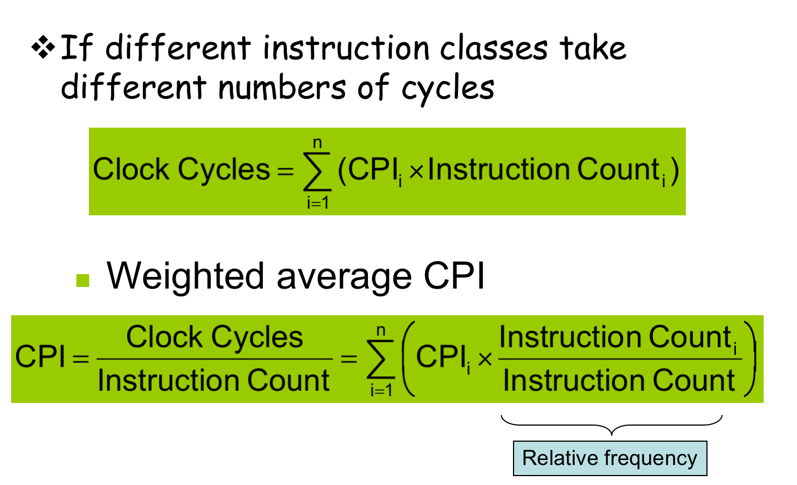

## Performance
* Response time: How long it takes to do a task.
* Throughput (吞吐量): Total work done per unit time.
$Performance = \frac{1}{Executation time}$
### CPI

CPI 表示的是 "Clocks Per Instruction"，即每条指令的时钟周期数。它是衡量计算机处理器性能的重要指标之一。CPI 数值越低，表示处理器在执行指令时需要的时钟周期越少，性能越好。

* CPI 的计算方式是将 CPU 执行指令所需的时钟周期数总和除以执行的总指令数。通常情况下，CPI 可以通过以下公式计算：$CPI = \frac{Total\ Clock\ Cycles}{Total\ Instructions\ Executed}$

  其中，"Total Clock Cycles" 表示执行所有指令所需的总时钟周期数，"Total Instructions Executed" 表示执行的总指令数。

通过监测和优化(减少) CPI，可以改善处理器的性能，例如减少指令执行时间，提高处理速度，以及降低能耗。

### CPU Time

**Clock cycle**: This refers to the basic unit of time used by a computer's CPU (Central Processing Unit) in executing instructions. It's the time it takes for **one complete pulse** of the CPU's clock signal. All operations in a computer, such as fetching instructions, decoding them, executing them, and storing results, are synchronized by this clock signal. Clock cycles are typically measured in units like milliseconds (ms), microseconds (μs), or nanoseconds (ns), depending on the speed of the processor.

**Clock rate**: Also known as clock speed or clock frequency, this is the rate at which a CPU executes instructions, measured in cycles per second (Hz). For example, a CPU with a clock rate of 2 gigahertz (GHz) performs 2 billion clock cycles per second. Higher clock rates generally mean faster processing speeds, assuming other factors remain constant.

**CPU time**: This represents the total time taken by a CPU to complete a task or process. It's typically measured in seconds. CPU time is influenced by factors such as the clock rate, the number of clock cycles required to execute each instruction, and the total number of instructions executed.

**Performance improved by**
* Reducing number of clock cycles
* Increasing clock rate
* Hardware designer must often trade off clock rate against cycle count